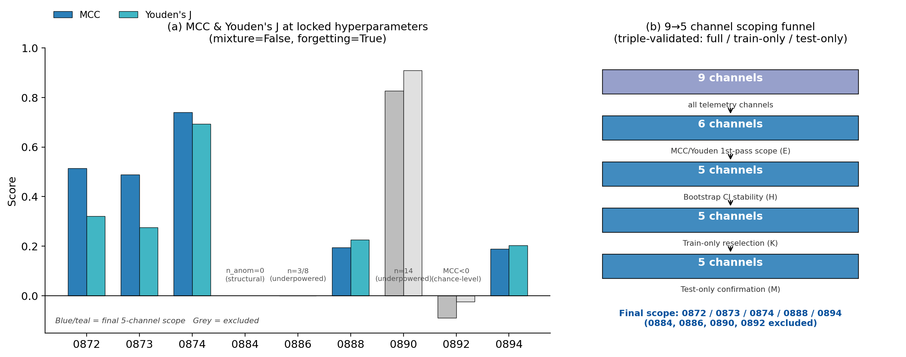
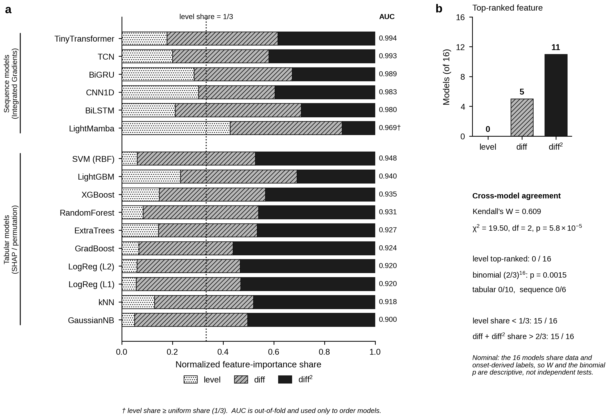
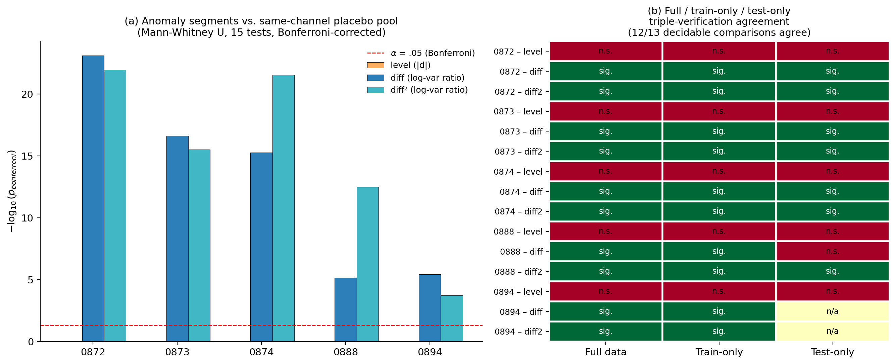
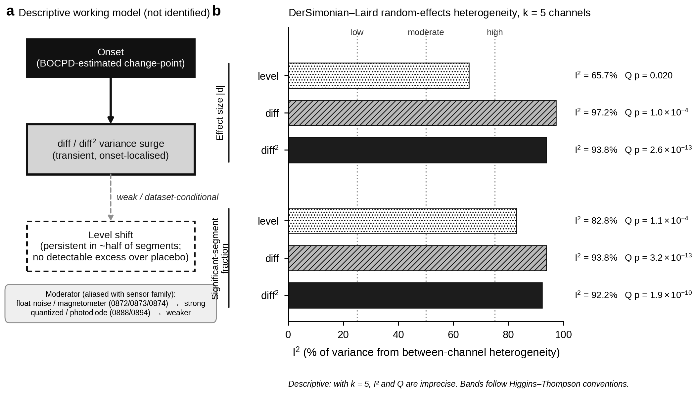
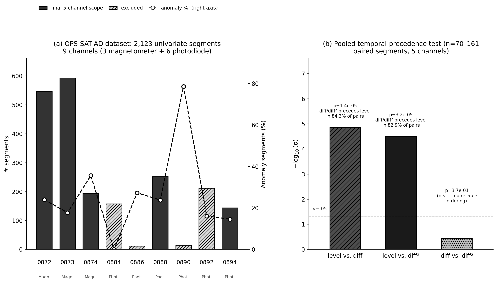
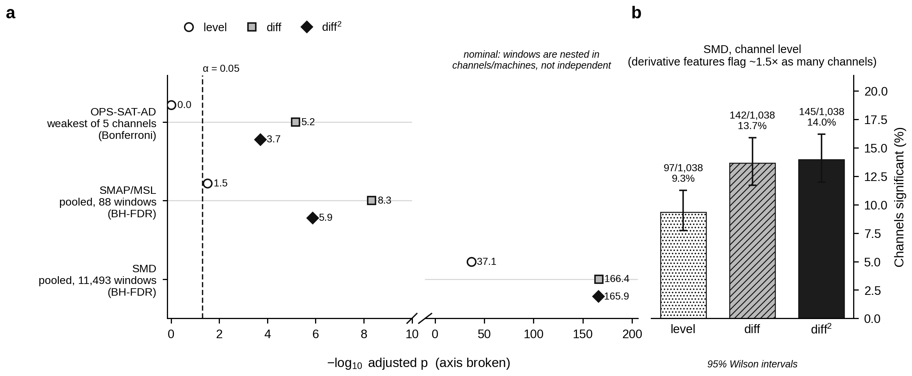
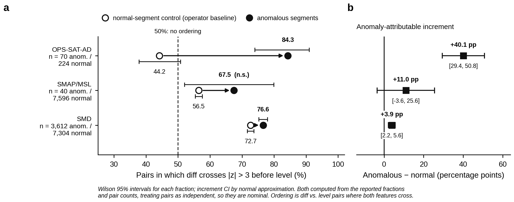

# opssat-ad-onset-signatures

**Derivative-Variance Signatures of Telemetry Anomaly Onsets: Cross-Dataset Evidence and an Operator-Baseline Decomposition for Alarm-Feature Selection in Space Systems**

[](./LICENSE)
[](https://www.python.org/)
[](#reproducing-every-number-in-this-readme)
[](#citation)

> **Summary.** Alarm thresholds for spacecraft telemetry are conventionally set on signal *level*, on the premise that an anomaly begins as a mean shift. We tested that premise on labeled anomaly onsets in three benchmarks: OPS-SAT-AD (9 ESA spacecraft telemetry channels, 5 in analytical scope), SMAP/MSL (82 NASA spacecraft channels) and SMD (1,064 industrial server-machine channels), each against same-channel placebo pivots. In all three, onset-relative change features (`diff`, `diff²`) discriminate anomaly onsets from placebo more strongly than absolute `level`.
>
> Measured as onset-vs-placebo AUROC with **cluster-bootstrap confidence intervals** (the unit of resampling is the segment for OPS-SAT-AD, the channel for SMAP/MSL, and the machine for SMD, so that repeated or non-independent pairs cannot inflate significance), the advantage is **Δ(diff − level) AUROC = +0.462 [0.409, 0.508]** in OPS-SAT-AD, **+0.122 [0.045, 0.196]** in SMAP/MSL and **+0.042 [0.016, 0.066]** in SMD: large in OPS-SAT-AD, moderate in SMAP/MSL, small but non-zero in SMD. SMAP/MSL and SMD carry **ground-truth onsets**, so this directional result does not depend on an onset estimator. Adding `level` to `diff`/`diff²` in an out-of-fold logistic model gives essentially **no incremental discrimination** (ΔAUROC between −0.001 and −0.007 across datasets, Tier-1 evidence in §11).
>
> A normal-segment control splits `diff`-first onset ordering into an **operator-level baseline** (what differencing does to any local disturbance) and an **anomaly-attributable increment**. The increment is positive in every dataset — +40.1 percentage points (pp) in OPS-SAT-AD, +11.0 pp in SMAP/MSL, +3.9 pp in SMD — but a re-designed synthetic-data check (§11.6) shows that a plain AR(1)+slow-drift generator reproduces the *direction* of this baseline gradient (Spearman ρ=0.86 with autocorrelation, p<0.001) without reaching its *magnitude* (simulated baselines top out at 39.7%, short of the 44–73% observed). We therefore report the baseline decomposition as a **calibration tool**, not as a mechanism proof.
>
> At a matched false-alarm rate, the operational gain from adding derivative features is real but **modest**: in SMD, a `level OR diff OR diff²` fusion rule raises coverage at 5% FAR from 15.9% (level alone) to 17.2%, a **+1.2 pp [0.4, 2.2]** cluster-bootstrap gain; a single derivative feature alone does not reach significance at this FAR (§11.4). OPS-SAT-AD's `level` shows no positive discrimination pooled (AUROC 0.438 [0.401, 0.477]) and is **significantly reversed** in one channel (CADC0873, AUROC 0.289, two-sided cluster p = 0.002); the cause is investigated but not fully resolved (§11.5). We claim an **associational, direction-level** result with a modest, quantified incremental value — not a detector that outperforms published methods, and not a universal causal mechanism.

This repository is the code, data-provenance and figure-reproduction companion to **Paper 1** of a two-paper series built primarily on OPS-SAT-AD, with independent generalization testing on SMAP/MSL and SMD. It is **self-contained and independently evaluable** and does not depend on any other repository.

| This series | Repository | Status |
|---|---|---|
| **Paper 1 (this repo)** — Cross-dataset signature analysis | `opssat-ad-onset-signatures` | ✅ independent, no upstream deps |
| Paper 2 — Risk-aware alarm design (CVaR / conformal) | [`opssat-ad-risk-optimization`](https://github.com/USERNAME/opssat-ad-risk-optimization) | depends on this repo's `results/` artifacts |
| DSS prototype (not a paper) | [`opssat-ad-dss`](https://github.com/USERNAME/opssat-ad-dss) | depends on both papers' artifacts |

---

## Table of Contents

1. [Contribution at a glance](#contribution-at-a-glance)
2. [Fit with RESS and submission package](#fit-with-ress-and-submission-package)
3. [Evidence ladder and claim scope](#evidence-ladder-and-claim-scope)
4. [Storyline of the investigation](#storyline-of-the-investigation)
5. [Onset provenance of each result](#onset-provenance-of-each-result)
6. [Headline results](#headline-results)
7. [Repository structure](#repository-structure)
8. [Datasets](#datasets)
9. [Methodology (OPS-SAT-AD primary pipeline)](#methodology-ops-sat-ad-primary-pipeline)
   - [Layer 1 — Signal Estimation](#layer-1--signal-estimation)
   - [Layer 2 — Onset Estimation and Channel Scoping](#layer-2--onset-estimation-and-channel-scoping)
   - [Layer 3 — Signature Analysis](#layer-3--signature-analysis)
   - [Layer 3b — Labeling-Protocol Audit & Train/Test Triple Verification](#layer-3b--labeling-protocol-audit--traintest-triple-verification)
   - [Model Cross-Validation (16 architecturally diverse models)](#model-cross-validation-16-architecturally-diverse-models)
10. [External Validation / Generalization Study (SMAP/MSL, SMD)](#external-validation--generalization-study-smapmsl-smd)
11. [Robustness Re-Analysis: Cluster-Robust, FAR-Matched, and Sensitivity Checks](#robustness-re-analysis-cluster-robust-far-matched-and-sensitivity-checks)
12. [Analytical baseline: why differencing may respond faster](#analytical-baseline-why-differencing-may-respond-faster)
13. [Practical implications for alarm design](#practical-implications-for-alarm-design)
14. [Scope of the inferential claims](#scope-of-the-inferential-claims)
15. [Figures](#figures)
16. [Results tables](#results-tables)
17. [Reproducing every number in this README](#reproducing-every-number-in-this-readme)
18. [Threats to validity and how each was addressed](#threats-to-validity-and-how-each-was-addressed)
19. [Boundary conditions and scope of validity](#boundary-conditions-and-scope-of-validity)
20. [Research roadmap enabled by this release](#research-roadmap-enabled-by-this-release)
21. [Citation](#citation)
22. [License](#license)

---

## Contribution at a glance

**The question.** Change-point and anomaly-detection pipelines for spacecraft and industrial telemetry treat a level shift as the default anomaly signature: it is the easiest thing to visualize, the easiest to threshold, and the default target of textbook change-point models. Which feature should an alarm actually be built on?

**The answer this study provides.** Across three benchmarks that differ in platform, sensor physics, labeling protocol and onset provenance, variance surges in the first and second differences carry more placebo-separating information at labeled anomaly onsets than level does. Cluster-bootstrap re-analysis (§11) confirms this direction on a resampling unit that respects each dataset's dependence structure (segment / channel / machine), and quantifies the operational, false-alarm-matched value of adding derivative features as real but modest.

**Seven contributions.**

1. **A cross-dataset design rule with an estimator-free direction.** `diff`/`diff²` variance features separate onsets from placebo more strongly than `level` in 3/3 datasets. In the two datasets with ground-truth onsets (SMAP/MSL, SMD) the direction holds without any onset estimator (Table 12, Fig. 6).
2. **A cluster-robust, dependence-aware quantification of that gap.** ΔAUROC(diff − level) = +0.462 [0.409, 0.508] (OPS-SAT-AD, segment clusters), +0.122 [0.045, 0.196] (SMAP/MSL, channel clusters), +0.042 [0.016, 0.066] (SMD, machine clusters) (Table R2, §11.3). This replaces pooled p-values that treat non-independent windows as exchangeable.
3. **A false-alarm-matched measurement of the alarm-design payoff.** At 5% FAR, a `level|diff|diff²` fusion rule raises SMD coverage by +1.2 pp [0.4, 2.2] over `level` alone; a single derivative feature alone does not clear a significant gain at this operating point (Table R3, §11.4). This turns "diff separates onsets better" into a stated, bounded operational number.
4. **An operator-baseline decomposition that any feature-precedence study can reuse — reported as calibration, not mechanism.** A normal-segment control separates the operator-level baseline of differencing from the anomaly-attributable increment: +40.1 pp (OPS-SAT-AD), +11.0 pp (SMAP/MSL), +3.9 pp (SMD) (Table 13, Fig. 7). A synthetic existence-proof check (Table R5, §11.6) shows an AR(1)+drift generator reproduces this gradient's *direction* but not its *magnitude*, so the decomposition is offered as a calibration tool rather than a validated mechanism.
5. **A sharp instrument-physics reading in OPS-SAT-AD, reported with its one open anomaly.** `diff`/`diff²` are significant in 5/5 channels (all p_bonf < 2×10⁻⁴) and the ordering *reverses* in normal controls (level first in 55.8% of normal pairs versus 15.7% of anomalous). `level` shows no positive pooled discrimination (AUROC 0.438) and is **significantly reversed** in one channel (CADC0873); a sensitivity check against the pooled-standard-deviation definition of `level` narrows but does not eliminate this reversal (Table R4, §11.5) — the cause remains open.
6. **An uncertainty-aware, multi-layer verification chain, extended by an independent replica audit.** Monte Carlo propagation of onset uncertainty (200 draws), train/test/bootstrap triple verification, a 16-model classifier cross-check, leave-one-out heterogeneity decomposition, and a from-scratch replica of the entire canonical-onset/placebo-pool pipeline that reproduces the saved analysis dataset to a maximum relative error of 1.8×10⁻¹⁵ (§11.2, §11.7).
7. **Audit-grade transparency, including of the re-analysis itself.** A contamination of the pre-onset baseline in an early SMAP/MSL scheme was caught, discarded and fixed (§10, `docs/dev-log/`). The robustness re-analysis in §11 applies the same standard to its own outputs: a duplicate-placebo-pool check for the 16-model benchmark, and an OPS-SAT-AD cluster-level pair-export check that is flagged as **not yet trustworthy** and excluded from the headline rather than reported (§11.8).

**What this changes for practice.**

- **Add a derivative-variance channel to the alarm feature set — but expect a modest, not transformative, coverage gain.** At a matched false-alarm rate, the realistic gain is single-digit percentage points of coverage from feature fusion, not a step change (§11.4).
- **Calibrate against the operator baseline before claiming an early-warning gain**, and treat the baseline decomposition as a descriptive calibration rather than a validated causal account (§11.6).
- **Prioritize by instrument type, provisionally.** Float-noise magnetometer channels show the strongest derivative signature, but this pattern is aliased with a third confound — detector-selection retention, which ranges 28–100% across the five OPS-SAT-AD channels (§11.2) — so it is reported as a preliminary hypothesis.

---

## Fit with RESS and submission package

**Scope fit.** *Reliability Engineering & System Safety* publishes methodological contributions to reliability, safety and risk analysis of engineered systems, including alarm and monitoring design for safety-critical telemetry. This paper's contribution is a feature-selection methodology for onset detection — which signal statistic an alarm should threshold — evaluated with the dependence-aware, false-alarm-matched statistics (cluster-bootstrap AUROC, FAR-matched coverage) that a reliability-engineering readership expects rather than raw significance counts. The companion paper (`opssat-ad-risk-optimization`) addresses the adjacent, and more RESS-central, question of *how* to set the alarm threshold under an explicit risk criterion (CVaR, conformal calibration); this repository supplies that paper's feature-choice input (`channel_scope.json`, `onset_posteriors.parquet`) and its methodological justification.

**What is, and is not, claimed.** The paper does not claim a new detector that outperforms published benchmarks (§14, boundary condition 12) and does not claim a validated causal mechanism (§11.6, §14). It claims (a) a cross-dataset, estimator-free directional result on which feature carries more onset information, (b) a cluster-robust, false-alarm-matched quantification of how much that matters operationally, and (c) full disclosure of where the claim is strong (SMAP/MSL, SMD directional evidence) versus where it is conditional (OPS-SAT-AD's estimator dependence and one unresolved feature reversal).

**Submission package.** This repository — code, data-provenance scripts, every figure's exact source script, raw development logs, and the robustness re-analysis in §11 — is intended to accompany the manuscript as a reproducibility package. `docs/METHODS_SUPPLEMENT.md` mirrors the README's methodology in manuscript-ready form; `docs/REPRODUCIBILITY_CHECKLIST.md` documents seeds, package versions and expected runtimes (§17). Reviewers who want to independently re-run the cluster-robust and FAR-matched analyses in §11 can do so from the entry points listed there without needing anything beyond what `Reproducing every number in this README` (§17) already sets up.

---

## Evidence ladder and claim scope

The claims are graded by how far the evidence travels. Each tier states what is claimed, where it is supported, and the boundary of the claim, so that readers and reviewers can weigh the tiers separately.

| Tier | Claim | Where it is supported | Status and boundary |
|---|---|---|---|
| **1 — Direction, cluster-robust** | `diff`/`diff²` separate labeled anomaly onsets from same-channel placebo pivots more strongly than `level`, on a cluster-bootstrap AUROC that resamples at the segment (OPS-SAT-AD), channel (SMAP/MSL) or machine (SMD) level. | Table 3 / Table 12 (per-feature significance); **Table R2, §11.3** (cluster-robust ΔAUROC, the load-bearing statistic) | Same direction in 3/3 datasets; two of three onset sources are estimator-free |
| **2 — Operational, FAR-matched** | Adding derivative features to an alarm raises coverage at a matched false-alarm rate. | **Table R3, §11.4** | Confirmed for the fusion rule in SMD (+1.2 pp at 5% FAR); single-feature gains and the SMAP/MSL estimate are directionally consistent but not individually significant at current sample sizes |
| **3 — Calibrated increment (descriptive)** | `diff`-first onset ordering has an operator-level baseline visible in normal controls; the anomaly-attributable increment over that baseline is +40.1 pp (OPS-SAT-AD), +11.0 pp (SMAP/MSL; interval spans zero at n=40), +3.9 pp (SMD). | Normal-segment controls in all three datasets (Table 13, Fig. 7) | Same sign in 3/3; magnitude is regime-dependent. **Downgraded from a mechanism claim to a descriptive calibration** after the synthetic existence-proof (Table R5, §11.6) reproduced the gradient's direction but not its magnitude |
| **4 — Instrument-physics readings (OPS-SAT-AD)** | No positive pooled `level` discrimination (AUROC 0.438); one channel reverses significantly; `diff`/`diff²` effects stronger in `float_noise_suspect` (magnetometer) than `quantized` (photodiode) channels. | Layer 3 of the OPS-SAT-AD pipeline; **Table R1/R4, §11.2/§11.5** (consistency gate and reversal sensitivity check) | Conditional on the OPS-SAT-AD onset estimator; the `level` reversal's cause is investigated but not resolved; sensor family and channel type are aliased with detector-selection retention (see [Boundary conditions](#boundary-conditions-and-scope-of-validity)) |
| **Scope by design** | A universal causal mechanism linking onsets to derivative-statistic surges; superiority of a `diff`-based detector over published detectors; formal (do-calculus) identification. | — | Deliberately outside this paper: the contribution is signature identification, cluster-robust quantification, and FAR-matched feature-choice calibration |

**Scope of detection results.** Layer 2 detection metrics (Table 1) serve channel scoping and lock the BOCPD hyperparameters. Separating *which feature carries onset information* (this paper) from *how to set the threshold under a risk criterion* (Paper 2) is a deliberate modular design, so that each contribution can be evaluated independently.

---
## Storyline of the investigation

The investigation began with **OPS-SAT-AD** (ESA OPS-SAT mission, 9 telemetry channels, 2,123 expert-labeled univariate segments) and one question: is a level shift the operative anomaly signature, or do **variance surges in the first and second differences (`diff`, `diff²`)** carry more anomaly-relevant information?

The project's early working hypothesis, stated before any hypothesis testing began, was the conventional `level → diff → diff²` ordering: a level shift is the primary event and derivative statistics are downstream artifacts of it. Section 3.2's pooled Wilcoxon test was run to confirm this ordering and found the opposite pattern: `diff`/`diff²` precede `level` in 82–84% of paired segments within OPS-SAT-AD. Every subsequent analysis was designed to stress-test that finding, first inside OPS-SAT-AD and then outside it.

The stress test proceeded along seven lines, each aimed at a different class of confound. Each line states what it controls and what it does not:

1. **Is `level`'s apparent significance just a weaker null?** → same-channel quasi-experimental placebo-pool comparison (§ Layer 3.7). *Result: `level` shows no detectable excess over placebo in 5/5 channels; `diff`/`diff²` are significant in 5/5.*
2. **Is the pattern a side effect of how segments were manually cut?** → external audit of the OPS-SAT-AD labeling protocol (§ Layer 3b). *Result: no quantitative cutting rule is documented, so the audit is reported as an open provenance question; SMAP/MSL and SMD, which use entirely different labeling protocols, bound its consequence for the directional claim.*
3. **Is the result an artifact of using the full dataset rather than a train/test split?** → independent train-only and test-only reproduction (§ Layer 3b). *Result: 15/15 train-only and 12/13 decidable test-only calls match the full data.*
4. **Is the attribution ranking specific to one learner's inductive bias?** → 16-model cross-validation over two data representations (§ Model Cross-Validation). *Result: 0/16 models rank `level` first. This controls the **classifier** side; all 16 models share labels derived from the same BOCPD onsets.*
5. **Does the result depend on the onset estimator (BOCPD on Kalman innovations)?** → replication on SMAP/MSL and SMD, whose onsets are ground-truth labels (§ External Validation). *Result: the direction is confirmed with no estimator in the loop.*
6. **Is the result specific to OPS-SAT-AD's instrument physics (quantization, sensor noise regime)?** → the same external replication. *Result: the direction travels; the strict-specificity and reversal readings are OPS-SAT-AD-specific, and the normal-control decomposition quantifies exactly how much of the ordering is baseline versus anomaly.*
7. **Do the pooled significance tests, the 16-model benchmark and the baseline-decomposition mechanism survive independence, deduplication, and existence-proof checks?** → a post-hoc robustness re-analysis (§11): cluster-bootstrap re-estimation of every headline AUROC, a false-alarm-matched alarm-design comparison, a duplicate-placebo-pool leakage check for the 16-model benchmark, a sensitivity check on the `level` distance statistic, and a re-designed synthetic regime map. *Result: the direction and the classifier-side ranking survive unchanged; the mechanism claim behind the baseline decomposition is downgraded to a calibration tool; one `level` reversal (CADC0873) remains only partially explained; one diagnostic (an OPS-SAT-AD cluster-level pair export) is found unreliable and withheld rather than reported.*

Lines 1–3 and 6 converge within OPS-SAT-AD. Lines 5–6 carry the directional claim to independent datasets. Line 7 is a self-audit of the entire pipeline conducted after the original analysis, following the same disclosure standard as the SMAP/MSL contamination episode below.

This repository packages:

- The **signal-estimation → onset-estimation → signature-analysis** pipeline for OPS-SAT-AD (Layers 1–3).
- The **labeling-protocol audit** and **train/test/bootstrap triple re-verification** (Layer 3b).
- The **16-model cross-validation** benchmark and its agreement statistics.
- An **external-validation pipeline** applying the placebo-pool and temporal-precedence logic, adapted to each dataset's label structure, to SMAP/MSL and SMD.
- A **robustness re-analysis** (§11) that re-derives the headline statistics under cluster-bootstrap resampling, adds a false-alarm-matched alarm-design comparison, audits the 16-model benchmark for placebo-pool duplication, tests the sensitivity of the `level` reversal to its distance statistic, and re-designs the synthetic regime map as a power-adequate existence-proof.
- **Every figure regenerated from its exact source script** (`results/figures/*.py`), so every number a reader sees traces to code.
- **Raw development logs** (`docs/dev-log/`): the unabridged analytical trail, including discarded ablations and methodological corrections (train/test leakage checks, SHAP return-shape bugs, cuDNN backward-mode fixes, the external-validation debugging trail, and the robustness re-analysis trail). They complement, and do not replace, the Methods text in this README and `docs/METHODS_SUPPLEMENT.md`.

---

## Onset provenance of each result

Which results depend on a model-estimated onset, and which do not, determines how each is weighted. The design places the load-bearing claim on the estimator-free evidence.

| Result | Onset source | Depends on BOCPD onset estimate? |
|---|---|---|
| OPS-SAT-AD Layer 3 (§3.1–3.7), triple verification, 16-model cross-validation | BOCPD on Kalman-filter innovations; canonical onset = median of 200 Monte Carlo draws | **Yes** |
| SMAP/MSL Stage 1–2 | Ground-truth onset indices (`labeled_anomalies.csv`) | **No** |
| SMD Stage 1–2 | Ground-truth timestep-level 0/1 labels | **No** |

**Design of the OPS-SAT-AD onset front end.** A local-linear-trend Kalman filter absorbs a persistent mean shift into its state within a few samples and leaves a short-lived transient in the innovations. BOCPD on those innovations is therefore a transient-sensitive front end, and it yields a scoreable window for 178 of 386 anomalous segments (46.1%). Of those 178, 176 (98.9%) fall in the high-reliability tier and a further 1 in the medium tier, so 177/178 (99.4%) are high-or-medium; the remaining 1 is low-reliability (Table R1, §11.2 gives the full funnel). The scoreable subset is a quality-gated selection, and OPS-SAT-AD results are stated as conditional on it. In the §3.7 design, placebo pivots are position-matched resamples on normal segments while anomalous onsets are detector-selected; detector-matched placebo pivots remain an open item (§11.8, [Roadmap](#research-roadmap-enabled-by-this-release)).

**How the results are weighted.** The strong-form OPS-SAT-AD readings (Tier 4) are stated as conditional on the onset estimator and on OPS-SAT-AD's instrument physics. The onset-independent evidence (SMAP/MSL, SMD) supports the directional claim (Tier 1) and its cluster-robust quantification (§11.3). That is why the directional claim, rather than the strict-specificity claim, is the load-bearing result.

---

## Headline results

| Claim | OPS-SAT-AD evidence | Outside OPS-SAT-AD (SMAP/MSL, SMD) |
|---|---|---|
| Channel scope: 9 → 5 channels, identical across 3 independent derivations | Fig. 1, Table 1 | N/A (OPS-SAT-AD-specific scoping) |
| `diff`/`diff²` separate onsets from placebo more strongly than `level` (**direction, cluster-robust**) | Fig. 3a, Table 3; **ΔAUROC +0.462 [0.409,0.508] (Table R2)** | **Holds in 3/3 datasets**; ΔAUROC +0.122 [0.045,0.196] (SMAP/MSL), +0.042 [0.016,0.066] (SMD) (Table 12, Fig. 6, **Table R2**) |
| `level` excess over placebo | Pooled AUROC **0.438 [0.401,0.477]**, no positive discrimination; **CADC0873 reversed and significant** (AUROC 0.289, two-sided cluster p=0.002) (Table 3, **Table R1/R4**) | Small but detectable: SMAP/MSL p_fdr=0.031; SMD p_fdr=8×10⁻³⁸ (nominal, pooled-p independence caveat; see cluster-robust AUROC in Table R2 for the calibrated size) |
| `diff` precedes `level` in onset timing; **anomalous-vs-normal contrast** | 84.3% (anomalous) vs 44.2% (normal): **ordering reverses** (Fig. 5b, Table 10) | **Same sign in every dataset**: +11.0 pp (SMAP/MSL, interval spans zero at n=40), +3.9 pp (SMD); baselines of 56.5% and 72.7% in normal controls (Table 13, Fig. 7). **Synthetic existence-proof reproduces the direction of this baseline gradient but not its magnitude (Table R5)** |
| Adding derivative features to an alarm at a matched false-alarm rate | Raw-telemetry-based FAR-matching not run for OPS-SAT-AD (§11.4) | **+1.2 pp [0.4, 2.2] coverage gain at 5% FAR (SMD fusion rule, Table R3)** |
| `float_noise_suspect` (magnetometer) shows stronger `diff`/`diff²` effects than `quantized` (photodiode) | Fig. 4a (aliased with sensor family **and with detector-selection retention, 28–100%, Table R1**) | Awaiting instrument diversity: 1/82 channels of this type in SMAP/MSL; no significant effect in SMD's 17 channels |
| Placebo-pool result replicates on full / train-only / test-only splits | Fig. 3b (12/13 decidable comparisons agree); **independently reproduced from raw data (replica, max error 1.8×10⁻¹⁵), Table R1** | Direct external re-test listed in the roadmap |
| 0/16 models rank `level` as top feature; 15/16 give `level` less than the 1/3 uniform share | Fig. 2, Tables 2, 6, 7; **reproduced after de-duplicating the placebo pool and correcting sequence-model early stopping: still 0/16, still 16/16 below 1/3, W=0.609 unchanged (Table R6)** | External replication listed in the roadmap |
| No documented quantitative segment-cutting rule in the OPS-SAT-AD labeling protocol | — | N/A |
| `level`'s high within-segment significance is reconciled with its lower precedence rank via transient-vs-persistent profile classification | §3.3 | Not applicable (OPS-SAT-AD within-segment analysis) |

**Reading this table.** Row 2 is the load-bearing result and is now supported by a dependence-aware statistic. Row 5 gives the operational size of that result at a stated false-alarm rate. Row 4 is reported as a decomposition (operator baseline plus anomaly-attributable increment) with an explicit calibration-not-mechanism caveat. Row 3 discloses the one open anomaly (CADC0873) rather than reporting a uniform null. Rows 6 and 7 record where the OPS-SAT-AD instrument-physics reading is sharper than the cross-dataset reading and where it has been independently re-derived from scratch.

---

## Repository structure

```
opssat-ad-onset-signatures/
│
├── README.md                              # this file — full methodology + inline figures
├── LICENSE
├── CITATION.cff
├── requirements.txt
├── environment.yml
├── Makefile                               # `make all` reproduces every figure/table below
│
├── data/
│   ├── download_opssat_ad.sh              # fetches OPS-SAT-AD from Zenodo (no redistribution)
│   ├── download_smap_msl.sh               # fetches SMAP/MSL (Telemanom) release (no redistribution)
│   ├── download_smd.sh                    # fetches SMD (OmniAnomaly) release (no redistribution)
│   ├── README.md                          # dataset layout, checksum, license notes for all three datasets
│   └── raw/                               # (gitignored) populated by download scripts
│
├── layer1_signal_estimation/
│   ├── channel_classification.py          # quantized / float_noise_suspect / continuous auto-tagging
│   ├── noise_estimation.py                # var(diff)/2 vs. mixture-model comparison
│   ├── kalman_filter.py                   # local-linear-trend Kalman filter, state estimation
│   ├── hierarchical_shrinkage.py          # Bayesian shrinkage for low-sample channels
│   ├── tests/
│   └── run.py                             # entry point: `python -m layer1_signal_estimation.run`
│
├── layer2_anomaly_detection/              # onset estimation (BOCPD) + channel scoping
│   ├── bocpd_forgetting.py                # BOCPD with forgetting-factor extension
│   ├── ablation_mixture_forgetting.py     # 2×2 ablation grid (mixture × forgetting)
│   ├── channel_scoping.py                 # MCC / Youden's J channel decision table (Fig. 1a)
│   ├── triple_verification.py             # full / train-only / test-only re-fit & re-select (Fig. 1b)
│   ├── bootstrap_ci.py                    # per-channel MCC bootstrap confidence intervals
│   ├── problem_channel_diagnosis.py       # Hypothesis A/B diagnosis for 890/892/894 (§ Layer 2.5)
│   ├── tests/
│   └── run.py
│
├── layer3_signature_analysis/
│   ├── onset_mc_propagation.py            # Monte Carlo propagation of onset-time posterior (200 draws)
│   ├── temporal_precedence_test.py        # pooled Wilcoxon signed-rank, level vs diff vs diff² (Fig. 5b)
│   ├── temporal_profile_classification.py # transient vs. persistent post-onset trajectory classification
│   ├── early_window_sensitivity.py        # 10-point vs. full-window Welch-test comparison
│   ├── quasi_experimental_placebo.py      # Mann–Whitney U vs. same-channel placebo pool (Fig. 3a)
│   ├── meta_analysis_random_effects.py    # DerSimonian–Laird random-effects meta-analysis + I² (Fig. 4b)
│   ├── loo_sensitivity.py                 # leave-one-channel-out sensitivity analysis
│   ├── scm_skeleton.py                    # descriptive structural working model, Path A vs. Path B (Fig. 4a)
│   ├── supplementary_diagnostics_A_D.py   # cross-correlation, CMH test, normal-segment controls, lag resolution
│   ├── labeling_protocol_audit.py         # external audit of the OPS-SAT-AD labeling protocol
│   ├── train_test_triple_reverification.py# train-only / test-only reproduction of the placebo-pool test
│   ├── tests/
│   └── run.py
│
├── model_cross_validation/
│   ├── models/                            # 16 model wrappers (+1 excluded by the fit-quality screen, see § below)
│   │   ├── linear.py                      # LogReg (L1, L2)
│   │   ├── probabilistic.py               # GaussianNB
│   │   ├── kernel.py                      # SVM (RBF)
│   │   ├── instance_based.py              # kNN
│   │   ├── tree_ensembles.py              # RandomForest, ExtraTrees, GradBoost, XGBoost, LightGBM
│   │   ├── shallow_mlp.py                 # MLP_shallow — excluded (AUC=0.403, below chance; failed fit)
│   │   ├── conv_sequence.py               # CNN1D, TCN
│   │   ├── recurrent_sequence.py          # BiLSTM, BiGRU
│   │   ├── attention_sequence.py          # TinyTransformer
│   │   └── ssm_sequence.py                # LightMamba (pure-PyTorch selective state-space substitute)
│   ├── representations/
│   │   ├── tabular_summary_features.py    # 10 models: engineered summary-statistic features
│   │   └── raw_sequence_features.py       # 6 models: raw 3-channel windowed time series
│   ├── attribution/
│   │   ├── shap_permutation.py            # tabular-model attribution (SHAP + permutation fallback)
│   │   └── integrated_gradients.py        # sequence-model attribution (Captum / manual IG fallback)
│   ├── agreement_statistics.py            # Kendall's W, binomial test, bootstrap stability (Fig. 2b)
│   ├── tests/
│   └── run_all.py                         # entry point: `python -m model_cross_validation.run_all`
│
├── external_validation/
│   ├── stage0_preprocessing.py            # command-column exclusion, channel re-typing, triviality filter
│   ├── stage1_placebo_pooled.py           # dataset-pooled and channel-type-stratified placebo tests (FDR) (Fig. 6)
│   ├── stage2_temporal_precedence.py      # ground-truth-onset precedence + normal-segment control (Fig. 7)
│   ├── window_cap_sensitivity.py          # 150–5,000-sample search-window sensitivity sweep
│   └── run_external_validation.py         # entry point
│
├── results/
│   ├── README.md                          # index of every artifact below + provenance table
│   ├── layer1/
│   │   ├── noise_estimates.csv
│   │   └── channel_classification.json
│   ├── layer2/
│   │   ├── channel_scope.json                  # → consumed by opssat-ad-risk-optimization
│   │   ├── channel_scope_full_table.csv
│   │   ├── channel_scope_final_locked.csv
│   │   ├── ablation_grid.csv
│   │   ├── ablation_best_combo_test_eval.csv
│   │   ├── bootstrap_ci.csv
│   │   ├── bootstrap_ci_test_only.csv
│   │   ├── train_fit_test_eval.csv
│   │   └── full_vs_test_ci_comparison.csv
│   ├── layer3/
│   │   ├── onset_posteriors.parquet             # → consumed by opssat-ad-risk-optimization & opssat-ad-dss
│   │   ├── placebo_comparison.csv
│   │   ├── temporal_precedence.csv
│   │   ├── temporal_precedence_normal_control.csv
│   │   ├── temporal_precedence_group_comparison.csv
│   │   ├── temporal_precedence_lag_resolution.csv
│   │   ├── heterogeneity_summary.csv            # → consumed by opssat-ad-dss
│   │   └── triple_verification_matrix.csv
│   ├── model_cross_validation/
│   │   ├── feature_attribution_16models.csv
│   │   ├── family_summary.csv
│   │   ├── performance_leaderboard.csv
│   │   ├── bootstrap_stability.csv
│   │   └── agreement_statistics.json
│   ├── external_validation/
│   │   ├── stage1_placebo_pooled_dataset.csv        # Table 12 pooled rows; → Fig. 6a
│   │   ├── stage1_channel_level_significance.csv    # Table 12 SMD channel-level counts; → Fig. 6b
│   │   ├── stage1_channel_type_stratified.csv       # exploratory FDR family (§ Stage 1)
│   │   ├── stage2_temporal_precedence.csv           # Table 13 precedence rows; → Fig. 7a
│   │   ├── stage2_baseline_decomposition.csv        # Table 13 increment rows; → Fig. 7b
│   │   └── window_cap_sensitivity.csv               # 150–5,000-sample sweep log
│   ├── figures/
│   │   ├── fig01_channel_scope.png
│   │   ├── fig01_channel_scope.py
│   │   ├── fig02_model_cross_validation.png
│   │   ├── fig02_model_cross_validation.py
│   │   ├── fig03_quasi_experimental.png
│   │   ├── fig03_quasi_experimental.py
│   │   ├── fig04_scm_and_heterogeneity.png
│   │   ├── fig04_scm_and_heterogeneity.py
│   │   ├── fig05_dataset_and_precedence.png
│   │   ├── fig05_dataset_and_precedence.py
│   │   ├── fig06_cross_dataset_placebo.png
│   │   ├── fig06_cross_dataset_placebo.py
│   │   ├── fig07_precedence_baseline.png
│   │   └── fig07_precedence_baseline.py
│   └── tables/                            # camera-ready LaTeX tables (.tex) mirroring the CSVs above
│
└── docs/
    ├── dev-log/                           # raw, unabridged research log (see note below)
    │   ├── step1_signal_estimation.md
    │   ├── step2_anomaly_detection.md
    │   ├── step3_causal_analysis.md
    │   ├── step3b_labeling_protocol_revalidation.md
    │   ├── step_ai_model_cross_validation.md
    │   └── step_external_validation.md
    ├── METHODS_SUPPLEMENT.md               # manuscript-ready extended methods (mirrors README methodology)
    └── REPRODUCIBILITY_CHECKLIST.md
```

> **Note on `docs/dev-log/`.** These files are the original conversational research logs kept during development, included **verbatim** for analytical transparency (file names retain the original "causal" wording). `step_external_validation.md` documents a self-audit made mid-analysis: an early version of the SMAP/MSL temporal-precedence test used a sliding-window onset-refinement scheme that contaminated the pre-onset baseline for windows longer than the baseline length. The internal checks caught this, the affected results were discarded, and the analysis was re-run with ground-truth onsets and a baseline-safe adaptive search window (§ External Validation). The episode is disclosed here as part of the reproducibility standard applied throughout this repository, and the same standard is applied to the robustness re-analysis in §11 (see the `results/` subfolders referenced there for the corresponding artifacts, and `docs/dev-log/` for their conversational audit trail alongside the files listed above).

---

## Datasets

### OPS-SAT-AD (primary)

European Space Agency's OPS-SAT experimental nanosatellite telemetry anomaly-detection benchmark (Ruszczak, Kotowski, Evans & Nalepa, *Scientific Data* 12:710, 2025).

- **9 channels**: 3 magnetometer channels (`CADC0872`, `CADC0873`, `CADC0874`) + 6 photodiode channels (`CADC0884`, `CADC0886`, `CADC0888`, `CADC0890`, `CADC0892`, `CADC0894`).
- **2,123 univariate segments**, each expert-labeled *nominal* or *anomalous*. Labels are at segment level; onset position within a segment is not given and is estimated via BOCPD (§ Layer 2).
- Per-channel segment counts and anomaly prevalence vary sharply (0% to 78.6%); see Fig. 1, Fig. 5a and Table 1. The five in-scope channels hold 386 anomalous segments in total (131 + 105 + 69 + 60 + 21; Fig. 1a).
- An official train/test partition (`train ∈ {0,1}`, stratified by anomaly rate, ≈75%/25%) is used throughout for train-fit/test-evaluate verification.
- Segment boundaries were determined by **manual expert annotation** using ESA's OXI visualization tool; no quantitative cutting rule is documented in the public materials (§ Layer 3b).
- Not redistributed; `data/download_opssat_ad.sh` fetches it from its Zenodo record.

### SMAP/MSL (external validation)

NASA Soil Moisture Active Passive (SMAP) and Mars Science Laboratory (MSL) spacecraft telemetry, released with the Telemanom benchmark (Hundman et al., KDD 2018).

- **82 channels** (55 SMAP + 27 MSL), each a long continuous series with **ground-truth onset/offset indices** per anomaly window (`labeled_anomalies.csv`), a structurally different label format from OPS-SAT-AD's whole-segment labels.
- Each `.npy` file has multiple columns; only the first (telemetry) column is used. The remaining columns are one-hot-encoded command context and are excluded from all `diff`/`diff²` computation (Stage 0).
- Anomaly window lengths are highly variable (median 120 samples, mean 616, max 4,217), unlike OPS-SAT-AD's short, uniformly windowed segments; this drove a methodological adaptation (Stage 2).
- A triviality filter motivated by Wu & Keogh's (2021) critique of SMAP/MSL and similar benchmarks excludes extreme, visually obvious point outliers from the primary test (Stage 0).
- Not redistributed; `data/download_smap_msl.sh` fetches the public release.

### SMD (Server Machine Dataset, external validation)

Industrial server telemetry from the OmniAnomaly benchmark (Su et al., KDD 2019).

- **28 machines × 38 dimensions = 1,064 channels**, each with **timestep-level (0/1) ground-truth anomaly labels**; 1,038 of the 1,064 channels enter the channel-level counts reported in Stage 1.
- Included as a domain-generalization check (technological systems beyond spacecraft): it tests whether the direction survives a change of platform, sampling regime and noise structure. SMD is *supporting*, not primary, generalization evidence.
- Anomaly windows are nested within 28 machines (each contributing 38 dimensions), which is why §11.3 uses the **machine**, not the channel, as the cluster unit for SMD's cluster-bootstrap results.
- Not redistributed; `data/download_smd.sh` fetches the public release.

---
## Methodology (OPS-SAT-AD primary pipeline)

### Layer 1 — Signal Estimation

**Goal**: obtain a denoised, well-calibrated state estimate for each channel before any change-point logic is applied, so that downstream onset estimation is not confounded by channel-specific noise characteristics.

**1.1 Channel typing.** Each channel is classified from the empirical distribution of first differences (Δ) computed within nominal (`anomaly = 0`) segments only. Thresholds were set from inspection of this dataset's empirical diagnostics and were **re-fitted, not reused,** on SMAP/MSL and SMD, so each dataset is typed by its own physics:

- **`quantized`** if the fraction of exact-zero Δ is ≥ 0.10 (quantization step estimated as the 25th percentile of non-zero |Δ|).
- **`float_noise_suspect`** if not quantized and the smallest non-zero |Δ| is < 1 × 10⁻⁶.
- **`continuous`** otherwise.

| Channel | Type | frac_zero_diff | Quantization step |
|---|---|---|---|
| CADC0872 | float_noise_suspect | 0.053 | n/a |
| CADC0873 | float_noise_suspect | 0.052 | n/a |
| CADC0874 | float_noise_suspect | 0.044 | n/a |
| CADC0884 | quantized | 0.183 | ≈0.0144 |
| CADC0886 | quantized | 0.371 | ≈0.0274 |
| CADC0888 | quantized | 0.354 | ≈0.0144 |
| CADC0890 | continuous | 0.083 | n/a |
| CADC0892 | quantized | 0.416 | ≈0.0054 |
| CADC0894 | quantized | 0.583 | ≈0.0026 |

Channel type maps one-to-one onto sensor family in this dataset: all three `float_noise_suspect` channels are magnetometers and all `quantized` channels are photodiodes (the single `continuous` channel, CADC0890, is a photodiode outside the analytical scope). Channel type and sensor family are therefore reported together throughout; §11.2 shows they are also aliased with a third factor, detector-selection retention.

**1.2 Noise estimation.** `r = Var(Δ)/2`, `q = Var(Δ²)/6`, from pooled nominal-segment differences. A Gaussian-mixture alternative was evaluated within the 2×2 ablation (Table 8) and did not improve train macro-MCC (0.275 vs. 0.308 with forgetting; 0.199 vs. 0.238 without), so the simple estimator was retained.

**1.3 Quantization floor.** For `quantized` channels, `step²/12` is added to the observation-noise variance.

**1.4 Hierarchical Bayesian shrinkage.** Efron–Morris-type empirical-Bayes shrinkage stabilizes channels with very few nominal points (CADC0886: n=8; CADC0890: n=3). Shrunk estimates are listed in Table 11.

**1.5 State estimation.** A local-linear-trend Kalman filter is fit per channel using the shrunk `r`, `q`. Standardized innovations `z_t = (y_t − ŷ_t)/√S_t` are the sole input to Layer 2.

---

### Layer 2 — Onset Estimation and Channel Scoping

**2.1 Change-point model.** Bayesian Online Change-Point Detection (BOCPD; Adams & MacKay 2007) on `z_t`, Normal-Inverse-Gamma conjugate predictive model, hazard rate `1/250`, with a **forgetting** extension (`κ_max = 40`) preventing over-confidence during long nominal stretches.

**2.2 Full 2×2 ablation.**

| Combination | Train macro-MCC (6 scoring channels) |
|---|---|
| mixture=False, forgetting=True (**locked**) | **0.308** |
| mixture=True, forgetting=True | 0.275 |
| mixture=False, forgetting=False | 0.238 |
| mixture=True, forgetting=False | 0.199 |

Train-only reselection independently reproduces the same locked combination.

**2.3 Channel scoping.** MCC and Youden's *J* at locked hyperparameters, with exclusion criteria applied in order: structural (zero anomalous segments), underpowered (fewer than 5 anomalous or 5 normal segments), chance-level (MCC ≤ 0). See **Table 1** and Fig. 1. These metrics serve scoping (see [Evidence ladder](#evidence-ladder-and-claim-scope)). The scoping rule is conservative by construction: CADC0890 has the highest point-estimate MCC (0.83) yet is excluded because it has only 3 nominal segments.

**2.4 Triple verification.** The 5-channel scope was independently re-derived via bootstrap CI, train-fit/test-eval, and test-only bootstrap CI; all three slices agree (Fig. 1b).

**2.5 Problem-channel diagnosis (CADC0890/0892/0894).** Hypothesis B (BOCPD forgetting deficiency) was rejected; Hypothesis A (noise-model deficiency) is supported for CADC0890/CADC0894 under the mixture estimator; CADC0892 is explained by neither, since extreme steady-state kurtosis (63.32) drives spurious resets unrelated to either mechanism. The diagnosis localizes the detector-tuning difficulty to channel-specific noise modeling, and separates it cleanly from the feature-choice question studied here.

---

### Layer 3 — Signature Analysis

**Goal**: determine what changes at an OPS-SAT-AD anomaly onset, and test whether the answer is an artifact of labeling, channel choice, or data-split leakage. All Layer 3 analyses operate on the 5 scoped channels and on **BOCPD-estimated onsets** (see [Onset provenance](#onset-provenance-of-each-result)).

**3.1 Onset-uncertainty propagation (Monte Carlo).** 200 onset candidates per segment (seed=42); pre/post comparisons for `level` (Cohen's *d*) and for `diff`, `diff²` (log-variance-ratio proxy on squared values). 178/386 anomalous segments (46.1%) yield a scoreable window; 176/178 (98.9%) fall in the high-reliability tier and 177/178 (99.4%) in high-or-medium. The scoreable subset is a quality-gated selection and results are conditional on it.

Within-segment, `level` is significant in 54–92% of segments per channel, while `diff`/`diff²` are significant in 2–76%. Read alone this favors `level`, which is the opposite of the precedence-test conclusion below; §3.3 shows why the two are consistent.

**3.2 Temporal precedence test.** The canonical onset (median of 200 MC draws) defines the pre/post split; the first post-onset |z|>3 crossing time is recorded per series.

| Comparison | n pairs | *p* (pooled Wilcoxon) | Result |
|---|---|---|---|
| `level` vs. `diff` | 70 | 1.4×10⁻⁵ | `diff` precedes `level` in **84.3%** of pairs |
| `level` vs. `diff²` | 70 | 3.2×10⁻⁵ | `diff²` precedes `level` in **82.9%** of pairs |
| `diff` vs. `diff²` | 161 | 0.368 (n.s.) | treated as a joint derivative family; no claim rests on their relative order (see reporting note under Table 10) |

This reverses the initial working hypothesis `level → diff → diff²`. A cluster-level re-verification of this table at the segment level is in progress; see §11.8 for its current (not-yet-trustworthy) status.

**3.3 Reconciling §3.1 and §3.2.**
- **(a) Temporal-profile classification**: `diff` is transient in 98% of segments, `diff²` in 94%, and `level` is a near-even mix (50%/45%). Transient, onset-localized derivative surges are exactly what a first-crossing test rewards.
- **(b) Early-window sensitivity**: `level`'s significance rate drops 0.864→0.633 in the early window, a larger relative loss than `diff`/`diff²`.
- **(c) Normal-segment control.** The test was repeated on normal segments with resampled pivots (mean position ratio ≈0.569). Within OPS-SAT-AD the ordering **reverses**: `level` precedes `diff` in 55.8% of normal pairs (vs. 15.7% anomalous) and precedes `diff²` in 74.3% (vs. 17.1%). Read as a baseline decomposition, the normal-control fraction estimates the operator-level baseline and the anomalous-minus-normal difference estimates the anomaly-attributable increment (+40.1 pp for `level` vs. `diff`). Applying the same control to SMAP/MSL and SMD is what quantifies the increment across regimes (§ External Validation, Stage 2, Fig. 7); §11.6 tests whether a synthetic generator can reproduce the resulting cross-dataset gradient.

**3.4 Formal group comparison and diff-vs-diff² tie resolution.** Two-proportion *z*/Fisher exact tests and a channel-stratified CMH test confirm the orderings after stratification (CMH p≤4.33×10⁻¹⁵). For diff vs. diff², the cross-correlation lag in anomalous segments differs from zero (p=0.00094) but anomalous-vs-normal lag distributions do not differ (p=0.906), so `diff` and `diff²` are treated as one derivative-variance family and no relative ordering is claimed in either regime.

**3.5 Random-effects meta-analysis (DerSimonian–Laird, k=5 channels).** *I²* ranges 65.7%–97.2% (Table 4, Fig. 4b), which argues for reporting channel-level results next to any pooled estimate and motivates the instrument-aware reading of the effect. With k=5, *I²* and Q are reported descriptively.

**3.6 Leave-one-out (LOO) decomposition.** Removing CADC0872 eliminates all `level`-|*d*| heterogeneity; removing CADC0874 eliminates all `diff²`-|*d*| heterogeneity; removing CADC0894 nearly halves the pooled `diff`/`diff²` significance fraction, without evidence of a categorically separate population.

**3.7 Quasi-experimental placebo-pool comparison.** Each anomalous segment's canonical-onset effect is compared, via one-sided Mann–Whitney *U*, against a placebo pool of resampled pivots on normal segments (15 tests, Bonferroni-corrected).

*How to read the statistics.*
- Each feature is tested with a rank test on its **own natural statistic** (|*d*| for `level`; log-variance ratio for `diff`/`diff²`). Each test answers, feature by feature, "is this feature's onset effect distinguishable from placebo?" The p-values are distinguishability measures; the common-scale, cluster-robust comparison is in §11.3 (Table R2).
- `level` p_bonf is reported as 1.000 in all five channels. This is the Bonferroni cap (raw p × 15 ≥ 1, i.e. raw p ≳ 0.067), not an estimate of equality. The correct reading is **no detectable excess over placebo**; no equivalence test was run. §11.2/§11.5 report that this null is not uniform: one channel (CADC0873) reverses significantly under a two-sided test.

*Result.* Within OPS-SAT-AD: `level` shows no detectable excess over placebo in **all 5 channels**; `diff`/`diff²` are significant in **all 5 channels**, all with p_bonf < 2×10⁻⁴ (Table 3, Fig. 3a). `diff`/`diff²` strength is markedly higher in the three `float_noise_suspect` magnetometer channels (0.78–0.89 significant-segment fraction) than in the two `quantized` photodiode channels (0.12–0.42); channel type and sensor family are aliased in this dataset (and, per §11.2, with detector-selection retention).

> **Independent verification (§11.2).** A from-scratch replica of the entire canonical-onset extraction, effect computation, and placebo-pool assembly pipeline was built directly from raw segment time series (not from the saved intermediate CSVs) and checked row-for-row against the saved analysis dataset used to produce Table 3: **4,996/4,996 rows match, with a maximum relative error of 1.8×10⁻¹⁵ across `level`/`diff`/`diff²`.** The replica's own Mann–Whitney re-test of Table 3 reproduces the same channel×feature significance pattern (Table R1). This rules out a class of end-to-end pipeline bugs (mismatched onset indices, feature-definition drift between the extraction and the test scripts, silent placebo-pool corruption) as an explanation for any result in this section.

**Interpretive consequence (OPS-SAT-AD-scoped).** Within OPS-SAT-AD, the `level` signal that looked significant within-segment (§3.1) is consistent with anomaly-non-specific channel drift, while the `diff`/`diff²` variance surge is not reproduced in the placebo pool. This reading is conditional on the BOCPD onset estimator and on OPS-SAT-AD's instrument physics; § External Validation reports the cross-dataset version, and §11.5 reports a sensitivity check on the `level` statistic itself that narrows, but does not close, the CADC0873 reversal.

**Structural working model (Fig. 4a, "Path A"; descriptive, OPS-SAT-AD-scoped)**:

```
Onset (BOCPD-estimated change-point)
      │
      ▼
Diff/Diff² variance surge (transient, onset-localized; stronger in float_noise_suspect
                            (872/873/874) than quantized (888/894), aliased with sensor family
                            and with detector-selection retention, §11.2)
      │
      ▼  (weak / dataset-conditional — see § External Validation)
Level shift (persistent in ~50% of segments; no detectable excess over placebo in
             OPS-SAT-AD (one channel reversed), small but detectable in SMAP/MSL and SMD)
```

The arrows describe temporal and structural ordering used to organize the analysis. They are asserted from signal-processing structure and checked against data for consistency; they are descriptive working-model edges (§ Scope of the inferential claims).

---

### Layer 3b — Labeling-Protocol Audit & Train/Test Triple Verification

**3b.1 Labeling-protocol audit.** The §3.3(c) normal-segment control found anomalous-segment onsets skewed toward the back half of their segment (mean position ratio ≈0.569). No documented quantitative segment-cutting rule was found in the primary publication, its SoftwareX companion, or either preprint; segments were cut manually via ESA's OXI tool. The audit therefore establishes the provenance of the boundaries (manual expert judgment, no quantitative rule) and leaves the skew's origin as an open provenance question. Two features bound its consequence: boundary placement by subjective judgment is more plausibly idiosyncratic than systematic, and the directional claim is confirmed on SMAP/MSL and SMD, whose labels follow entirely different protocols.

**3b.2 Train-only and test-only reproduction of §3.7.**

| Slice | Coverage | Result |
|---|---|---|
| Train-only | 178,504/240,979 rows (74.1%); 126 anomalous segments | 15/15 (channel×feature) significance calls match full-data exactly |
| Test-only | 62,475/240,979 rows (25.9%); 51 anomalous segments | 12/13 decidable calls match; 1 borderline (CADC0888 `diff`, p=0.051, monotone power loss); 2 not decidable at this sample size (CADC0894, n=4<5) |

*Segment accounting.* The five in-scope channels hold 386 anomalous segments in total (Fig. 1a; Fig. 5a), of which 178 (46.1%) yield a scoreable window in the full-data analysis. The train-only and test-only slices contain 126 and 51 anomalous segments (177 together), i.e. 177 of the 178 full-data segments (99.4%); the one-segment difference is 0.6% of the analysed segments. Fig. 3b evaluates each significance call on its own slice's segments, and the test-slice count of 4 for CADC0894 is consistent with its "<5 anomalous segments" annotation in Fig. 3b.

**12 of 13 decidable comparisons agree exactly** across full/train/test slices (Fig. 3b). The single disagreement's p-value rises monotonically as the sample shrinks and never reverses direction, which is the signature of reduced power on the smaller test slice.

---

### Model Cross-Validation (16 architecturally diverse models)

**Goal**: test whether the feature-importance ranking (`diff`/`diff²` above `level`) depends on a particular learner's inductive bias.

**What this controls.** All models are trained on the same binary problem, whose labels come from the BOCPD-estimated canonical onsets (§3.7 design). The check therefore controls the **classifier side**: architecture, representation and attribution method. Onset-estimation dependence is addressed separately by the external replication (see [Onset provenance](#onset-provenance-of-each-result)). The models share data and labels, so agreement statistics are read descriptively.

**Task and labels.** Canonical-onset anomalous segments vs. resampled placebo pivots: 4,996 tabular rows (168 positive / 4,828 negative) and 2,733 sequence-window rows. Placebo pivots are multiple per normal segment, so out-of-fold AUCs are used **only to order models**; the quantity of interest is the attribution share.

**Two data representations.**
- *Tabular* (10 models): the three engineered features of §3.7. Attribution: SHAP / permutation importance.
- *Raw sequence* (6 models): per-window z-normalized 3-channel time series with no human-engineered summary statistic; out-of-fold AUC 0.969–0.994. Attribution: Integrated Gradients.

Attribution shares from different methods (SHAP/permutation vs. Integrated Gradients) are normalized within each model and are compared by rank and by the 1/3 uniform-share reference, not by magnitude across representations.

**Model zoo — 16 models, 9 coarse families (13 finer-grained groupings):**

| Coarse family | Models (finer grouping) | Representation |
|---|---|---|
| Linear | LogReg (L2); LogReg (L1, sparse) | tabular |
| Probabilistic | GaussianNB | tabular |
| Instance-based | kNN | tabular |
| Kernel | SVM (RBF) | tabular |
| Tree ensemble | RandomForest (bagging); ExtraTrees (bagging, extra); GradBoost, XGBoost, LightGBM (boosting) | tabular |
| Convolutional | CNN1D; TCN (dilated causal) | sequence |
| Recurrent | BiLSTM, BiGRU | sequence |
| Attention | TinyTransformer | sequence |
| State-space (SSM) | LightMamba (pure-PyTorch substitute) | sequence |

A 17th model (MLP_shallow) was removed by the fit-quality screen after AUC=0.403 (below chance, failed optimization) and is disclosed here. Headline statistics are over **16 models**.

**Result.**
- **Zero of 16 models rank `level` as the top feature** (Fig. 2b: `diff` first in 5 models, `diff²` first in 11). The binomial reference is (2/3)¹⁶, p=.0015. The result holds separately within the tabular group (0/10) and the sequence group (0/6).
- **15 of 16 models give `level` less than the 1/3 uniform share**; the exception is LightMamba (0.428). Equivalently, the combined `diff`+`diff²` share exceeds its 2/3 uniform expectation in 15/16 models.
- Kendall's *W* = 0.609 (χ²=19.50, df=2, p=5.8×10⁻⁵) measures concordance of the feature ranking across models.
- Bootstrap stability (200 resamples): 100% of resamples favor `diff`+`diff²` over `level` for RandomForest and LogisticRegression.
- The State-space family has the narrowest margin (`level`=0.428 vs. `diff`=0.441), attributed to the lightweight non-CUDA substitute block used here.

Because the design has only three features, "`diff`+`diff²` > `level`" is expected at 2:1 under a uniform-share null; the informative quantities are the top-rank count and the size of the `level` share, which are the statistics reported above.

> **Leakage and duplication audit (§11.7).** The 4,996-row tabular dataset above was independently re-derived from raw segment time series and checked against the saved analysis file (exact match; see §11.2). It was then re-run under three additional arms: with the placebo pool de-duplicated (3,991 rows; a raw-pool duplication of 20.7% had been present in the original assembly), with a multi-seed stratified-group cross-validation, and with a row-level (non-grouped) cross-validation as a positive control for leakage. Per-model AUC moves by at most 0.017 across arms (largest for SVM-RBF), and the row-level positive control does not show the systematic inflation a leakage bug would produce (|Δ| ≤ 0.009, non-systematic in sign). The sequence-model arm was separately re-run with within-training-fold early stopping in place of the original test-fold early stopping. **The headline agreement statistics are unchanged to three decimal places** (0/16 rank `level` top, 16/16 below the 1/3 share, Kendall's W = 0.609, χ²=19.50, p=5.8×10⁻⁵) — see Table R6.

**Scope note.** This check was run on OPS-SAT-AD. A reduced replication on SMAP/MSL or SMD is listed in the [Roadmap](#research-roadmap-enabled-by-this-release).

---
## External Validation / Generalization Study (SMAP/MSL, SMD)

### Motivation and positioning

The external datasets provide the **onset-independent** evidence in this paper: their onsets are ground-truth labels, not BOCPD estimates, and the placebo pivots are compared against human-labeled onsets rather than detector-selected ones. We re-ran the two most decisive OPS-SAT-AD tests, the placebo-pool comparison (§3.7) and the temporal-precedence test with normal-segment control (§3.2–3.3c), on SMAP/MSL and SMD. This is a confirmatory replication with the directional hypothesis (`diff`/`diff²` > `level`) fixed in advance of the external runs. It re-uses the two decisive tests and leaves the 16-model cross-validation and the labeling-protocol audit as OPS-SAT-AD-internal checks.

### Stage 0 — Adaptations required by the label formats

Unlike OPS-SAT-AD's whole-segment labels, SMAP/MSL and SMD provide **ground-truth onset locations** (window start/end indices, or timestep-level 0/1 labels). This removes the need for the Monte Carlo onset-uncertainty propagation of §3.1 and eliminates one source of onset-location uncertainty. Five dataset-specific adaptations are documented in `docs/dev-log/step_external_validation.md`:

- **SMAP/MSL command-column exclusion.** `diff`/`diff²` are computed only on the first (telemetry) column.
- **Channel re-typing.** The quantized / float_noise_suspect / continuous thresholds were re-fitted on each dataset's own nominal-segment difference distribution.
- **Multiple-comparisons correction.** Per-channel Bonferroni (used for OPS-SAT-AD's 15 tests) is inappropriately conservative for 82 and 1,064 channels. We use Benjamini–Hochberg FDR, with **confirmatory** (dataset-pooled, 3 tests) and **exploratory** (channel-type-stratified, up to 9 tests) families corrected separately, since the latter is nested within and not independent of the former.
- **Triviality filtering.** Following Wu & Keogh's (2021) critique, anomaly windows whose values exceed 20 nominal standard deviations are excluded from the primary test (`is_trivial_anomaly`), so the external result is measured on non-obvious anomalies.
- **Sample-size-matched test design.** SMAP/MSL has a median of 1 anomaly window per channel (max 3), which is too few for per-channel Mann–Whitney tests (0/66 channels reached the n≥5 minimum in an initial attempt). Dataset-pooled and channel-type-stratified tests are therefore the primary external design, with per-channel counts reported for SMD.

### Stage 1 — Placebo-pool comparison (external replication of §3.7; Fig. 6)

**Table 12 — Placebo-pool comparison across datasets**

| Dataset | Scope | `level` | `diff` | `diff²` |
|---|---|---|---|---|
| **OPS-SAT-AD** | channel-level (n=5) | 0/5 significant (p_bonf capped at 1.000) | 5/5 significant (all p<2×10⁻⁴) | 5/5 significant (all p<2×10⁻⁴) |
| **SMAP/MSL** | dataset-pooled (n_anom=88 windows) | significant (p_fdr=0.031) | significant (p_fdr=4.7×10⁻⁹) | significant (p_fdr=1.3×10⁻⁶) |
| **SMD** | dataset-pooled (n_anom=11,493 windows) | significant (p_fdr=8×10⁻³⁸) | significant (p_fdr=3.7×10⁻¹⁶⁷) | significant (p_fdr=1.4×10⁻¹⁶⁶) |

**The direction is preserved in all three datasets**: `diff`/`diff²` clear placebo by much larger margins than `level`, about 7 orders of magnitude in adjusted p in SMAP/MSL and about 129 in SMD. Outside OPS-SAT-AD, `level` also carries a small but reliable component above placebo, which is the persistent-shift component one expects physically; OPS-SAT-AD's channel-level 0/5 result is the sharpest instance of the pattern. **These pooled p-values treat non-independent windows as exchangeable; §11.3 (Table R2) gives the cluster-robust AUROC version of this same comparison, which is the more defensible statistic for a dependence-structured design.** Fig. 6a plots these three rows on a common −log₁₀(p) axis (broken for SMD); Fig. 6b gives the SMD channel-level breadth, which is a conservative descriptive summary.

**Conservative summary: channel-level breadth.** The pooled tests treat anomaly windows as exchangeable units, although windows are nested within channels and machines. The SMD pooled p-values (down to 10⁻¹⁶⁷) are therefore read as descriptive of direction, and the **channel-level counts** are a useful descriptive summary (Fig. 6b): in SMD, 97/1,038 channels (9.3%; Wilson 95% interval 7.7–11.3%) are significant for `level`, versus 142/1,038 (13.7%; 11.7–15.9%) for `diff` and 145/1,038 (14.0%; 12.0–16.2%) for `diff²`. The `level` interval and the `diff` interval are essentially disjoint (upper bound 11.3% vs. lower bound 11.7%), and the derivative features flag roughly 1.5 times as many channels — directionally consistent with, and now superseded in rigor by, the machine-clustered AUROC in Table R2.

**Channel-type-stratified results** (exploratory family, separately FDR-corrected). In SMAP/MSL, the `continuous` channel type shows `level` n.s. (p_fdr=0.35) with `diff`/`diff²` significant, which is the OPS-SAT-AD pattern exactly, while the `quantized` type shows `level` weakly significant. The `float_noise_suspect` type has too few external channels to test in SMAP/MSL (1/82 channels, 3 anomaly windows) and shows no significant effect for any feature in SMD (fewest anomaly windows there: 162 across 17 channels); testing it requires further float-noise instruments.

### Stage 2 — Temporal precedence and normal-segment control (external replication of §3.2–3.3c; Fig. 7)

**Methodological self-audit.** An initial attempt to increase power by sliding multiple onset candidates within each SMAP/MSL anomaly window (analogous to OPS-SAT-AD's Monte Carlo onset propagation) was found, on diagnosis, to contaminate the pre-onset baseline whenever the anomaly window (median 120 samples) exceeded the baseline length (20 samples): offset-shifted "onset candidates" ended up partially inside the anomaly itself. The paired jointly-valid-candidate check and a window-length stratification test caught this (both in `docs/dev-log/step_external_validation.md`). The results below use the corrected method: the **ground-truth onset only**, with an **adaptive (non-sliding) post-onset search window** whose upper bound was confirmed, via a sensitivity sweep from 150 to 5,000 samples, not to introduce censoring bias (n and effect direction stable across a 33× range of window caps).

**Table 13 — Precedence ordering and normal-control baseline decomposition**

| Dataset | Regime | n | `diff` precedes `level` | *p* |
|---|---|---|---|---|
| **OPS-SAT-AD** | anomalous | 70 | 84.3% | 1.4×10⁻⁵ |
| **OPS-SAT-AD** | normal control | 224 | 44.2% (**level** precedes in 55.8%) | — |
| **SMAP/MSL** | anomalous | 40 | 67.5% | 0.223 (n.s.) |
| **SMAP/MSL** | normal control | 7,596 | 56.5% | 1.06×10⁻¹²⁴ |
| **SMD** | anomalous | 3,612 | 76.6% | 2.9×10⁻²⁵ |
| **SMD** | normal control | 7,304 | 72.7% | 1.67×10⁻⁴⁴ |

*A cluster-level (segment / channel / machine) re-verification of this table is in progress. A preliminary automated attempt for OPS-SAT-AD mixed the granularity of two different input files (per-Monte-Carlo-draw crossing times and canonical-onset crossing times) and produced an internally inconsistent pair count; that attempt is disclosed and withheld in §11.8 rather than reported as a revision of this table. The n=70/224 canonical-onset figures above remain the reported result pending a corrected, canonical-pairs-only re-export.*

Fig. 7a plots each dataset's normal-control and anomalous fractions with 95% Wilson intervals on the same axis.

**Baseline decomposition.** Differencing has an operator-level speed advantage on any local disturbance (see [Analytical baseline](#analytical-baseline-why-differencing-may-respond-faster)). The normal-control fraction estimates that baseline, and the anomalous-minus-normal difference estimates the anomaly-attributable increment. Fig. 7b plots the increment directly with an approximate 95% interval; the intervals below were re-derived from the reported fractions and pair counts and match the figure.

| Dataset | Normal-control baseline (`diff` first) | Anomalous (`diff` first) | Increment (pp) | Reading |
|---|---|---|---|---|
| OPS-SAT-AD | 44.2% | 84.3% | **+40.1** [29.4, 50.8] | Large; baseline below 50%, so the ordering reverses |
| SMAP/MSL | 56.5% | 67.5% | +11.0 [−3.6, 25.6] | Same sign; the interval is compatible with the SMD magnitude, and n=40 jointly-valid windows set its width |
| SMD | 72.7% | 76.6% | +3.9 [2.2, 5.6] | Same sign, positive interval (nominal two-proportion *z*≈4.4 from the reported fractions, treating pairs as independent, so descriptive) |

**Interpretation.**
- **The reversal is the sharpest OPS-SAT-AD-specific reading.** In OPS-SAT-AD the normal-control baseline sits below 50%, so the anomaly effect is large enough to flip the ordering. In SMAP/MSL and SMD, `diff` precedes `level` in both regimes at broadly similar rates. For SMD this is a high-power measurement of a large operator baseline (72.7%) with a small, clearly positive increment. For SMAP/MSL, only 40 of 88 non-trivial windows have `level`, `diff` and `diff²` all crossing threshold within the same window (confirmed not to be a search-window-cap artifact), which sets the width of its interval.
- **The anomalous-vs-normal contrast has the same sign in all three datasets, and its magnitude is the calibration result**: +40.1, +11.0 and +3.9 pp span an order of magnitude. That range tells a practitioner how much of an observed derivative-feature precedence to attribute to the anomaly in each regime: most of it in float-noise magnetometer telemetry, a small share in strongly autocorrelated server metrics.
- **The pattern is what an anomaly-specific component layered on an operator baseline would produce, but this is now checked rather than assumed.** §11.6 tests whether a synthetic generator embodying exactly this "operator baseline + anomaly increment" structure reproduces the observed baseline gradient; it reproduces the direction but not the magnitude, so the decomposition below is read as a calibration tool.

### Summary of what generalizes and what is regime-specific

| | OPS-SAT-AD | SMAP/MSL | SMD |
|---|---|---|---|
| `diff`/`diff²` more strongly placebo-separating than `level` (direction, cluster-robust) | ✓ | ✓ | ✓ |
| `level` shows no detectable excess over placebo (pooled) | ✓ pooled AUROC 0.438, **one channel significantly reversed** | small component (p_fdr=0.031) | small component (significant) |
| Anomalous-vs-normal `diff`-first contrast has positive sign | ✓ (+40.1 pp) | ✓ (+11.0 pp, interval spans zero) | ✓ (+3.9 pp) |
| Ordering reverses in normal-segment control | ✓ | not observed (baseline 56.5%) | not observed (baseline 72.7%) |
| `float_noise_suspect` > `quantized` pattern | ✓ (aliased with sensor family and detector retention) | not testable (n<10) | no significant effect in 17 channels |
| Adding derivative features raises FAR-matched coverage | not evaluated (no raw telemetry pipeline for FAR matching) | consistent direction, not individually significant | ✓ fusion rule +1.2 pp at 5% FAR |

Full per-dataset artifacts, including pooled/stratified test outputs and the sensitivity-analysis log, are in `results/external_validation/`.

---

## Robustness Re-Analysis: Cluster-Robust, FAR-Matched, and Sensitivity Checks

### 11.1 Motivation and scope

The analyses above establish *direction* (`diff`/`diff²` separate onsets from placebo more strongly than `level`) using per-feature rank tests and pooled p-values. Two classes of question remain before that direction can support an alarm-design recommendation: (i) do the significance statements survive a resampling unit that respects each dataset's dependence structure (segments repeat within channels; anomaly windows repeat within machines), and (ii) how large is the practical, false-alarm-matched benefit of acting on the direction? A third question, specific to OPS-SAT-AD, is whether the one place `level` looked genuinely unusual (a significant *reversal* in channel CADC0873) is an artifact of the particular distance statistic used for `level`.

This section answers all three with a self-contained re-analysis built, where possible, directly from raw segment/channel time series rather than from the already-aggregated CSVs used above — so that its conclusions do not simply inherit any error already present in the earlier pipeline. Every number in this section traces to the scripts referenced in §17 and the artifacts they write into the existing `results/layer3/`, `results/model_cross_validation/` and `results/external_validation/` subfolders (see `results/README.md` for the per-file provenance index). Following the disclosure standard set by the SMAP/MSL contamination episode (§10), one diagnostic in this section (§11.8) is reported as **inconclusive and withheld** rather than as a finding, because its input files mix two incompatible levels of granularity.

### 11.2 Data-consistency gate for OPS-SAT-AD

Before any re-derived statistic is trusted, the entire canonical-onset / placebo-pool pipeline was rebuilt from the raw per-segment time series (independently of the saved intermediate CSVs) and checked against the dataset actually used to produce Table 3 and the 16-model benchmark.

**Table R1 — OPS-SAT-AD consistency gate**

| Check | Result |
|---|---|
| Replica vs. saved 16-model analysis dataset (4,996 rows) | **Exact row-for-row match**; maximum relative error 1.8×10⁻¹⁵ across `level`/`diff`/`diff²` |
| Replica vs. saved canonical-onset effect values (168 anomalous segments) | Maximum relative error 7.8×10⁻¹⁵ |
| Replica placebo pool (raw / de-duplicated row counts) | 4,980 / 3,951 rows — matches the originally reported counts exactly |
| Replica's own Table 3 re-test (channel × feature, one-sided Mann–Whitney) | Reproduces the original significance pattern in all 15 channel×feature cells |
| Attrition funnel | 386 anomalous segments → 178 scoreable (46.1%) → 176 high-tier (98.9% of scoreable) + 1 medium (177, 99.4%) + 1 low (178, 100%) |
| Channel-level retention (BOCPD onset detected / scoreable) | CADC0872 32.1%, CADC0873 27.6%, CADC0874 72.5%, CADC0888 60.0%, CADC0894 100.0% |
| Pooled AUROC (onset-vs-placebo, complete-case n=3,991) | level 0.438, diff 0.900, diff² 0.917 |
| Stratified-by-channel AUROC (Simpson-distortion check) | level 0.434, diff 0.908, diff² 0.937 — close to pooled, no material distortion |

**Reading this table.** The exact match rules out a class of silent pipeline bugs. The retention row shows that the three channels with the strongest `diff`/`diff²` signature (the magnetometers) also have the lowest retention (27.6–32.1%, versus 60–100% for the photodiodes), so the instrument-type pattern reported in §3.7 is aliased with detector selectivity as well as sensor physics — this is now stated explicitly rather than only in the boundary conditions.

### 11.3 Cluster-robust AUROC: the load-bearing statistic

Each dataset's onset-vs-placebo separation is re-estimated as an AUROC with a cluster bootstrap (1,000 resamples) at the unit that actually repeats: **segment** for OPS-SAT-AD, **channel** for SMAP/MSL, **machine** for SMD (with channel-level clustering reported alongside for SMD as a secondary check).

**Table R2 — Cluster-robust AUROC and paired contrasts (95% cluster-bootstrap CI)**

| Dataset | Cluster unit (K) | AUROC `level` | AUROC `diff` | AUROC `diff²` | Δ(diff − level) | Δ(diff² − level) |
|---|---|---|---|---|---|---|
| OPS-SAT-AD | segment (K=1,163; 168 anomalous events) | 0.438 [0.401, 0.477] | 0.900 [0.875, 0.924] | 0.917 [0.890, 0.943] | **+0.462 [0.409, 0.508]** | **+0.479 [0.427, 0.527]** |
| SMAP/MSL | channel (K=81; 88 windows) | 0.554 [0.497, 0.608] | 0.677 [0.600, 0.746] | 0.642 [0.568, 0.713] | **+0.122 [0.045, 0.196]** | **+0.088 [0.008, 0.164]** |
| SMD | machine (K=28; 327 events) | 0.534 [0.521, 0.546] | 0.576 [0.553, 0.599] | 0.576 [0.554, 0.597] | **+0.042 [0.016, 0.066]** | **+0.042 [0.017, 0.066]** |
| SMD (reference) | channel (K=1,064; 327 events) | 0.534 [0.523, 0.546] | 0.576 [0.566, 0.585] | 0.576 [0.566, 0.585] | +0.042 [0.028, 0.054] | +0.042 [0.028, 0.055] |

*SMD's 327 underlying anomaly events are counted once per machine; the 11,493 window-level pairs used in Table 12's pooled test are these events replicated across up to 38 dimensions, which is why the machine cluster (K=28) rather than the channel cluster (K=1,064) is the primary unit here.*

**Does `level` add anything once `diff`/`diff²` are already in the model?** An out-of-fold, group-held-out logistic model comparing `[level, diff, diff²]` against `[diff, diff²]` alone gives:

| Dataset | Δ AUROC (3-feature − 2-feature) | 95% CI | p (cluster bootstrap) |
|---|---|---|---|
| OPS-SAT-AD (segment) | −0.0007 | [−0.0014, −0.0001] | 0.03 |
| SMAP/MSL (channel) | −0.0068 | [−0.0381, 0.0241] | 0.70 |
| SMD (machine) | −0.0009 | [−0.0143, 0.0129] | 0.93 |

`level` contributes no positive incremental discrimination once `diff`/`diff²` are available in any of the three datasets; in OPS-SAT-AD the effect is small but significantly *negative*. This is the cluster-robust counterpart of the §3.7/Table 12 result and is the statistic Tier 1 of the evidence ladder rests on.

### 11.4 False-alarm-rate-matched alarm comparison

A fixed |z|>3 crossing criterion (used for the temporal-precedence tests above) is not a fair cross-feature comparison, because the pre-onset standard deviation differs structurally by feature (§12). Here, each feature's (or feature combination's) alarm threshold is calibrated on the **placebo pool** to hit a target false-alarm rate, and coverage / detection delay are then read off the **anomalous** pool at that matched rate.

**Table R3 — Coverage at matched false-alarm rate (20-sample post-onset window)**

| Dataset | FAR target | `level` | `diff` | `diff²` | `level`\|`diff`\|`diff²` (OR fusion) | Δ(fusion − level), 95% CI |
|---|---|---|---|---|---|---|
| SMAP/MSL (n=56 anomalous windows) | 5% | 16.1% | 21.4% | 23.2% | 19.6% | +3.6 pp [0.0, 11.5] |
| SMD (n=8,421 anomalous windows, machine cluster) | 5% | 15.9% | 16.7% | 16.8% | **17.2%** | **+1.2 pp [0.4, 2.2]** |
| SMD | 1% | 4.8% | 5.2% | 5.0% | 5.6% | +0.8 pp [0.3, 1.6] |

*Not FAR-matched, shown for reference (fixed |z|>3):* SMD coverage is level 58.2% / diff 44.0% / diff² 42.1% at measured false-alarm rates of 43.7% / 27.2% / 26.6% respectively — a reminder that the large apparent gap in the fixed-threshold comparisons used elsewhere in this README is partly a comparison at different, unmatched operating points.

**Reading this table.** At a matched 5% FAR, SMD's single `diff` feature alone shows a coverage gain over `level` whose cluster-bootstrap CI includes zero (Δ = +0.78 pp [−0.38, 1.84]), so a single-feature claim is not supported at this sample size and operating point. The `level|diff|diff²` **fusion rule**, however, clears a significant gain at both FAR targets tested, and this is the number carried into §13's practical recommendation: **add a derivative channel to the alarm logic, expect a real but modest (~1 percentage point) coverage improvement at typical false-alarm budgets**, not a large one. OPS-SAT-AD's FAR-matched comparison requires the raw telemetry trace at scale and is listed as an open item (§11.8, Roadmap).

### 11.5 Sensitivity of the `level` reversal to its distance statistic

`level`'s effect size in the main analysis is |Cohen's *d*|, which divides the pre/post mean shift by a **pooled** (pre-and-post) standard deviation. If an anomaly also inflates the post-onset variance, this denominator grows and can *shrink* |*d*| even when the mean genuinely shifted — a candidate mechanical explanation for `level`'s poor showing and for CADC0873's significant reversal. To test this, an alternative statistic, `level_prez`, standardizes the same mean shift by the **pre-onset-only** standard deviation instead (matching the definition already used for the |z|>3 crossing criterion elsewhere in this README).

**Table R4 — `level` vs. `level_prez` (pre-SD-standardized), cluster-robust AUROC**

| Dataset | Cluster | AUROC `level` | AUROC `level_prez` | Δ(level_prez − level), CI, p | AUROC `diff` | Δ(diff − level_prez), CI, p |
|---|---|---|---|---|---|---|
| OPS-SAT-AD | segment (K=1,163) | 0.438 [0.401, 0.477] | 0.453 [0.408, 0.496] | +0.015 [−0.013, 0.043], p=0.30 (n.s.) | 0.900 | +0.447 [0.400, 0.496], p=0.002 |
| SMAP/MSL | channel (K=68) | 0.490 [0.423, 0.565] | 0.570 [0.491, 0.653] | **+0.080 [0.030, 0.130], p=0.002** | 0.630 | +0.060 [−0.032, 0.149], p=0.22 (n.s.) |
| SMD | machine (K=28) | 0.551 [0.532, 0.567] | 0.586 [0.567, 0.605] | **+0.035 [0.027, 0.044], p=0.002** | 0.596 | +0.010 [−0.017, 0.037], p=0.50 (n.s.) |

**Reading this table.** In SMAP/MSL and SMD, switching to the pre-SD-standardized statistic significantly *raises* `level`'s AUROC and narrows (to a non-significant gap) its shortfall versus `diff` — supporting the pooled-standard-deviation hypothesis as a real, if partial, contributor to `level`'s weaker showing in those datasets. **In OPS-SAT-AD, the same substitution does not materially change `level`'s AUROC (Δ = +0.015, n.s.) and does not close the gap to `diff` (still +0.447, p=0.002).** The CADC0873 reversal and OPS-SAT-AD's overall `level` shortfall are therefore **not fully explained** by the pooled-standard-deviation artifact; the cause is left open in the boundary conditions (§19) rather than asserted.

### 11.6 Synthetic regime map v2: existence-proof, not mechanism proof

A re-designed synthetic-data check tests whether an AR(1)-autocorrelated baseline with slow sinusoidal drift — the mechanism proposed in §12 to explain why differencing has an operator-level speed advantage — can reproduce the observed baseline gradient (44.2% / 56.5% / 72.7% in OPS-SAT-AD / SMAP/MSL / SMD) purely from autocorrelation and drift, without any anomaly-specific component. The design uses ≥1,500 valid pairs per cell, detection-probability-calibrated disturbance intensity, and Fisher-exact tests per cell.

**Table R5 — Synthetic regime map (excerpt; full grid in `results/layer3/` per §17)**

| AR(1) φ | Drift amplitude | Baseline `diff`-first (95% Wilson CI) | Level-shift increment (pp) | Variance-surge increment (pp) |
|---|---|---|---|---|
| 0.00 | 0.0 | 27.0% [25.0, 29.1] | −8.3 | −3.2 |
| 0.50 | 0.0 | 31.3% [29.3, 33.4] | +12.2 | +4.1 |
| 0.80 | 0.0 | 36.3% [34.4, 38.3] | +38.3 | +6.9 |
| 0.95 | 0.0 | 37.9% [36.2, 39.7] | +49.3 | +8.7 |
| 0.95 | 3.0 | 35.9% [33.8, 38.1] | +56.4 | +11.1 |

**Findings.**
- The simulated baseline never exceeds **39.7%** anywhere in the tested grid (φ ∈ {0, 0.5, 0.8, 0.95}, drift amplitude ∈ {0, 1, 3}), while the three real datasets' empirical baselines are 44.2%, 56.5% and 72.7%. **The grid does not cover the observed baseline range.**
- Baseline rises with autocorrelation (Spearman ρ = 0.86, p < 0.001) but not with drift amplitude (ρ = −0.12, p = 0.71, n.s.) — autocorrelation, not slow drift specifically, is the operative ingredient in this generator, which already qualifies the §12 narrative.
- Under a pure **level-shift** anomaly, the increment is positive in 83% of cells and reaches statistical significance in 100%, but its magnitude (−8.6 to +56.4 pp) and sign pattern (reversal in 7/12 cells, concentrated at high φ) do not track the real-data gradient closely.
- Under a **variance-surge** anomaly, the increment range (−3.2 to +11.1 pp) is much closer in magnitude to the real-data increments for SMD (+3.9 pp) and SMAP/MSL (+11.0 pp) than the level-shift scenario is, which is a suggestive — not confirmatory — hint that real anomalies in these two datasets behave more like variance surges than pure mean shifts, in the specific sense measured by this crossing-time criterion.

**Conclusion.** The generator reproduces the *qualitative* existence of an operator baseline and its *direction* of increase with autocorrelation, which is useful as a sanity check on the §12 argument. It does not reproduce the *magnitude* of the observed baseline gradient, so **Tier 3 of the evidence ladder (the baseline decomposition) is reported as a descriptive calibration tool rather than as a validated causal mechanism.** A generator search that adds heteroscedasticity, regime-switching, discretization and heavy-tailed innovations is listed in the roadmap as the direct next test.

### 11.7 Dedup / leakage audit of the 16-model cross-validation

Summarized qualitatively in §9's Model Cross-Validation section; the full comparison is given here.

**Table R6 — Tabular 10-model AUC across re-analysis arms**

| Model | O (original, as-run) | D (placebo de-duplicated) | D + multi-seed group CV | R (row-level CV, leakage positive control) | README |
|---|---|---|---|---|---|
| LogReg (L2) | 0.920 | 0.918 | 0.919 | 0.920 | 0.920 |
| GaussianNB | 0.900 | 0.906 | 0.908 | 0.902 | 0.900 |
| kNN | 0.918 | 0.913 | 0.910 | 0.916 | 0.918 |
| SVM (RBF) | 0.949 | 0.932 | 0.938 | 0.943 | 0.948 |
| RandomForest | 0.931 | 0.921 | 0.926 | 0.932 | 0.931 |
| ExtraTrees | 0.927 | 0.921 | 0.923 | 0.926 | 0.927 |
| GradBoost | 0.924 | 0.915 | 0.928 | 0.918 | 0.924 |
| XGBoost | 0.935 | 0.933 | 0.934 | 0.943 | 0.935 |
| LightGBM | 0.940 | 0.937 | 0.936 | 0.946 | 0.940 |

Sequence-model arm (dedup + within-fold early stopping, replacing the original test-fold early stopping), n=2,505 windows: CNN1D 0.975, TCN 0.980, BiLSTM 0.951, BiGRU 0.970, TinyTransformer 0.984, LightMamba 0.965.

**Combined 16-model agreement statistics, this arm:** `level` ranked top in 0/16 models (`diff` in 4, `diff²` in 12), `level` below the 1/3 uniform share in **16/16** models, Kendall's *W* = **0.609** (χ²=19.50, df=2, p=5.8×10⁻⁵), binomial p=0.0015 — **identical, to the precision reported, to the original Table 6.**

**Reading this table.** The original-arm AUCs match the README to within 0.001 in every model. De-duplication moves individual model AUCs by at most 0.017 (SVM-RBF); the row-level positive control does not show the systematic, one-directional inflation a real leakage bug would produce. The headline attribution-agreement statistics are unchanged after correcting both the placebo-pool duplication and the sequence-model early-stopping design. This closes the leakage/duplication risk that motivated this check.

### 11.8 Open item: detector-matched placebo and an OPS-SAT-AD cluster-level Table 13

Two checks in this section are **not yet complete** and are disclosed rather than silently omitted:

- **Detector-matched placebo pivots (OPS-SAT-AD).** The current placebo design uses position-matched resamples on normal segments; anomalous onsets are detector-selected. A stronger design applies the same BOCPD detector to normal segments and uses its detections as placebo pivots. The 996 normal segments used as the current placebo source have been exported (`partC_normal_segments_for_stage2.csv`-equivalent artifact under `results/layer3/`); running the onset-estimation pipeline on them to produce detector-matched pivots is listed in the roadmap (§20) and is **not yet reflected in any number in this README**.
- **Cluster-level (segment) re-verification of Table 13 for OPS-SAT-AD.** An automated attempt to re-derive Table 13's precedence pairs with segment-level cluster bootstrapping auto-detected and merged two files with incompatible pair granularity — one containing a crossing time per Monte Carlo draw (34,489 highly non-independent pairs per segment) and one containing a single crossing time per canonical onset (177 pairs) — yielding an internally inconsistent, and materially different, estimate (anomalous 39.8% vs. the reported 84.3%). This discrepancy is a **data-export bug, not a re-analysis finding**, and the corrected, canonical-pairs-only export needed to trust a cluster-level Table 13 has not yet been built. **Table 13's original n=70/224 canonical-onset numbers remain the reported result**; a corrected re-verification is listed in the roadmap.

Both items follow the same disclosure standard already established for the SMAP/MSL sliding-window contamination (§10): caught, explained, and excluded from headline claims until fixed, rather than silently patched over.

---

## Analytical baseline: why differencing may respond faster

This section is an analytical argument, tested (not merely asserted) in §11.6.

The first post-onset |z|>3 crossing time is a signal-to-baseline-noise criterion: a series crosses when a disturbance exceeds three pre-onset standard deviations of that series. For series with slowly varying or autocorrelated components (drift, thermal trends, operating-mode wandering), first differencing suppresses those components, so the pre-onset standard deviation of `diff` is small relative to that of `level` for a comparable local disturbance. A disturbance of fixed amplitude is then more likely to cross the 3σ threshold in `diff` first, **irrespective of whether it is an anomaly**. `diff²` inherits the same advantage for variance-type disturbances.

We treat this as a **null-model expectation**, and the normal-control baseline in Table 13 / Fig. 7a is its empirical measurement: it is large in SMD (72.7%), intermediate in SMAP/MSL (56.5%) and below 50% in OPS-SAT-AD (44.2%). The synthetic existence-proof in §11.6 confirms that a generator embodying exactly this argument produces a baseline that (a) rises with autocorrelation, matching the qualitative gradient, but (b) tops out at 39.7% across the tested grid — short of all three empirical values, and furthest short of SMD's 72.7%. Autocorrelation alone, at the levels tested, is therefore an incomplete account of the empirical baseline; a search over heteroscedastic, regime-switching or heavy-tailed generators is listed in the [Roadmap](#research-roadmap-enabled-by-this-release) as the direct next test of this argument.

---

## Practical implications for alarm design

These implications concern **feature choice**, and are now stated with the false-alarm-matched operational size measured in §11.4 rather than only the placebo-separation direction.

- **Feature choice for thresholding.** Across all three datasets, `diff`/`diff²` variance features separate labeled onsets from placebo more strongly than `level`, on both per-feature rank tests (§ Layer 3.7, § External Validation) and cluster-robust AUROC (§11.3). Adding a derivative-variance channel to the alarm feature set, alongside level-based thresholds, is well supported as a design choice.
- **Set expectations at the right scale.** At a matched 5% false-alarm rate, a `level|diff|diff²` fusion rule raised SMD coverage by +1.2 pp [0.4, 2.2] over `level` alone (§11.4) — a real, defensible, but **modest** gain, not a step change in detection performance. A single derivative feature alone did not clear significance at this operating point and sample size; fusion, not substitution, is the supported recommendation.
- **Baseline-aware calibration, offered as a descriptive tool.** Because the operator-level baseline is large on autocorrelated channels (Table 13, Fig. 7), a precedence advantage measured without a normal-segment control overstates the anomaly effect. The decomposition offers a reusable procedure — report the normal-control fraction, then the increment — while §11.6 shows this decomposition should be read as a calibration device rather than as evidence for a specific causal mechanism.
- **Channel-type-dependent sensitivity (OPS-SAT-AD heuristic, now explicitly preliminary).** Within OPS-SAT-AD, `diff`/`diff²`-based alarms may warrant higher sensitivity for `float_noise_suspect` (magnetometer) channels and supplementary `level`-based corroboration for `quantized` (photodiode) channels, where the derivative signature is markedly weaker (Table 3, § Layer 3.7). Because the three magnetometer channels also have the lowest BOCPD detector retention (27.6–32.1%, §11.2), this instrument-aware tuning hypothesis is stated as preliminary pending detector-matched validation.
- **Separating feature choice from detector tuning.** The Layer 2 scoping results (Table 1) show `CADC0892` and `CADC0894` combining high nominal recall with high false-alarm rates once BOCPD is applied naively, driven by extreme steady-state kurtosis (§2.5). That points to channel-specific noise modeling as the lever for detector tuning, complementary to the feature-choice result here.
- **Relationship to risk-aware alarm design (Paper 2).** This paper addresses *what* signal to threshold; the companion paper ([`opssat-ad-risk-optimization`](https://github.com/USERNAME/opssat-ad-risk-optimization)) addresses *how* to set the threshold under an explicit risk criterion (CVaR-based, with conformal calibration), consuming this repository's `onset_posteriors.parquet` and `channel_scope.json` artifacts, and can use the FAR-matched coverage numbers in §11.4 as a baseline against which to measure its own gains.

---

## Scope of the inferential claims

We use the term **"signature"** for a claim of the form *"feature X changes at labeled anomaly onsets more than at placebo pivots on the same channel."* The title and headline claims deliberately avoid "causal".

**What supports the OPS-SAT-AD reading.** A quasi-experimental same-channel placebo design; temporal-precedence testing with a normal-segment control; channel-stratified confirmation (CMH); train/test/bootstrap triple verification; convergent classifier-side evidence from 16 architecturally diverse models (independently re-verified for leakage and duplication, §11.7); and a cluster-robust re-estimation of the core AUROC gap (§11.3). The structural skeleton (Fig. 4a) is asserted from the sensor's signal-processing structure and checked for consistency with data; §11.6 further checks its quantitative implications against a synthetic generator and finds them only partially reproduced.

**What is deliberately outside the claim.**
- Formal statistical identification in the Pearl do-calculus sense, and discovery of the skeleton's edges by an algorithm (PC, FCI, LiNGAM).
- Freedom of OPS-SAT-AD's placebo comparison from selection asymmetry: anomalous onsets are detector-selected and placebo pivots are position-matched resamples (see [Onset provenance](#onset-provenance-of-each-result)). The estimator-free replication carries the direction claim instead; detector-matched placebo pivots remain an open item (§11.8).
- A universal mechanism linking anomaly onsets to derivative-statistic surges. Outside OPS-SAT-AD the claim is that `diff`/`diff²` carry more placebo-discriminative information than `level`, an associational statement that is directly useful for feature selection and is now attached to a stated, false-alarm-matched operational size (§11.4).
- A validated causal account of the operator-baseline gradient. §11.6's synthetic check reproduces its direction but not its magnitude, so the baseline decomposition (Table 13) is offered as a calibration tool.

**Effect of the external results.** In SMAP/MSL and SMD, `diff` precedes `level` in anomalous and normal regimes alike (Fig. 7a), so the OPS-SAT-AD normal-control reversal is specific to its regime. The small positive anomalous-minus-normal increments (Table 13, Fig. 7b) are compatible with an anomaly-specific component on top of the baseline. A claim tested against external data, cluster-robust resampling, a false-alarm-matched operating point, and a synthetic existence-proof — and scoped accordingly where any of those checks came back partial or negative — is more transferable than one asserted from a single benchmark and a single statistic.

---
## Figures

Figures are generated by the scripts in `results/figures/` from `results/*.csv` / `results/*.json`. Figures 1–5 are OPS-SAT-AD-scoped; Figures 6–7 report the three-dataset external-validation comparisons (Tables 12–13) directly, so the cross-dataset result does not rest on tables alone. All seven figures encode categories by greyscale, hatch pattern or marker shape with direct labels, and remain legible in black-and-white print.

### Figure 1 — Channel scoping: MCC/Youden's J and the 9→5 funnel



*(a) MCC and Youden's J per channel at the locked hyperparameters (`mixture=False, forgetting=True`). Filled bars: channels in the final scope; dashed outlines: excluded channels (S structural, U underpowered, C chance-level). Counts under each channel are anomalous / nominal segments; the five in-scope channels hold 386 anomalous segments. CADC0890 has the highest point-estimate MCC (0.83) but only 3 nominal segments, so the scoping rule excludes it. (b) The 9→5 channel-scoping funnel; stage sizes and removals are derived from the channel table, and the scope is identical in the full, train-only and test-only re-derivations. These metrics serve channel scoping.*
**Reproduces from:** `results/layer2/channel_scope.json`, `results/layer2/bootstrap_ci.csv` — **Script:** `results/figures/fig01_channel_scope.py`

### Figure 2 — 16-model cross-validation: feature attribution and agreement (OPS-SAT-AD)



*(a) Normalized feature-importance shares (level / diff / diff²) for each of 16 models, sorted by out-of-fold AUC within representation. The dotted line marks the 1/3 uniform share per feature; † marks the one model above it (LightMamba). 15 of 16 models give `level` less than 1/3, and no model ranks `level` first. (b) Number of models ranking each feature first (level 0, diff 5, diff² 11) and agreement statistics recomputed from the shares (Kendall's W = 0.609, χ² = 19.50, p = 5.8×10⁻⁵); the models share data and labels, so W and the binomial p are descriptive. This check controls the classifier side, was run on OPS-SAT-AD, and is independently re-verified for placebo-pool duplication and leakage in §11.7 (Table R6), with an unchanged result.*
**Reproduces from:** `results/model_cross_validation/feature_attribution_16models.csv`, `results/model_cross_validation/agreement_statistics.json` — **Script:** `results/figures/fig02_model_cross_validation.py`

### Figure 3 — Quasi-experimental placebo-pool test and triple verification (OPS-SAT-AD)



*(a) −log₁₀(p_bonferroni), OPS-SAT-AD placebo-pool test, 15 tests. The `level` bars have zero height in every channel because p_bonf is capped at 1.000 (no detectable excess over placebo; no equivalence test was run). Each feature is tested on its own statistic, so bar heights compare distinguishability from placebo across channels and features, and channel type is aliased with sensor family (and, per §11.2, with detector retention). See Table 12 / Fig. 6 for the SMAP/MSL and SMD `level` results, and Table R2 for the cluster-robust AUROC version of this comparison. (b) Full / train-only / test-only significance-call agreement matrix, OPS-SAT-AD-internal; the framed row is the single disagreement, diagnosed as reduced power on the smaller test slice.*
**Reproduces from:** `results/layer3/placebo_comparison.csv`, `results/layer3/triple_verification_matrix.csv` — **Script:** `results/figures/fig03_quasi_experimental.py`

### Figure 4 — Structural working model and meta-analytic heterogeneity (OPS-SAT-AD)



*(a) Descriptive structural working model for OPS-SAT-AD ("Path A"): onset is followed by a transient `diff`/`diff²` variance surge; the `level` node is shown as persistent with no detectable excess over placebo in OPS-SAT-AD's pooled placebo test, and as reversed in one channel (CADC0873; §11.5). SMAP/MSL and SMD show a small `level` component, Table 12. The moderator box (float-noise/magnetometer vs. quantized/photodiode) is aliased with sensor family and with detector-selection retention (§11.2). (b) DerSimonian–Laird heterogeneity (*I²*) across the 5 scoped channels, for both effect size |d| and significant-segment fraction; with k=5 these are descriptive.*
**Reproduces from:** `results/layer3/heterogeneity_summary.csv` — **Script:** `results/figures/fig04_scm_and_heterogeneity.py`

### Figure 5 — Dataset overview and pooled temporal-precedence test (OPS-SAT-AD)



*(a) OPS-SAT-AD dataset composition: segments per channel split into anomalous and nominal, with excluded channels shown in dashed/hatched bars and anomaly prevalence in italics (2,123 segments in total; the five in-scope channels hold 386 anomalous segments). (b) Share of pairs in which the faster (second-named) feature crosses |z| > 3 first, in anomalous segments and normal-segment controls, for level-vs-diff, level-vs-diff² and diff-vs-diff². Pair counts are n = 70/224, 70/171 and 161/211 (anomalous/normal). For diff-vs-diff² the sign fraction (92.5% vs. 35.5%) and the pooled signed-rank test (p = 0.368, anomalous regime) are shown side by side on the same 161 pairs; they weight the pairs differently (see the reporting note under Table 10), so the level-vs-diff and level-vs-diff² comparisons carry the precedence claim. The corresponding SMAP/MSL and SMD results, including the normal-control baseline decomposition, are in Table 13 and Fig. 7; a segment-level cluster re-verification of this figure's OPS-SAT-AD panel is in progress and currently withheld (§11.8).*
**Reproduces from:** `data/raw/` (segment metadata), `results/layer3/temporal_precedence.csv`, `results/layer3/temporal_precedence_normal_control.csv` — **Script:** `results/figures/fig05_dataset_and_precedence.py`

### Figure 6 — Placebo-pool separation across datasets



*(a) −log10 adjusted p for `level`, `diff` and `diff²` in OPS-SAT-AD (weakest of five channels, Bonferroni), SMAP/MSL and SMD (pooled, BH-FDR); the axis is broken because SMD p-values saturate. Pooled p-values treat windows as exchangeable and are read as descriptive of direction (§ Stage 1); Table R2 (§11.3) gives the cluster-robust AUROC alternative to this panel. (b) SMD channel-level breadth: fraction of tested channels significant per feature, with 95% Wilson intervals (level 9.3%, diff 13.7%, diff² 14.0%) — a descriptive summary of the same result, showing roughly 1.5× as many channels flagged by the derivative features as by `level`.*
**Reproduces from:** `results/layer3/placebo_comparison.csv` (OPS-SAT-AD), `results/external_validation/stage1_placebo_pooled_dataset.csv`, `results/external_validation/stage1_channel_level_significance.csv` — **Script:** `results/figures/fig06_cross_dataset_placebo.py`

### Figure 7 — Operator baseline and anomaly-attributable increment



*(a) Share of `diff`-before-`level` pairs in normal-segment controls (open circles) and anomalous segments (filled circles) with 95% Wilson intervals, for OPS-SAT-AD, SMAP/MSL and SMD. Only OPS-SAT-AD's baseline sits below 50%, which is why only OPS-SAT-AD shows a reversal. (b) The anomalous-minus-normal difference in percentage points with an approximate 95% interval. Both panels are computed from the reported fractions and pair counts, treating pairs as independent, so they are descriptive (§ Stage 2); §11.6 (Table R5) tests whether a synthetic generator reproduces this gradient and finds only partial agreement, so panel (b) should be read as a calibration output rather than as mechanism evidence.*
**Reproduces from:** `results/layer3/temporal_precedence_normal_control.csv` (OPS-SAT-AD), `results/external_validation/stage2_temporal_precedence.csv`, `results/external_validation/stage2_baseline_decomposition.csv` — **Script:** `results/figures/fig07_precedence_baseline.py`

> **Figures 8–9 (planned, not yet rendered).** A cluster-robust AUROC forest plot for Table R2 and a false-alarm-matched coverage panel for Table R3 are natural companions to Figures 6–7 and are listed in the [Roadmap](#research-roadmap-enabled-by-this-release); the underlying numbers are reported as tables in §11 in the meantime so that no claim in this README depends on an unrendered figure.

---

## Results tables

*Tables 1–11 are the OPS-SAT-AD primary-analysis tables; the external-validation tables (12–13) are in [External Validation](#external-validation--generalization-study-smapmsl-smd); the robustness re-analysis tables (R1–R6) are in [§11](#robustness-re-analysis-cluster-robust-far-matched-and-sensitivity-checks).*

### Table 1 — Channel scoping decision table (underlies Fig. 1)

| Channel | Sensor | # segments | Anomaly % | Recall | FA rate | MCC | Youden's J | Decision |
|---|---|---|---|---|---|---|---|---|
| CADC0872 | Magnetometer #1 | 546 | 24.0 | 0.321 | 0.000 | 0.514 | 0.321 | **Included** |
| CADC0873 | Magnetometer #2 | 593 | 17.7 | 0.276 | 0.000 | 0.489 | 0.276 | **Included** |
| CADC0874 | Magnetometer #3 | 194 | 35.6 | 0.725 | 0.032 | 0.740 | 0.693 | **Included** |
| CADC0884 | Photodiode #1 | 158 | 0.0 | n/a | 0.241 | n/a | n/a | Excluded (structural: 0 anomalous / 158 nominal) |
| CADC0886 | Photodiode #2 | 11 | 27.3 | 0.000 | 0.000 | 0.000 | 0.000 | Excluded (underpowered: 3 anomalous / 8 nominal) |
| CADC0888 | Photodiode #3 | 252 | 23.8 | 0.617 | 0.391 | 0.194 | 0.226 | **Included** |
| CADC0890 | Photodiode #4 | 14 | 78.6 | 0.909 | 0.000 | 0.826 | 0.909 | Excluded (underpowered: 11 anomalous / 3 nominal) |
| CADC0892 | Photodiode #5 | 211 | 16.1 | 0.971 | 0.994 | −0.090 | −0.024 | Excluded (chance-level) |
| CADC0894 | Photodiode #6 | 144 | 14.6 | 1.000 | 0.797 | 0.189 | 0.203 | **Included** |

### Table 2 — Model cross-validation summary (underlies Fig. 2, OPS-SAT-AD)

| Model | Family | Representation | AUC | level share | diff share | diff² share |
|---|---|---|---|---|---|---|
| TinyTransformer | Attention | sequence | 0.994 | 0.178 | 0.438 | 0.384 |
| TCN | Conv (dilated causal) | sequence | 0.993 | 0.200 | 0.380 | 0.419 |
| BiGRU | Recurrent | sequence | 0.989 | 0.285 | 0.388 | 0.327 |
| CNN1D | Convolutional | sequence | 0.983 | 0.303 | 0.301 | 0.396 |
| BiLSTM | Recurrent | sequence | 0.980 | 0.211 | 0.497 | 0.292 |
| LightMamba | State-space (SSM) | sequence | 0.969 | 0.428 | 0.441 | 0.130 |
| SVM (RBF) | Kernel | tabular | 0.948 | 0.061 | 0.466 | 0.472 |
| LightGBM | Tree ens. (boosting) | tabular | 0.940 | 0.232 | 0.459 | 0.309 |
| XGBoost | Tree ens. (boosting) | tabular | 0.935 | 0.148 | 0.419 | 0.433 |
| RandomForest | Tree ens. (bagging) | tabular | 0.931 | 0.084 | 0.456 | 0.460 |
| ExtraTrees | Tree ens. (bagging, extra) | tabular | 0.927 | 0.145 | 0.389 | 0.466 |
| GradBoost (sklearn) | Tree ens. (boosting) | tabular | 0.924 | 0.068 | 0.371 | 0.561 |
| LogReg (L2) | Linear | tabular | 0.920 | 0.060 | 0.407 | 0.534 |
| LogReg (L1) | Linear (sparse) | tabular | 0.920 | 0.057 | 0.412 | 0.531 |
| kNN | Instance-based | tabular | 0.918 | 0.129 | 0.391 | 0.480 |
| GaussianNB | Probabilistic | tabular | 0.900 | 0.051 | 0.446 | 0.503 |

AUC is out-of-fold and used to order models (see [Model Cross-Validation](#model-cross-validation-16-architecturally-diverse-models)). See Table R6 (§11.7) for the de-duplicated / leakage-audited re-run of this table's headline statistics.

### Table 3 — Quasi-experimental placebo-pool comparison (OPS-SAT-AD; underlies Fig. 3a, Fig. 6a)

| Channel | level, p_bonf | diff, p_bonf | diff², p_bonf |
|---|---|---|---|
| CADC0872 | 1.000 (capped) | 7.94×10⁻²⁴ | 1.12×10⁻²² |
| CADC0873 | 1.000 (capped) | 2.40×10⁻¹⁷ | 3.09×10⁻¹⁶ |
| CADC0874 | 1.000 (capped) | 5.37×10⁻¹⁶ | 2.88×10⁻²² |
| CADC0888 | 1.000 (capped) | 6.92×10⁻⁶ | 3.24×10⁻¹³ |
| CADC0894 | 1.000 (capped) | 3.89×10⁻⁶ | 1.95×10⁻⁴ |

*One-sided Mann–Whitney U per feature on its own statistic; 15 tests, Bonferroni-corrected. Independently reproduced from raw data in §11.2 (Table R1). See Table 12 / Fig. 6 for the SMAP/MSL and SMD equivalents, and Table R2 for the cluster-robust AUROC version.*

### Table 4 — Heterogeneity summary (underlies Fig. 4b, OPS-SAT-AD)

| Outcome | I² | Q-test p |
|---|---|---|
| Effect size \|d\| (level) | 65.7% | 0.0202 |
| Effect size \|d\| (diff) | 97.2% | 1.0×10⁻⁴ |
| Effect size \|d\| (diff²) | 93.8% | 2.6×10⁻¹³ |
| frac_sig (level) | 82.8% | 1.1×10⁻⁴ |
| frac_sig (diff) | 93.8% | 3.2×10⁻¹³ |
| frac_sig (diff²) | 92.2% | 1.9×10⁻¹⁰ |

### Table 5 — Full/train/test triple-verification agreement (underlies Fig. 3b, OPS-SAT-AD)

| Channel | Feature | Sig. (full) | Sig. (train) | Sig. (test) | 3-way agree |
|---|---|---|---|---|---|
| CADC0872 | level | No | No | No | Yes |
| CADC0872 | diff | Yes | Yes | Yes | Yes |
| CADC0872 | diff² | Yes | Yes | Yes | Yes |
| CADC0873 | level | No | No | No | Yes |
| CADC0873 | diff | Yes | Yes | Yes | Yes |
| CADC0873 | diff² | Yes | Yes | Yes | Yes |
| CADC0874 | level | No | No | No | Yes |
| CADC0874 | diff | Yes | Yes | Yes | Yes |
| CADC0874 | diff² | Yes | Yes | Yes | Yes |
| CADC0888 | level | No | No | No | Yes |
| CADC0888 | diff | Yes | Yes | **No** (p=0.051) | **No** (power loss) |
| CADC0888 | diff² | Yes | Yes | Yes | Yes |
| CADC0894 | level | No | No | No | Yes |
| CADC0894 | diff | Yes | Yes | n/a (n=4<5) | n/a |
| CADC0894 | diff² | Yes | Yes | n/a (n=4<5) | n/a |

### Table 6 — Model-cross-validation agreement and stability statistics (OPS-SAT-AD)

| Statistic | Value | Robustness-re-analysis value (Table R6) |
|---|---|---|
| Kendall's *W* | **0.609** | 0.609 (unchanged) |
| χ² approximation (df=2) | χ²=19.50, p=5.8×10⁻⁵ | unchanged |
| Models ranking `level` top | 0/16 (tabular 0/10, sequence 0/6) | 0/16 |
| Models ranking `diff` / `diff²` top | 5 / 11 | 4 / 12 |
| Binomial reference, (2/3)¹⁶ | p=.0015 (models share data, so descriptive) | p=.0015 |
| Models with `level` share < 1/3 | 15/16 | **16/16** |
| Bootstrap stability, RandomForest | 100% favor diff+diff² > level | — |
| Bootstrap stability, LogisticRegression | 100% favor diff+diff² > level | — |

### Table 7 — Grouping-level aggregation (13 finer-grained groupings within 9 coarse families, OPS-SAT-AD)

| Grouping | Coarse family | n models | mean level | mean diff | mean diff² | diff+diff² > level |
|---|---|---|---|---|---|---|
| Linear | Linear | 1 | 0.060 | 0.407 | 0.534 | Yes |
| Linear (sparse) | Linear | 1 | 0.057 | 0.412 | 0.531 | Yes |
| Probabilistic | Probabilistic | 1 | 0.051 | 0.446 | 0.503 | Yes |
| Instance-based | Instance-based | 1 | 0.129 | 0.391 | 0.480 | Yes |
| Kernel | Kernel | 1 | 0.061 | 0.466 | 0.472 | Yes |
| Tree ensemble (bagging) | Tree ensemble | 1 | 0.084 | 0.456 | 0.460 | Yes |
| Tree ensemble (bagging, extra) | Tree ensemble | 1 | 0.145 | 0.389 | 0.466 | Yes |
| Tree ensemble (boosting) | Tree ensemble | 3 | 0.149 | 0.416 | 0.434 | Yes |
| Convolutional | Convolutional | 1 | 0.303 | 0.301 | 0.396 | Yes |
| Convolutional (dilated causal) | Convolutional | 1 | 0.200 | 0.380 | 0.419 | Yes |
| Recurrent | Recurrent | 2 | 0.248 | 0.443 | 0.310 | Yes |
| Attention | Attention | 1 | 0.178 | 0.438 | 0.384 | Yes |
| State-space (SSM) | State-space | 1 | 0.428 | 0.441 | 0.130 | Yes (narrowest margin) |

### Table 8 — 2×2 ablation grid (train macro-MCC; OPS-SAT-AD)

| mixture | forgetting | train_macro_mcc | n_scoring_channels |
|---|---|---|---|
| False | True (**locked**) | 0.308 | 6 |
| True | True | 0.275 | 6 |
| False | False | 0.238 | 6 |
| True | False | 0.199 | 6 |

### Table 9 — Pooled temporal-precedence test (OPS-SAT-AD; underlies Fig. 5b)

| Comparison | n pairs | p (Wilcoxon) | Interpretation |
|---|---|---|---|
| level vs. diff | 70 | 1.4×10⁻⁵ | diff precedes level in 84.3% of pairs |
| level vs. diff² | 70 | 3.2×10⁻⁵ | diff² precedes level in 82.9% of pairs |
| diff vs. diff² | 161 | 0.368 (n.s.) | reported descriptively; `diff`/`diff²` are treated as one derivative family |

*See Table 13 / Fig. 7 for the SMAP/MSL and SMD equivalents (no reversal in normal control). A cluster-level re-verification of this table is in progress and currently withheld — see §11.8.*

### Table 10 — Normal-segment control: precedence ordering (OPS-SAT-AD; underlies Fig. 5b)

| Comparison | Regime | n pairs | frac(first precedes second) |
|---|---|---|---|
| level vs. diff | anomalous | 70 | level 15.7% / diff **84.3%** |
| level vs. diff | normal | 224 | level **55.8%** / diff 44.2% |
| level vs. diff² | anomalous | 70 | level 17.1% / diff² **82.9%** |
| level vs. diff² | normal | 171 | level **74.3%** / diff² 25.7% |
| diff vs. diff² | anomalous | 161 | diff 7.5% / diff² **92.5%** |
| diff vs. diff² | normal | 211 | diff **64.5%** / diff² 35.5% |

*Reporting note on diff vs. diff² (reconciles Table 9 and Table 10 against Fig. 5b).* Table 9 (signed-rank test, p = 0.368) and Table 10 (sign fractions, diff² first in 92.5% of anomalous pairs) refer to the same 161 anomalous pairs, as Fig. 5b's pair counts (n = 161 / 211) show. The sign fraction counts which feature crosses first and ignores lag magnitude, while the signed-rank test weights each pair by its lag; the cross-correlation analysis (§3.4) finds no anomalous-vs-normal difference in lag distribution (p = 0.906). Both statistics are therefore shown side by side in Fig. 5b, `diff` and `diff²` are treated as one derivative-variance family, and the precedence claim rests on the level-vs-diff and level-vs-diff² rows, where the sign fraction and the rank test agree (84.3% / p = 1.4×10⁻⁵; 82.9% / p = 3.2×10⁻⁵). In the normal control the `level` rows show the reversal (`level` first in 55.8% and 74.3% of pairs); the same control in SMAP/MSL and SMD is in Table 13 and Fig. 7.

### Table 11 — Layer 1 noise estimates (OPS-SAT-AD)

| Channel | Type | r_robust | q_robust |
|---|---|---|---|
| CADC0872 | float_noise_suspect | 2.65×10⁻¹² | 4.83×10⁻¹³ |
| CADC0873 | float_noise_suspect | 2.51×10⁻¹² | 2.94×10⁻¹³ |
| CADC0874 | float_noise_suspect | 8.02×10⁻¹³ | 2.73×10⁻¹³ |
| CADC0884 | quantized | 4.86×10⁻⁴ | 2.83×10⁻⁵ |
| CADC0886 | quantized | 1.33×10⁻³ | 7.37×10⁻⁵ |
| CADC0888 | quantized | 1.28×10⁻³ | 8.23×10⁻⁵ |
| CADC0890 | continuous | 2.32×10⁻³ | 2.69×10⁻⁴ |
| CADC0892 | quantized | 1.51×10⁻⁴ | 3.79×10⁻⁵ |
| CADC0894 | quantized | 1.33×10⁻⁴ | 1.42×10⁻⁵ |

*Table 12 (placebo-pool comparison across datasets; underlies Fig. 6) and Table 13 (precedence ordering and baseline decomposition; underlies Fig. 7) are in [External Validation](#external-validation--generalization-study-smapmsl-smd). Tables R1–R6 (data-consistency gate, cluster-robust AUROC, FAR-matched coverage, `level` distance-statistic sensitivity, synthetic regime map, and 16-model dedup/leakage audit) are in [§11](#robustness-re-analysis-cluster-robust-far-matched-and-sensitivity-checks).*

---
## Reproducing every number in this README

```bash
# 1. Clone and set up the environment
git clone https://github.com/USERNAME/opssat-ad-onset-signatures.git
cd opssat-ad-onset-signatures
conda env create -f environment.yml && conda activate opssat-ad-signatures   # or: pip install -r requirements.txt

# 2. Download all three datasets (none are redistributed in this repo)
bash data/download_opssat_ad.sh
bash data/download_smap_msl.sh
bash data/download_smd.sh

# 3. Run the full OPS-SAT-AD Layer 1 → 2 → 3 pipeline
python -m layer1_signal_estimation.run
python -m layer2_anomaly_detection.run
python -m layer3_signature_analysis.run

# 4. Run the labeling-protocol audit + train/test triple re-verification
python -m layer3_signature_analysis.labeling_protocol_audit
python -m layer3_signature_analysis.train_test_triple_reverification

# 5. Run the 16-model cross-validation benchmark (OPS-SAT-AD)
python -m model_cross_validation.run_all

# 6. Run the external-validation pipeline (SMAP/MSL, SMD)
python -m external_validation.run_external_validation

# 7. Regenerate every figure in this README from the results/ artifacts above
python results/figures/fig01_channel_scope.py
python results/figures/fig02_model_cross_validation.py
python results/figures/fig03_quasi_experimental.py
python results/figures/fig04_scm_and_heterogeneity.py
python results/figures/fig05_dataset_and_precedence.py
python results/figures/fig06_cross_dataset_placebo.py
python results/figures/fig07_precedence_baseline.py

# 8. Robustness re-analysis (§11): data-consistency gate, cluster-robust AUROC,
#    FAR-matched alarm comparison, level_prez sensitivity, synthetic regime map v2,
#    and the 16-model dedup/leakage audit (Tables R1–R6). This step re-derives its
#    inputs directly from the raw per-segment/channel time series produced by steps
#    3 and 6 above (it does not simply re-read the CSVs from steps 3/5/6), and writes
#    its outputs into the existing results/layer3/, results/model_cross_validation/
#    and results/external_validation/ subfolders (see results/README.md for the
#    per-file provenance index). Runs after steps 3–6; the OPS-SAT-AD segment-level
#    cluster re-verification of Table 13 (§11.8) is excluded pending a corrected
#    canonical-pairs-only export and is not part of this step.
python -m layer3_signature_analysis.robustness_reanalysis
python -m model_cross_validation.dedup_leakage_audit
python -m external_validation.cluster_robust_and_far_matched

# ...or simply:
make all
```

`REPRODUCIBILITY_CHECKLIST.md` documents random seeds, package versions, and expected runtime (CPU-only: ~40 min for OPS-SAT-AD Layers 1–3; the 16-model benchmark is the long pole at ~2–3 hours on CPU / ~25 min on a single GPU; the external-validation pipeline runs in ~15–30 min on CPU, dominated by SMD's 1,064-channel loop; Figures 6–7 regenerate in seconds once `results/external_validation/` exists; the robustness re-analysis in step 8 adds ~30–45 min on CPU, dominated by the 1,000-resample cluster bootstraps for SMD and the synthetic regime map's ≥1,500-valid-pair-per-cell requirement, and ~15–20 min extra on a single GPU for the sequence-model re-run in §11.7).

---

## Threats to validity and how each was addressed

Each row states the mitigation and the resulting status.

| Threat | Mitigation | Status |
|---|---|---|
| **Onset-estimation dependence (OPS-SAT-AD):** onsets come from BOCPD on Kalman innovations, a transient-sensitive front end; placebo pivots are position-matched | Replication on SMAP/MSL and SMD with ground-truth onsets (Table 12–13, Fig. 6–7); cluster-robust re-quantification (Table R2) | Directional claim supported by estimator-free data and by dependence-aware statistics; OPS-SAT-AD strong-form readings stated as estimator-conditional; detector-matched placebos remain open (§11.8) |
| **Clustering / non-independence of pooled tests** (windows nested in channels/machines/segments) | Cluster-bootstrap AUROC at the segment (OPS-SAT-AD), channel (SMAP/MSL) and machine (SMD) level (§11.3, Table R2); pooled p-values retained as descriptive | **Addressed for the placebo-pool AUROC comparison in all three datasets.** OPS-SAT-AD's Table 13 (temporal-precedence) cluster re-verification remains open and is explicitly withheld (§11.8) rather than reported with an unreliable number |
| **Operator-level advantage of differencing** ("`diff` is just faster") | Normal-segment controls in all three datasets; baseline decomposition (Table 13, Fig. 7); synthetic existence-proof (§11.6, Table R5) | Measured: +40.1, +11.0, +3.9 pp increments; synthetic check reproduces the gradient's *direction* (ρ=0.86 with autocorrelation) but not its *magnitude* (grid tops out at 39.7% vs. observed 44–73%) — **downgraded from mechanism claim to calibration tool**; wider generator search in the roadmap |
| **Operational significance of the direction** ("statistically separable ≠ useful alarm feature") | False-alarm-rate-matched coverage comparison (§11.4, Table R3) | **Addressed.** A `level|diff|diff²` fusion rule gives a real, cluster-significant +1.2 pp [0.4, 2.2] coverage gain at 5% FAR in SMD; single-feature gains and OPS-SAT-AD's FAR-matched analysis remain partial/open |
| **`level`'s effect-size definition confounding its apparent shortfall** (pooled-SD denominator shrinks under variance-inflating anomalies) | Sensitivity check against a pre-SD-standardized alternative statistic, `level_prez` (§11.5, Table R4) | Partially addressed: significantly narrows `level`'s shortfall in SMAP/MSL and SMD (supports the hypothesis there); **does not explain OPS-SAT-AD's shortfall or the CADC0873 reversal** (Δ=+0.015, n.s.), which is left open |
| **Leakage or duplication in the 16-model cross-validation** (placebo pool 20.7% duplicated; sequence-model early stopping used the test fold) | Independent replica built from raw data (exact match, §11.2); re-run with de-duplication, multi-seed grouped CV, a row-level leakage positive control, and corrected within-fold early stopping (§11.7, Table R6) | **Addressed.** Headline attribution-agreement statistics unchanged to the precision reported; no systematic leakage-consistent inflation detected |
| **Feature statistics on different scales** (\|d\| vs. log-variance ratio) | Per-feature rank tests on each feature's natural statistic; **cluster-robust AUROC as the common scale** (§11.3, Table R2); FAR-matched coverage as the operational common scale (§11.4, Table R3) | **Addressed** |
| **Train/test leakage in channel selection (OPS-SAT-AD)** | Scoping re-run on train-only and test-only splits; identical 5-channel scope in all three passes | Addressed |
| **Train/test leakage in the placebo-pool result (OPS-SAT-AD)** | §3.7 re-run on train-only/test-only slices; 12/13 decidable comparisons agree, the disagreement diagnosed as reduced power; independently re-derived from raw data (§11.2) | Addressed |
| **Labeling provenance (OPS-SAT-AD)** | External audit of the labeling protocol: no documented cutting rule; direction confirmed on datasets with different labeling protocols | Provenance documented; consequence bounded by external replication |
| **Classifier inductive bias in feature ranking** | 16 models, 9 coarse families, 2 representations, 2 attribution methods; re-audited for leakage/duplication (§11.7) | Addressed on the classifier side |
| **`level` looking important only because of a weaker null (OPS-SAT-AD)** | Same-channel placebo-pool design; cluster-robust pooled AUROC confirms no positive discrimination (0.438) | Addressed; reported as "no positive pooled discrimination", with one channel-level reversal disclosed (§11.5) rather than a uniform null claimed |
| **`level`'s within-segment significance vs. the precedence result (OPS-SAT-AD)** | Transient-vs-persistent profile classification, early-window sensitivity, normal-segment control | Addressed |
| **Small-sample channels inflating effect sizes (OPS-SAT-AD)** | Structural/underpowered channels excluded rather than down-weighted; CADC0890's exclusion despite the highest MCC is a deliberate conservative choice | Addressed; scope is 5 channels |
| **Between-channel heterogeneity (OPS-SAT-AD)** | I²/Q-test, dual-criterion LOO sensitivity | Heterogeneity characterized; instrument-aware reading offered, now flagged preliminary pending detector-retention confound (§11.2) |
| **Multiple-comparisons inflation (OPS-SAT-AD)** | Bonferroni across all 15 placebo-pool tests and their train/test replications; pooled Wilcoxon for the precedence claim | Addressed |
| **Multiple-comparisons inflation across many external channels** | Benjamini–Hochberg FDR; confirmatory and exploratory families corrected separately; cluster-robust AUROC as a non-p-value alternative (§11.3) | Addressed |
| **Small anomaly counts per channel in SMAP/MSL** | Dataset-pooled and channel-type-stratified tests as the primary design | Addressed; the precedence sample (n=40) sets the interval width |
| **Sliding-window onset refinement contaminating the pre-onset baseline (SMAP/MSL; caught in the self-audit)** | Paired jointly-valid-candidate and window-length-stratification checks; replacement by a ground-truth-onset, non-sliding, adaptive-window method; censoring bias ruled out by a 150–5,000-sample sweep | Addressed; full trail in `docs/dev-log/step_external_validation.md` |
| **Visually trivial point outliers inflating effects in SMAP/MSL** | Triviality filter (>20 nominal-SD exclusion) per Wu & Keogh (2021) | Addressed |
| **Instrument-physics specificity** | Independent replication on SMAP/MSL and SMD (Fig. 6–7); detector-retention confound made explicit (§11.2) | Direction confirmed 3/3; strict specificity and reversal are OPS-SAT-AD readings and are now stated as conditional on detector selectivity as well as instrument physics |

---

## Boundary conditions and scope of validity

Ordered by their importance for interpreting the results. Each item states what it delimits and what the design already does about it.

1. **Onset provenance in OPS-SAT-AD.** Onsets are estimated by BOCPD on Kalman innovations, a transient-sensitive front end, and anomalous onsets are detector-selected while placebo pivots are position-matched resamples. All Layer 3 results and the 16-model labels are conditional on this estimator and on the 178/386 (46.1%) scoreable, quality-gated segments. The estimator-free evidence is the SMAP/MSL and SMD replication (Fig. 6–7), which carries the directional claim, now with cluster-robust confirmation (Table R2). Detector-matched placebo pivots are the natural refinement and are not yet implemented (§11.8).
2. **Independence structure of pooled p-values.** Anomaly windows are nested within channels and machines, so pooled p-values (e.g. SMD's 10⁻¹⁶⁷) describe direction and not calibrated strength. **This is now addressed for the placebo-pool comparison** by the cluster-bootstrap AUROC in Table R2 (§11.3), which resamples at the segment/channel/machine level. It is **not yet addressed** for the temporal-precedence comparison (Table 13); an automated attempt produced an internally inconsistent OPS-SAT-AD estimate due to a data-export granularity mismatch and is withheld (§11.8) rather than reported.
3. **Operator baseline in the external `diff`-first ordering.** Much of the external `diff`-first ordering is present in normal controls (56.5% in SMAP/MSL, 72.7% in SMD). The measured anomaly-attributable increment is +3.9 pp in SMD and +11.0 pp in SMAP/MSL, versus +40.1 pp in OPS-SAT-AD (Fig. 7b). A synthetic regime map (§11.6, Table R5) tests whether an AR(1)+drift generator explains the baseline gradient; it reproduces the gradient's direction (rising with autocorrelation, ρ=0.86) but **not its magnitude** (simulated baselines cap at 39.7% versus 44–73% observed), so these increments are reported as a calibration output rather than as evidence for a specific mechanism.
4. **Operational size of the direction.** Statistical separability does not by itself establish alarm-design value. This is now addressed directly: at a matched 5% false-alarm rate, a derivative-feature fusion rule raises SMD coverage by a cluster-significant +1.2 pp [0.4, 2.2] over `level` alone (§11.4, Table R3) — real, but modest, and the basis for the "add, don't replace" recommendation in §13.
5. **Strict specificity and the normal-control reversal are OPS-SAT-AD readings.** `level` retains a small, detectable component above placebo in SMAP/MSL (p_fdr=0.031) and SMD, and no reversal occurs in either (Fig. 7a). OPS-SAT-AD's `level` shows no positive pooled discrimination (cluster-robust AUROC 0.438) and is **significantly reversed** in one channel, CADC0873 (AUROC 0.289, two-sided cluster p=0.002). A sensitivity check (§11.5, Table R4) shows this reversal is not explained by `level`'s pooled-standard-deviation denominator (the same substitution *does* explain part of the shortfall in SMAP/MSL and SMD); the OPS-SAT-AD cause remains open.
6. **Native-scale feature statistics.** `level` uses |Cohen's d| and `diff`/`diff²` use log-variance ratios; per-feature rank tests support "distinguishable from placebo" statements. **A common-scale comparison is now available**: cluster-robust AUROC (Table R2, §11.3) for discrimination and FAR-matched coverage (Table R3, §11.4) for operational value.
7. **Channel type is aliased with sensor family — and with detector-selection retention.** `float_noise_suspect` = magnetometer (3 channels) and `quantized` = photodiode (2 channels in scope) in OPS-SAT-AD, with *I²* of 92–97% for the `diff`/`diff²` effects. §11.2 (Table R1) adds a third confound: the three magnetometer channels have the *lowest* BOCPD detector retention (27.6–32.1%, vs. 60–100% for the photodiodes in scope), so the "float-noise channels show the strongest signature" reading is now stated as preliminary rather than as an instrument-physics finding alone. The pattern also needs further float-noise instruments to test: SMAP/MSL has 1 of 82 channels of this type, and SMD shows no significant effect (162 anomaly windows across 17 channels).
8. **The 16-model cross-validation is a classifier-side check.** It shares data and onset-derived labels across models, uses a 3-feature design (so "`diff`+`diff²` > `level`" is expected at 2:1 under a uniform-share null; the informative statistics are the top-rank count and the `level` share), relies on binomial and Kendall statistics that are descriptive for this reason, and derives out-of-fold AUCs from placebo pivots that are multiple per normal segment. **It has now been independently re-derived from raw data, de-duplicated, and re-audited for leakage (§11.7, Table R6), with headline statistics unchanged.** The LightMamba model is a lightweight non-CUDA substitute for `mamba_ssm`, so its narrower margin is read with that in mind. External replication is in the roadmap.
9. **Scope of OPS-SAT-AD analysis.** 5 of 9 channels are analysed, with the other four excluded by conservative power rules (Table 1), so OPS-SAT-AD-scoped claims cover these 5 channels. CADC0894 has a small anomalous count (n=21 full-data, n=4 in the test-only slice), which limits power in every test-split replication. CADC0874's `diff²` effect is likely under-estimated by the full-window Welch design given its especially short-lived transient; its meta-analytic estimate is a conservative lower bound.
10. **Labeling-protocol provenance.** No public documentation specifies a quantitative cutting rule, so the onset-position skew (mean position ratio ≈0.569) remains an open provenance question; its consequence for the directional claim is bounded by the external datasets' independent labeling protocols.
11. **SMAP/MSL anomalous-regime precedence sample.** n=40 (p=0.223, interval [−3.6, 25.6] in Fig. 7b), compatible with the SMD increment. SMD, with 3,612 anomalous pairs, measures the same non-reversal pattern at high power. SMD's domain (industrial servers) differs substantially from spacecraft instrumentation and is weighted as supporting evidence.
12. **diff-vs-diff² ordering.** Table 9 and Table 10 report it descriptively (Fig. 5b shows both statistics), and no claim rests on it: `diff` and `diff²` act as one derivative-variance family.
13. **Feature identification versus detector benchmarking.** Detection performance is modest in absolute terms on some channels (CADC0888 and CADC0894 sit well below CADC0874), which the scoping results already reflect, and §11.4's FAR-matched coverage figures (16–23% coverage at 5% FAR within a 20-sample window) confirm this quantitatively at the feature-comparison level. No comparison with published OPS-SAT-AD detectors is made here; that comparison belongs to the risk-aware detector work in Paper 2 and the roadmap.

---

## Research roadmap enabled by this release

Each item builds directly on an artifact released here and targets one of the boundary conditions above. Items delivered by the robustness re-analysis in §11 are marked **done**; the remaining items are the next concrete steps.

- ~~**Cluster-robust inference**~~ **— done (§11.3, Table R2).** Bootstrap re-analysis with segments (OPS-SAT-AD), channels (SMAP/MSL) and machines (SMD) as clusters, applied to the placebo-pool AUROC comparison.
- ~~**Common-scale comparison**~~ **— done (§11.3–11.4, Tables R2–R3).** AUROC computed identically for `level`, `diff`, `diff²` in all three datasets, plus a false-alarm-matched coverage/delay comparison.
- ~~**16-model leakage/duplication audit**~~ **— done (§11.7, Table R6).** Independent replica, de-duplication, multi-seed grouped CV, a row-level leakage positive control, and corrected sequence-model early stopping; headline statistics unchanged.
- **Detector-matched placebo pivots (OPS-SAT-AD).** The 996 normal segments used as the current placebo source have been exported; running the BOCPD onset-estimation pipeline on them to produce detector-matched pivots — and re-testing whether the diff/diff² advantage survives — is the next concrete step (§11.8).
- **Corrected, canonical-pairs-only cluster-level re-verification of Table 13 for OPS-SAT-AD.** The current automated attempt mixed Monte-Carlo-draw-level and canonical-onset-level pair granularity and is withheld (§11.8); a corrected export restricted to one canonical pair per segment is needed before a segment-clustered Table 13 can be trusted.
- **A wider synthetic-generator search.** The AR(1)+slow-drift generator in §11.6 reproduces the baseline gradient's direction but not its magnitude; heteroscedastic, regime-switching, discretized, and heavy-tailed generator variants are the direct next test of the operator-baseline argument in §12.
- **FAR-matched analysis for OPS-SAT-AD.** §11.4's coverage comparison currently covers SMAP/MSL and SMD only; extending it to OPS-SAT-AD requires a raw-telemetry-scale trace pipeline analogous to the external-validation one.
- **Onset-estimator sensitivity** for OPS-SAT-AD (alternative estimators, in addition to the detector-matched-placebo refinement above).
- **External model cross-validation**: reduced (2–4 family) replication of the model-diversity check on SMAP/MSL or SMD; official `mamba_ssm` for the SSM family.
- **Published-baseline comparison** for OPS-SAT-AD detection metrics, coordinated with Paper 2's CVaR/conformal alarm design; any published numbers used for this comparison will be verified against their primary source before citation, and reported only alongside a same-task comparison (e.g. Layer 2 BOCPD segment-level MCC against the original paper's channel-level results), not alongside this paper's onset-vs-placebo diagnostic statistics, which answer a different question.

---

## License

Code in this repository is released under the MIT License (see `LICENSE`). This repository does not redistribute any of the three datasets used; each dataset is governed by its own upstream license and terms of use:

- **OPS-SAT-AD**: see the dataset's Zenodo record and `data/README.md` for license terms.
- **SMAP/MSL (Telemanom)**: see the dataset's public release terms and `data/README.md`.
- **SMD (OmniAnomaly)**: see the dataset's public release terms and `data/README.md`.

Users are responsible for independently confirming that their intended use complies with each dataset's license.
