# opssat-ad-onset-signatures

### Multi-feature alarm rules for nested industrial telemetry

**A false-alarm-controlled, dependence-aware evaluation toolkit: SMD · SMAP/MSL · OPS-SAT-AD**

[](./LICENSE)
[](https://www.python.org/)
[](#9-reproducing-every-number)
[](#13-citation-and-license)

</div>

> **TL;DR.** Alarm thresholds are usually set on signal *level*. This repository tests whether a *dispersion-of-successive-differences* channel (`diff`, `diff²`) should join the rule, how much extra coverage a fused rule buys at a fixed false-alarm budget, and, just as important, how much of any reported advantage survives when labels are nested in segments, channels and machines and the "normal" reference is itself constructed. Everything is reproducible from public data with one command.

This repository is the code, data-provenance and figure-reproduction companion to **Paper 1** of a two-paper series on alarm design for telemetry. It is self-contained and does not depend on any other repository. The repository name is kept for link stability; its scope is broader than OPS-SAT (Section 1.6).

---

## Table of Contents

1. [Overview](#1-overview)
2. [Quick start](#2-quick-start)
3. [Data and scope](#3-data-and-scope)
4. [Methods](#4-methods)
5. [Results](#5-results)
6. [Alarm design playbook and inflation ledger](#6-alarm-design-playbook-and-inflation-ledger)
7. [Scope, limits and roadmap](#7-scope-limits-and-roadmap)
8. [Repository structure](#8-repository-structure)
9. [Reproducing every number](#9-reproducing-every-number)
10. [Artifact index](#10-artifact-index)
11. [Data and code availability](#11-data-and-code-availability)
12. [References](#12-references)

---

## 1. Overview

### 1.1 The problem, and the four questions this repo answers

Monitoring logic for satellites, servers and plants typically treats a level shift as the default anomaly signature: a threshold sits on a standardized signal value and an alarm fires when the value leaves its nominal range. The feature on which that threshold sits decides which failures are caught early, how many false alarms operators absorb, and how far an offline validation can be trusted (alarm-management practice treats nuisance alarms as a cost in their own right; ANSI/ISA-18.2).

Offline validation of such rules on public telemetry benchmarks has three recurring weaknesses:

1. **Labels repeat inside units.** Anomalous segments cluster in few channels (OPS-SAT-AD: five usable channels), machines (SMD: 28) or missions. An interval that treats segments as independent is near-nominal for one estimand and covers another at 79% (Fig. 6b).
2. **The reference is constructed.** The "normal" pivots that onsets are compared with are position-matched resamples or detector outputs. Their construction moved the OPS-SAT-AD `diff` AUROC from 0.900 to 0.569 (Fig. 3c).
3. **Threshold-crossing criteria hide their operating point and tie convention.** A fixed |z| > 3 rule has a placebo false-alarm rate of 27% to 46% in the external datasets, and integer-sample ties reversed the sign of one contrast (Fig. 7).

The repo is organized around four questions. Every section below is tagged with the question it serves.

| # | Question | Short answer | Evidence | Status |
|---|---|---|---|---|
| **Q1** | **Direction.** Does an onset-relative dispersion feature (`diff`, `diff²`) separate onsets from same-channel placebo better than `level`? | Yes, in 3/3 datasets. Size: large (OPS-SAT-AD), moderate (SMAP/MSL), small (SMD). | Table 7, Fig. 6a | Established (direction) |
| **Q2** | **Sufficiency.** Once dispersion features are in the rule, does `level` add anything? | No out-of-fold gain in any dataset (ΔAUROC −0.0007, −0.0068, −0.0009). | Table 9 | Established |
| **Q3** | **Operating value.** At a matched false-alarm rate, how much extra coverage does a fused rule deliver? | SMD: +1.2 pp at 5% FAR and +0.8 pp at 1% FAR; positive at all six FAR targets. | Table 16, Fig. 6c | Established (SMD); unresolved (SMAP/MSL, 56 windows) |
| **Q4** | **Trust.** How much of an apparent advantage survives dependence-aware evaluation, and what should a report state? | Eight evaluation choices move the apparent advantage; each is quantified and turned into a reporting rule. | Table 26, Section 6 | Quantified |

### 1.2 What the repo does

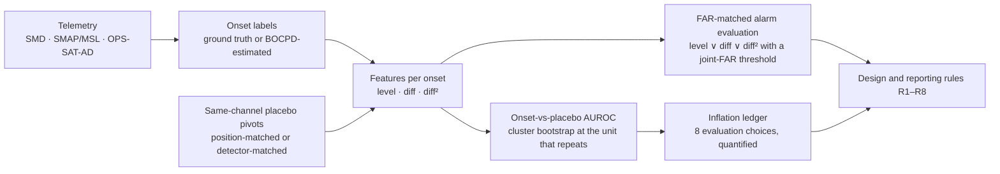
```mermaid
flowchart LR
    T["Telemetry<br/>SMD · SMAP/MSL · OPS-SAT-AD"] --> O["Onset labels<br/>ground truth or BOCPD-estimated"]
    O --> F["Features per onset<br/>level · diff · diff²"]
    P["Same-channel placebo pivots<br/>position-matched or detector-matched"] --> F
    F --> E["Onset-vs-placebo AUROC<br/>cluster bootstrap at the unit that repeats"]
    F --> A["FAR-matched alarm evaluation<br/>level ∨ diff ∨ diff² with a joint-FAR threshold"]
    E --> L["Inflation ledger<br/>8 evaluation choices, quantified"]
    A --> R["Design and reporting rules R1–R8"]
    L --> R
```

### 1.3 Results at a glance

**Q1: onset-versus-placebo AUROC** (cluster-bootstrap; chance = 0.5 = 10 blocks; each block = 0.05).

```text
                                         AUROC
SMD (28 machines, 327 events)
  level      ███████████░░░░░░░░░        0.534
  diff       ████████████░░░░░░░░        0.576
  diff²      ████████████░░░░░░░░        0.576

SMAP/MSL (81 channels, 88 windows)
  level      ███████████░░░░░░░░░        0.554
  diff       ██████████████░░░░░░        0.677
  diff²      █████████████░░░░░░░        0.642

OPS-SAT-AD, position-matched placebo (168 events)
  level      █████████░░░░░░░░░░░        0.438
  diff       ██████████████████░░        0.900
  diff²      ██████████████████░░        0.917

OPS-SAT-AD, detector-matched placebo (same detector for onsets and pivots)
  level      ████████░░░░░░░░░░░░        0.382   (direction-agnostic 0.618)
  diff       ███████████░░░░░░░░░        0.569
  diff²      ██████████████░░░░░░        0.720
```

**Q3: what the fused rule adds in SMD** (coverage gain of `level ∨ diff ∨ diff²` over `level`, joint placebo FAR calibrated; each block = 0.2 pp).

```text
FAR target   gain (pp)   95% CI          
0.5%         +0.2   █            [ 0.0, 0.6]
1%           +0.8   ████         [ 0.3, 1.4]
2%           +0.7   ████         [-0.1, 1.5]
5%           +1.2   ██████       [ 0.4, 2.0]
10%          +1.5   ████████     [-0.0, 3.2]
20%          +1.8   █████████    [ 0.4, 3.4]
```

**Q4: what evaluation choices do to an apparent advantage** (details: Table 26).

| Evaluation choice | Naive reading | Corrected reading |
|---|---|---|
| Placebo construction (OPS-SAT-AD) | `diff` 0.900 | `diff` 0.569 |
| Resampling unit (pooled `level`) | p = 0.004 | p = 0.244 |
| Interval width of the contrast | 0.099 | 0.311 (2.7 to 3.1 times wider) |
| Statistic definition (SMAP/MSL, SMD) | +0.122, +0.042 | +0.060, +0.010 |
| Tie handling (precedence baselines) | 44.2 / 56.5 / 72.7% | 36.9 / 34.8 / 32.1% |

### 1.4 Contributions

| # | Contribution | Serves | Where |
|---|---|---|---|
| **C1** | **An alarm-rule design procedure.** Add a dispersion channel, fuse with an OR rule, calibrate the threshold on the *joint* placebo FAR. Measured value: +1.2 pp coverage at 5% FAR in SMD, with no loss of discrimination from dropping `level`. | Q1–Q3 | Sections 5.2, 5.3, 5.7 |
| **C2** | **A dependence-aware validation protocol.** Unit-of-repeat cluster bootstrap, small-K tools (two-level, wild-cluster, exact sign-flip), matched placebo, FAR matching, tie audit, and an exact pooling-bias identity. | Q4 | Sections 5.4, 5.5, 5.8, 5.11 |
| **C3** | **Cross-domain generality evidence.** Three datasets that differ in platform, sensor physics, labeling protocol and onset provenance; two of the three use ground-truth onsets, which gives an estimator-free arm. | Q1, Q2 | Sections 3.1, 5.2, 5.6 |
| **C4** | **A reproducibility kit.** An independent from-scratch replica (4,996/4,996 rows, maximum relative error 1.8×10⁻¹⁵), a de-duplicated placebo pool, multi-seed grouped cross-validation, a row-level leakage positive control, and figure scripts that assert the sample sizes of their inputs. | all | Sections 5.1, 5.10, 9 |

### 1.5 Reading the features as monitoring statistics (SPC lens)

The features map onto familiar statistical-process-monitoring ideas. The mapping is an interpretive aid, not an equivalence.

| Monitoring concept | Classical counterpart | In this repo | Caveat |
|---|---|---|---|
| Location statistic | Shewhart-type chart on a standardized value | `level` (standardized level shift) | Direction can reverse: OPS-SAT-AD `level` AUROC is 0.438, so a direction-agnostic value is reported (Table 8). |
| Dispersion statistic on successive differences | Successive-difference variance and moving-range-type charts (von Neumann et al., 1941) | `diff`, `diff²`: onset-relative change of the first-difference series and of its square (effect = log-variance ratio, post- versus pre-pivot window) | Features are onset-relative window statistics, not sequential run statistics. |
| Several charts under one false-alarm budget | Multi-chart scheme with a combined false-alarm rate | OR fusion `level ∨ diff ∨ diff²`, threshold calibrated so the *joint* placebo FAR equals the target | Joint calibration matters: fixed abs(z) > 3 has placebo FAR of 27% to 46%. |
| In-control reference | Phase I calibration data | Same-channel placebo pivots on normal segments | The reference is a construction; its construction is audited (Table 13). |
| False-alarm control | In-control average run length (ARL₀) | Placebo false-alarm rate per pivot or window | **No ARL claim is made.** Converting FAR to ARL needs assumptions about autocorrelation and is out of scope (Section 7.3). |

### 1.6 Series map and scope

| This series | Repository | Role |
|---|---|---|
| **Paper 1 (this repo)**: which onset feature should trigger the alarm, and how far the evidence can be trusted | `opssat-ad-onset-signatures` | independent, no upstream dependencies |
| Paper 2: risk-aware alarm design (CVaR / conformal) | [`opssat-ad-risk-optimization`](https://github.com/USERNAME/opssat-ad-risk-optimization) | consumes `results/` artifacts of this repo |
| DSS prototype (not a paper) | [`opssat-ad-dss`](https://github.com/USERNAME/opssat-ad-dss) | consumes artifacts of both papers |

**Scope in one sentence.** This is a *feature-level* result and an *evaluation protocol*. It does not claim a detector that outperforms published detectors, does not identify a causal mechanism, and does not claim a general instrument-physics effect. Where a comparison is missing, it is listed in the roadmap (Section 7.3), not implied.

---

## 2. Quick start

### 2.1 Reader's map

| If you are... | Start here | Then |
|---|---|---|
| An alarm or reliability engineer | Section 6.3 (playbook, rules R1–R8), Fig. 6c | Table 16, Section 7.1 |
| A statistician checking the inference | Section 5.4 and 5.8, Fig. 3, Fig. 6b | Tables 10–12, 17–19, Section 4.4–4.5 |
| Someone reproducing the numbers | Section 9, Table 6 (consistency gate) | Section 10 (artifact index) |
| A reviewer looking for the weak points | Section 7.1 (limits and how each is bounded), Table 28 (claim ledger) | Section 7.2 (open items) |

### 2.2 Run it

```bash
git clone https://github.com/USERNAME/opssat-ad-onset-signatures
cd opssat-ad-onset-signatures
pip install -r requirements.txt          # or: conda env create -f environment.yml
bash data/download_opssat_ad.sh
bash data/download_smap_msl.sh
bash data/download_smd.sh
make all                                  # regenerates every figure and table
```

Full details, seeds and runtimes: Section 9 and `docs/REPRODUCIBILITY_CHECKLIST.md`.

### 2.3 Three artifacts to open first

| Artifact | What it shows | Question |
|---|---|---|
| `results/figures/fig06_cross_dataset_placebo.png` (Fig. 6) | Every Δ AUROC with its cluster-bootstrap interval, across datasets and resampling schemes | Q1 |
| `results/figures/fig06c_coverage_vs_far.png` (Fig. 6c) | Coverage against false-alarm rate, and the fused-minus-`level` gain | Q3 |
| Table 26 (Section 6.2) | Eight evaluation choices, the naive number and the corrected number | Q4 |

---

## 3. Data and scope

### 3.1 Datasets and the role each plays

**Table 1. Datasets, role in this repo, onset provenance and cluster units.**

| Dataset | Role here | Content | Onset source | Cluster unit (K) |
|---|---|---|---|---|
| **SMD** | Anchor for operating value: largest sample, FAR-matchable, 28 clusters | Industrial server telemetry; 28 machines × 38 dimensions = 1,064 channels; 327 events; 11,493 window-level pairs (events replicated across dimensions) | Ground-truth timestep-level 0/1 labels | machine (28) |
| **SMAP/MSL** | Second ground-truth replication | NASA telemetry; 82 channels (55 SMAP, 27 MSL); 105 labeled windows, 88 after triviality filtering; window length median 120, mean 616, max 4,217 samples | Ground-truth onset indices (`labeled_anomalies.csv`) | channel (81) |
| **OPS-SAT-AD** | Small-K stress test with detector-selected onsets; the case study for the inflation ledger | ESA OPS-SAT nanosatellite; 9 channels (3 magnetometer, 6 photodiode); 2,123 expert-labeled univariate segments; 5 channels in scope hold 386 anomalous segments | BOCPD on Kalman-filter innovations; canonical onset = median of 200 Monte Carlo draws | segment (1,163) and channel (5) |

OPS-SAT-AD labels are at segment level; onset position within a segment is estimated by BOCPD. Segment boundaries were set by manual expert annotation with ESA's OXI tool. An official train/test partition (`train ∈ {0,1}`, ≈75%/25%) supports train-fit/test-evaluate verification. In SMAP/MSL only the first (telemetry) column of each `.npy` file enters `diff`/`diff²`; the remaining one-hot command columns are excluded. Windows whose values exceed 20 nominal SDs are excluded from the primary test (17 of 105 windows). Datasets are not redistributed; `data/download_*.sh` fetches each public release.

> [!NOTE]
> Triviality filtering in SMAP/MSL follows the concern of Wu and Keogh (2021) that common benchmarks contain trivial or ill-defined labels. It is a hygiene step, not a claim about the benchmarks' overall quality.

### 3.2 Sample accounting: which n belongs to which claim

**Table 2. Sample accounting.**

| Quantity | Value |
|---|---|
| OPS-SAT-AD segments / anomalous in scope | 2,123 / 386 |
| Scoreable → high-or-medium → complete-case | 178 → 177 → 168 |
| Placebo pool, raw / de-duplicated | 4,980 / 3,951 rows (20.7% duplicated) |
| Pooled complete-case rows (168 anomalous + 3,823 de-duplicated placebo) | 3,991 |
| 16-model tabular dataset (168 positive + 4,828 raw placebo) | 4,996 rows |
| Sequence windows, before / after de-duplication | 2,733 / 2,505 |
| SMAP/MSL: cluster-robust AUROC (Table 7) / channel-level `level_prez` (Table 15) / FAR-matched (Table 16) | 88 windows / 68 channels / 56 windows |
| SMD events / window-level pairs / FAR-matched anomalous windows | 327 / 11,493 / 8,421 |
| SMD channels: total / channel-level breadth test (Fig. 6b) | 1,064 / 1,038 (reason to be stated: open item O1) |

Each analysis uses the subset for which its inputs are defined; the full accounting is in `results/partE_n_accounting.csv`.

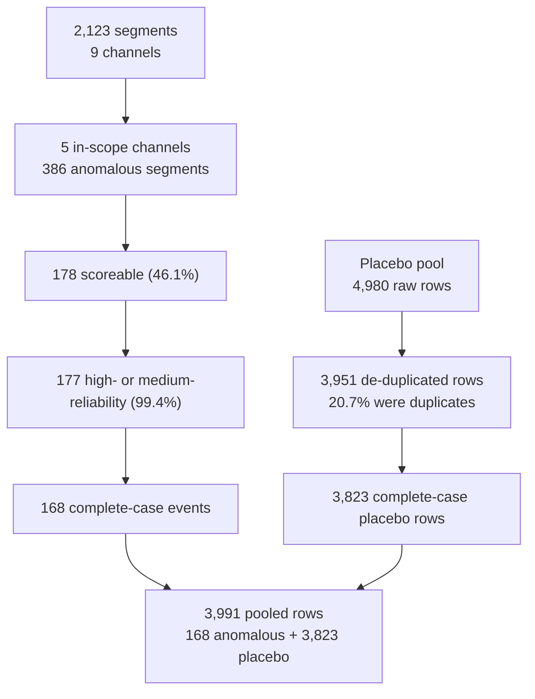
```mermaid
flowchart TD
    S["2,123 segments<br/>9 channels"] --> I["5 in-scope channels<br/>386 anomalous segments"]
    I --> C["178 scoreable (46.1%)"]
    C --> H["177 high- or medium-reliability (99.4%)"]
    H --> K["168 complete-case events"]
    N["Placebo pool<br/>4,980 raw rows"] --> D["3,951 de-duplicated rows<br/>20.7% were duplicates"]
    D --> Q["3,823 complete-case placebo rows"]
    K --> M["3,991 pooled rows<br/>168 anomalous + 3,823 placebo"]
    Q --> M
```

### 3.3 OPS-SAT-AD channel scope: 9 → 5

Exclusion criteria are applied in order: structural (zero anomalous segments), underpowered (fewer than 5 anomalous or fewer than 5 nominal segments), chance-level (MCC ≤ 0). The rule is conservative by construction: CADC0890 has the highest point-estimate MCC (0.83) and is still excluded, for having only 3 nominal segments.

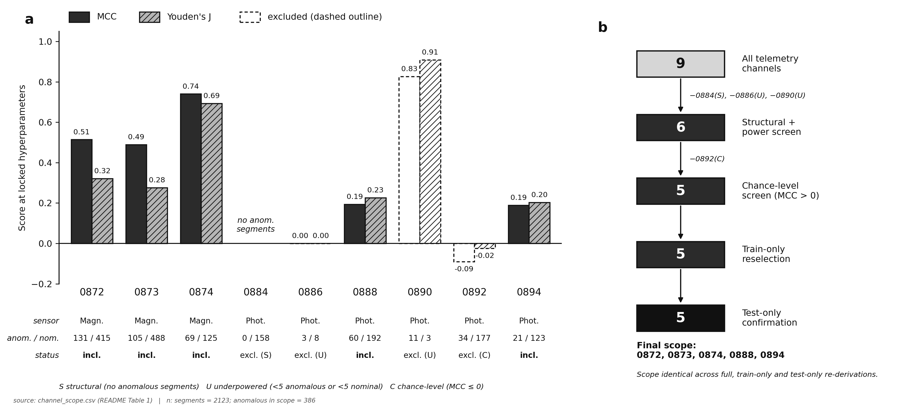

*Fig. 1. (a) MCC and Youden's J at locked BOCPD hyperparameters; dashed outlines mark excluded channels (S structural, U underpowered, C chance-level). (b) Screening funnel 9 → 6 → 5 → 5 → 5. The final scope (CADC0872, 0873, 0874, 0888, 0894) is identical in full-data, train-only and test-only re-derivations.*

**Table 3. Layer-2 channel scoping (locked hyperparameters).**

| Channel | Sensor | Anomalous / nominal | Segments | Prevalence | MCC | Youden's J | Status |
|---|---|---|---|---|---|---|---|
| CADC0872 | Magn. | 131 / 415 | 546 | 24.0% | 0.51 | 0.32 | included |
| CADC0873 | Magn. | 105 / 488 | 593 | 17.7% | 0.49 | 0.28 | included |
| CADC0874 | Magn. | 69 / 125 | 194 | 35.6% | 0.74 | 0.69 | included |
| CADC0884 | Phot. | 0 / 158 | 158 | 0.0% | n/a | n/a | excluded (S) |
| CADC0886 | Phot. | 3 / 8 | 11 | 27.3% | 0.00 | 0.00 | excluded (U) |
| CADC0888 | Phot. | 60 / 192 | 252 | 23.8% | 0.19 | 0.23 | included |
| CADC0890 | Phot. | 11 / 3 | 14 | 78.6% | 0.83 | 0.91 | excluded (U) |
| CADC0892 | Phot. | 34 / 177 | 211 | 16.1% | −0.09 | −0.02 | excluded (C) |
| CADC0894 | Phot. | 21 / 123 | 144 | 14.6% | 0.19 | 0.20 | included |

The five in-scope channels hold 386 anomalous segments (131 + 105 + 69 + 60 + 21) out of 2,123 segments in total.

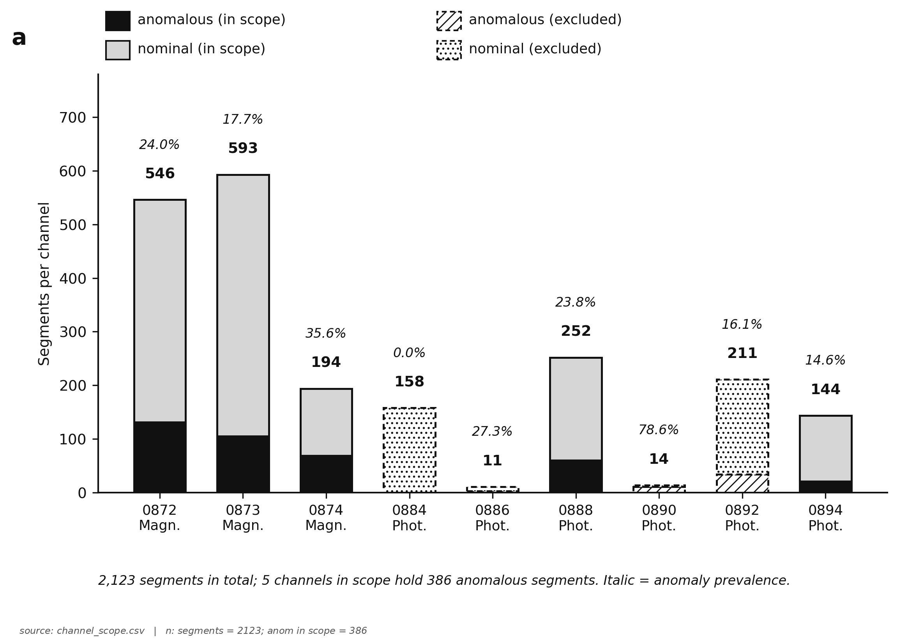

*Fig. 5. Segments per channel, split into anomalous and nominal, with anomaly prevalence in italics (2,123 segments; 386 anomalous in scope). Hatched and dotted outlines mark excluded channels. (The file name is kept for path stability; the precedence figure is Fig. 7.)*

<details>
<summary><b>Channel typing (OPS-SAT-AD): rule and Table 4</b></summary>

Channels are typed from the distribution of first differences Δ within nominal segments: `quantized` if the fraction of exact-zero Δ is at least 0.10 (step = 25th percentile of non-zero |Δ|); `float_noise_suspect` if not quantized and the smallest non-zero |Δ| is below 1×10⁻⁶; `continuous` otherwise. Thresholds are re-fitted, not reused, on SMAP/MSL and SMD.

**Table 4. Channel typing.**

| Channel | Sensor | Type | frac_zero_diff | Quantization step |
|---|---|---|---|---|
| CADC0872 | magnetometer | float_noise_suspect | 0.053 | n/a |
| CADC0873 | magnetometer | float_noise_suspect | 0.052 | n/a |
| CADC0874 | magnetometer | float_noise_suspect | 0.044 | n/a |
| CADC0884 | photodiode | quantized | 0.183 | ≈0.0144 |
| CADC0886 | photodiode | quantized | 0.371 | ≈0.0274 |
| CADC0888 | photodiode | quantized | 0.354 | ≈0.0144 |
| CADC0890 | photodiode | continuous | 0.083 | n/a |
| CADC0892 | photodiode | quantized | 0.416 | ≈0.0054 |
| CADC0894 | photodiode | quantized | 0.583 | ≈0.0026 |

Channel type maps one-to-one onto sensor family in this dataset; both are also aliased with detector-selection retention (Section 5.9).

</details>

### 3.4 Onset front end and the scoreable subset (OPS-SAT-AD)

A local-linear-trend Kalman filter absorbs a persistent mean shift into its state within a few samples and leaves a short-lived transient in the innovations, so BOCPD on the innovations is a transient-sensitive front end. It yields a scoreable window for 178 of 386 anomalous segments (46.1%): 176 high-reliability, 1 medium and 1 low (177/178 = 99.4% high-or-medium). Nine of the 177 have a non-positive pre- or post-window variance in the `diff` windows (CADC0873: 1, CADC0888: 3, CADC0894: 5), leaving **168 complete-case events** (CADC0872: 41, 0873: 28, 0874: 50, 0888: 33, 0894: 16).

> [!IMPORTANT]
> Anomalous onsets are detector-selected, whereas the default placebo pivots are position-matched resamples on normal segments. That asymmetry is exactly what inflates the OPS-SAT-AD numbers. The detector-matched placebo (Section 5.5) removes it, and the resulting shrinkage is reported as an inflation term rather than hidden.

---
## 4. Methods

This section is a map from *method* to *module* to *output*. Full derivations are in `docs/METHODS_SUPPLEMENT.md`.

### 4.1 Pipeline map

| Stage | What it does | Module | Main output | Serves |
|---|---|---|---|---|
| Layer 1 | Signal estimation: channel typing, noise estimation, Kalman filter, shrinkage | `layer1_signal_estimation/` | standardized innovations z_t | onset front end |
| Layer 2 | Onset estimation (BOCPD) and channel scoping | `layer2_anomaly_detection/` | onset candidates, 9 → 5 channel scope | onset front end |
| Layer 3 | Signature analysis: Monte Carlo onsets, placebo tests, heterogeneity, LOO | `layer3_signature_analysis/` | effect sizes, placebo comparison (Table 21) | Q1 |
| Robustness re-analysis | Cluster-robust AUROC, small-K resampling, FAR matching, detector-matched placebo, tie audit, definition sensitivity, synthetic studies | `care_protocol_v8.py`, `run_pending_analyses.py`, `ress_followup_v6.py`, `ress_priority_analyses_v5.py` | Tables 7–20 | Q1–Q4 |
| Classifier-side check | 16-model cross-validation with attribution | `model_cross_validation/` | Table 23, Fig. 2 | Q2 |
| External validation | SMAP/MSL and SMD with ground-truth onsets | `external_validation/` | Tables 14, 24, 25 | Q1, Q3 |

### 4.2 Features and effect definitions

`level`, `diff` and `diff²` are onset-relative statistics computed on windows before and after a pivot. For each anomalous onset (or placebo pivot) the effect is |*d*| (Cohen's d) for `level` and the log-variance ratio between post- and pre-pivot windows for `diff` and `diff²`. Two hundred onset candidates per segment (seed 42) propagate onset uncertainty on OPS-SAT-AD; the canonical onset is the median draw and defines the pre/post split.

### 4.3 Layers 1 and 2: the OPS-SAT-AD onset front end

Observation and process noise are estimated from pooled nominal-segment differences as r = Var(Δ)/2 and q = Var(Δ²)/6. For quantized channels, step²/12 is added to the observation-noise variance. Efron–Morris-type empirical-Bayes shrinkage stabilizes channels with very few nominal points (CADC0886: n = 8; CADC0890: n = 3). A Gaussian-mixture noise alternative did not improve train macro-MCC and the simple estimator was retained. A local-linear-trend Kalman filter is fitted per channel using the shrunk (r, q); standardized innovations z_t = (y_t − ŷ_t)/√S_t are the sole input to Layer 2.

BOCPD (Adams and MacKay, 2007) runs on z_t with a Normal-Inverse-Gamma conjugate predictive model, hazard rate 1/250 and a forgetting extension (κ_max = 40). The 2×2 ablation (mixture × forgetting) was evaluated on train macro-MCC over the six scoring channels; train-only reselection reproduces the locked combination.

**Table 5. Layer-2 ablation (train macro-MCC, 6 scoring channels).**

| Mixture | Forgetting | Train macro-MCC |
|---|---|---|
| False | True (**locked**) | **0.308** |
| True | True | 0.275 |
| False | False | 0.238 |
| True | False | 0.199 |

The five-channel scope was re-derived by bootstrap CI, by train-fit/test-evaluate and by test-only bootstrap CI; all three agree (Fig. 1b). Problem-channel diagnosis for CADC0890/0892/0894 rejected a BOCPD forgetting deficiency; a noise-model deficiency is supported for CADC0890/0894 under the mixture estimator; CADC0892 is explained by neither (steady-state kurtosis 63.32 drives spurious resets). This localizes detector-tuning difficulty to channel-specific noise modeling, separately from the feature-choice question.

### 4.4 Cluster-robust AUROC (Q1, Q2)

Each dataset's onset-versus-placebo separation is re-estimated as an AUROC with a cluster bootstrap (1,000 resamples) at the unit that repeats: segment (OPS-SAT-AD), channel (SMAP/MSL), machine (SMD; channel-level as a secondary check). Paired contrasts Δ(diff − level) and Δ(diff² − level) share resamples. Because `level` falls below 0.5 in OPS-SAT-AD, a direction-agnostic variant scores `level` as max(AUC, 1 − AUC). The incremental value of `level` is measured by an out-of-fold, group-held-out logistic model on `[level, diff, diff²]` versus `[diff, diff²]`.

### 4.5 Small-K resampling (Q4)

For OPS-SAT-AD (K = 5 channels) the two contrasts are re-estimated under a two-level bootstrap (channel > segment), wild-cluster bootstrap with Webb six-point and Rademacher weights (Webb, 2014; Cameron, Gelbach and Miller, 2008), and exact sign-flip enumeration (2⁵ = 32 patterns), plus leave-one-channel-out fits. With K = 5 no exact test can reject at 0.05 (the smallest attainable two-sided p is 2/2⁵ = 0.0625), so K = 5 intervals are read as direction and magnitude.

### 4.6 Detector-matched placebo (Q4)

The stage-2 detector is run on the 996 normal segments (`partC_normal_segments_for_stage2.csv`); its detected resets serve as placebo pivots, so anomalous onsets and placebo pivots are produced by the same detector. Normal-segment detection rates and anomalous retention are reported per channel.

### 4.7 FAR-matched alarm evaluation (Q3)

For each feature, the alarm threshold is calibrated to a target placebo false-alarm rate on the grid 0.5%, 1%, 2%, 5%, 10%, 20% (pre-specified: 1% and 5%). The fusion rule `level ∨ diff ∨ diff²` is calibrated so that the *joint* placebo FAR equals the target. Coverage is the fraction of anomalous windows alarmed; paired contrasts against `level` use cluster-bootstrap intervals (machine for SMD, channel for SMAP/MSL). Fixed abs(z) > 3 operating points are reported with their measured FAR.

### 4.8 The audit sequence

Every headline statistic passes through the same eight checks.

| # | Check | Result lives in |
|---|---|---|
| i | Independent from-scratch replica of the data pipeline | Table 6 |
| ii | Resampling at the higher (cluster) level | Tables 10, 12, 17 |
| iii | FAR matching over an extended grid | Table 16 |
| iv | Detector-matched placebo | Table 13 |
| v | Tie-handling audit of the precedence criterion | Tables 24, 25 |
| vi | Duplicate-pool and leakage audit | Sections 5.1, 5.10 |
| vii | Statistic-definition sensitivity | Table 15 |
| viii | Synthetic existence proof | Tables 17–19 |

### 4.9 External validation protocol

Stage 0 applies command-column exclusion, per-dataset channel re-typing, triviality filtering and a sample-size-matched design (SMAP/MSL has a median of 1 window per channel, maximum 3, so dataset-pooled and type-stratified tests are primary). Multiple comparisons use Benjamini–Hochberg FDR (1995) with a confirmatory family (dataset-pooled, 3 tests) and an exploratory family (channel-type-stratified). Stage 2 uses ground-truth onsets with an adaptive, non-sliding post-onset search window; a 150 to 5,000-sample sweep showed that the window's upper bound does not induce censoring bias (n = 40 → 41).

### 4.10 Synthetic studies

*Coverage (K = 5, 500 replications):* single-level, two-level and wild-cluster intervals against the size-weighted and channel-mean estimands. *Pooling bias (300 replications per row; K = 8, 500 replications for the endogenous-size design):* the exact pair-decomposition identity pooled AUROC = [Σₖ n₁ₖn₀ₖ·AUCₖ + cross-cluster pair terms] / (N₁N₀), and simulated bias for size–effect correlation ρ ∈ {−0.8, −0.4, 0, 0.4, 0.8}. *K-sensitivity:* interval widths on SMD machine subsets.

### 4.11 Classifier-side cross-validation

Sixteen architecturally diverse models solve the binary task canonical-onset segments versus resampled placebo pivots (4,996 tabular rows; 2,733 sequence windows, 2,505 after de-duplication). Ten tabular models use the three engineered features (SHAP or permutation attribution): LogReg (L2, L1), GaussianNB, kNN, SVM (RBF), RandomForest, ExtraTrees, GradBoost, XGBoost, LightGBM. Six sequence models use per-window z-normalized three-channel series (Integrated Gradients): CNN1D, TCN, BiLSTM, BiGRU, TinyTransformer, LightMamba. A seventeenth model (MLP_shallow, AUC 0.403) was removed by the fit-quality screen. Shares are normalized within each model and compared by rank and by the 1/3 uniform reference.

### 4.12 Precedence and ties (a calibration control, not a mechanism claim)

Temporal precedence records the first post-onset abs(z) > 3 crossing per series. Crossing times are integer sample indices, so simultaneous crossings (t_level = t_diff) are frequent. The primary analysis excludes ties; sensitivity analyses score ties as 0.5 and as `diff`-first (the original convention). Intervals are cluster bootstraps (SMAP/MSL: channel, K = 63; SMD: machine, K = 28; OPS-SAT-AD: canonical pairs treated as independent, K = 237). Synthetic AR(1) series calibrate what a pure level shift produces under the criterion.

---

## 5. Results

Each subsection states the question it serves, what to look at, and how to read it.

### 5.1 Pipeline integrity gate

*Serves: all questions. Look at: the exact-match rows.*

**Table 6. Consistency gate (OPS-SAT-AD).**

| Check | Result |
|---|---|
| Replica vs saved 16-model dataset (4,996 rows) | exact row-for-row match; max relative error 1.8×10⁻¹⁵ |
| Replica vs saved canonical effect values (168 events) | max relative error 7.8×10⁻¹⁵ |
| Replica placebo pool (raw / de-duplicated) | 4,980 / 3,951 rows; matches reported counts |
| Replica re-test of the placebo-pool comparison | same significance pattern in all 15 channel × feature cells |
| Attrition funnel | 386 → 178 scoreable (46.1%) → 177 high-or-medium (99.4%) → 168 complete-case |
| Channel-level retention (scoreable / anomalous) | CADC0872 32.1% (42/131), CADC0873 27.6% (29/105), CADC0874 72.5% (50/69), CADC0888 60.0% (36/60), CADC0894 100.0% (21/21) |
| Pooled AUROC (complete-case n = 3,991) | level 0.438, diff 0.900, diff² 0.917 |
| Stratified-by-channel AUROC (Simpson check) | level 0.434, diff 0.908, diff² 0.937; no material distortion |
| Monte Carlo median vs canonical onset (level AUROC, per channel) | 0.463 vs 0.468, 0.276 vs 0.289, 0.468 vs 0.470, 0.424 vs 0.454, 0.558 vs 0.574 (raw-pool denominators); the Monte Carlo median is not the source of the `level` reversal |

**Read as:** the exact match rules out a class of end-to-end pipeline bugs (onset-index mismatch, feature-definition drift, placebo-pool corruption) as an explanation for any result below. The three magnetometer channels, which carry the strongest derivative signature, have the lowest retention for CADC0872/0873 (27.6% to 32.1%; CADC0874 is 72.5%), so instrument type is aliased with detector selectivity.

### 5.2 Q1, direction: derivative features separate onsets from placebo in 3/3 datasets

*Look at: the sign of every square and diamond in Fig. 6a, and how far each interval sits from 0.*

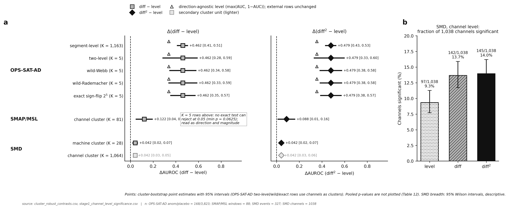

*Fig. 6. (a) Δ AUROC(diff − level) and Δ AUROC(diff² − level) with 95% cluster-bootstrap intervals. OPS-SAT-AD rows compare resampling schemes (segment, two-level, wild-Webb, wild-Rademacher, exact sign-flip 2⁵); triangles mark the direction-agnostic `level` variant. The K = 5 rows are read as direction and magnitude because no exact test can reject at 0.05 (minimum p = 0.0625). (b) SMD channel-level breadth: fraction of 1,038 channels significant per feature (Wilson 95% intervals, descriptive). Pooled p-values are not plotted (Table 14).*

**Table 7. Cluster-robust AUROC and paired contrasts (95% cluster-bootstrap CI; OPS-SAT-AD against the position-matched placebo).**

| Dataset | Cluster unit (K) | AUROC `level` | AUROC `diff` | AUROC `diff²` | Δ(diff − level) | Δ(diff² − level) |
|---|---|---|---|---|---|---|
| SMD | machine (28; 327 events) | 0.534 [0.521, 0.546] | 0.576 [0.553, 0.599] | 0.576 [0.554, 0.597] | **+0.042 [0.016, 0.066]** | **+0.042 [0.017, 0.066]** |
| SMD (reference) | channel (1,064; 327 events) | 0.534 [0.523, 0.546] | 0.576 [0.566, 0.585] | 0.576 [0.566, 0.585] | +0.042 [0.028, 0.054] | +0.042 [0.028, 0.055] |
| SMAP/MSL | channel (81; 88 windows) | 0.554 [0.497, 0.608] | 0.677 [0.600, 0.746] | 0.642 [0.568, 0.713] | **+0.122 [0.045, 0.196]** | **+0.088 [0.008, 0.164]** |
| OPS-SAT-AD | segment (1,163; 168 events) | 0.438 [0.401, 0.477] | 0.900 [0.875, 0.924] | 0.917 [0.890, 0.943] | **+0.462 [0.409, 0.508]** | **+0.479 [0.427, 0.527]** |

**Read as:** the contrast is positive in every row and its size follows the dataset: large in OPS-SAT-AD, moderate in SMAP/MSL, small in SMD. SMAP/MSL and SMD use ground-truth onsets, so the direction does not depend on an onset estimator. Because `level` lies below 0.5 in OPS-SAT-AD, the direction-agnostic contrast (Table 8) removes the part of +0.462 that arises from the reversed direction.

**Table 8. Direction-agnostic variant.**

| Dataset | `level`, direction-agnostic | Δ(diff − level) | Δ(diff² − level) |
|---|---|---|---|
| SMD | 0.534 (unchanged) | +0.042 | +0.042 |
| SMAP/MSL | 0.554 (unchanged) | +0.122 | +0.088 |
| OPS-SAT-AD | 0.562 [0.523, 0.599] | **+0.338** | **+0.355** |

**Breadth in SMD.** At channel level, 97/1,038 channels (9.3%; Wilson 95% 7.7% to 11.3%) are significant for `level`, 142/1,038 (13.7%; 11.7% to 15.9%) for `diff` and 145/1,038 (14.0%; 12.0% to 16.2%) for `diff²`: the derivative features flag about 1.5 times as many channels.

### 5.3 Q2, sufficiency: `level` adds no incremental discrimination

*Look at: every Δ AUROC is at or below zero.*

**Table 9. Incremental value of `level` (out-of-fold AUROC, `[level, diff, diff²]` minus `[diff, diff²]`).**

| Dataset | Δ AUROC | 95% CI | p (cluster bootstrap) |
|---|---|---|---|
| SMD (machine) | −0.0009 | [−0.0143, 0.0129] | 0.93 |
| SMAP/MSL (channel) | −0.0068 | [−0.0381, 0.0241] | 0.70 |
| OPS-SAT-AD (segment) | −0.0007 | [−0.0014, −0.0001] | 0.03 |

**Read as:** `level` contributes no positive incremental discrimination in any dataset; the OPS-SAT-AD change (|Δ| < 0.001) is negligible in size. In design terms: an alarm feature set built on derivative-variance channels loses nothing in discrimination relative to one that also includes `level`.

### 5.4 Q4, small K: what survives when the channel is the unit

*Look at: Fig. 3a (channel-level `level` AUROCs), the bottom half of Fig. 3a (pooled interval by scheme), and Fig. 3b (slice replication).*

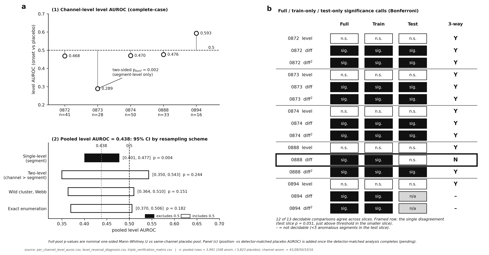

*Fig. 3. (a) Channel-level `level` AUROC (complete-case) and pooled AUROC 0.438 with 95% intervals under four resampling schemes. (b) Full / train-only / test-only significance calls (Bonferroni): 12 of 13 decidable calls agree; the single disagreement (CADC0888 `diff`, test-slice p = 0.051) is a monotone power loss. (c) Position-matched (open circle) versus detector-matched (filled, 95% CI) placebo; normal-segment detection rate / anomalous retention: 0872 18%/31%, 0873 22%/28%, 0874 30%/72%, 0888 99%/60%, 0894 88%/100%. The detector was run on the 996 normal segments used as placebo; detected resets are pivots (Section 5.5).*

**Table 10. Δ AUROC under alternative resampling schemes (OPS-SAT-AD, position-matched placebo).**

| Scheme | Unit (K) | Δ(diff − level) [95% CI] | Δ(diff² − level) [95% CI] |
|---|---|---|---|
| Point estimate | n/a | +0.462 | +0.479 |
| Single-level bootstrap | segment (1,163) | [0.409, 0.508] | [0.427, 0.527] |
| Two-level bootstrap | channel > segment (5) | [0.282, 0.593] | [0.327, 0.600] |
| Wild cluster, Webb 6-point | channel (5) | [0.342, 0.582] | [0.379, 0.578] |
| Wild cluster, Rademacher | channel (5) | [0.334, 0.590] | [0.380, 0.578] |
| Exact sign-flip enumeration (2⁵ = 32) | channel (5) | [0.350, 0.574] | [0.384, 0.574] |

Single-level interval widths are 0.099 (`diff`) and 0.100 (`diff²`); two-level widths are 0.311 and 0.273 (2.7 to 3.1 times wider). **Both contrasts keep their sign and size under every scheme.** Leave-one-channel-out fits preserve the sign as well:

**Table 11. Leave-one-channel-out (OPS-SAT-AD).**

| Channel dropped | AUROC `level` | Δ(diff − level) | Δ(diff² − level) |
|---|---|---|---|
| none (full) | 0.438 | 0.462 | 0.479 |
| CADC0872 | 0.426 | 0.448 | 0.476 |
| CADC0873 | 0.486 | 0.390 | 0.417 |
| CADC0874 | 0.437 | 0.475 | 0.489 |
| CADC0888 | 0.433 | 0.495 | 0.494 |
| CADC0894 | 0.415 | 0.490 | 0.513 |

Pooled `level` moves toward 0.5 only when CADC0873 is removed.

**Table 12. Pooled `level` AUROC (0.438) under the same schemes.**

| Scheme | 95% CI | p vs 0.5 | Excludes 0.5 |
|---|---|---|---|
| Single-level (segment) | [0.401, 0.477] | 0.004 | yes |
| Two-level (channel > segment) | [0.350, 0.543] | 0.244 | no |
| Wild cluster, Webb | [0.364, 0.510] | 0.151 | no |
| Exact enumeration | [0.370, 0.506] | 0.182 | no |

**Read as:** the derivative-over-level contrast is robust to the resampling unit; the pooled `level` reversal is not. It is significant only when segments are treated as the independent unit, and is indistinguishable from chance under channel-level resampling. Channel-level `level` AUROCs are 0.468, 0.289, 0.470, 0.476 and 0.593 for CADC0872, 0873, 0874, 0888 and 0894 (n = 41, 28, 50, 33, 16). The within-channel CADC0873 value (0.289; two-sided p_bonf = 0.002) rests on segment clusters inside one channel. `level` in OPS-SAT-AD is therefore read as **inconclusive**, neither for nor against discrimination.

### 5.5 Q4, the reference: detector-matched placebo and selection inflation

*Look at: Fig. 3c. Open circles are the position-matched placebo values; filled markers with intervals are detector-matched.*

**Table 13. Onset-versus-placebo AUROC by placebo type (OPS-SAT-AD, pooled).**

| Feature | Position-matched | Detector-matched (95% CI) |
|---|---|---|
| `level` | 0.438 | 0.382 [0.327, 0.441]; direction-agnostic 0.618 |
| `diff` | 0.900 | **0.569 [0.518, 0.626]** |
| `diff²` | 0.917 | **0.720 [0.675, 0.769]** |

Per channel, `diff` under the detector-matched placebo falls to 0.136 in CADC0888 and 0.314 in CADC0894 (Fig. 3c). Detector-matched placebo counts are 254 pivots.

**Read as:**

- Both derivative features stay above 0.5 against a detector-produced reference (`diff` [0.518, 0.626], `diff²` [0.675, 0.769]); the magnitude is much smaller than the position-matched value.
- `diff²` remains above the direction-agnostic `level` (0.720 versus 0.618); `diff` does not (0.569 versus 0.618).
- OPS-SAT-AD is therefore treated as a **case study whose magnitude is detector-conditioned**, and the selection-conditioned difference enters the ledger as an inflation term (Table 26). Detector-matched intervals are segment-level, so between-channel uncertainty is not reflected in this table (Section 7.1).

### 5.6 Q1 (external), replication and the definition of `level`

*Look at: how the pooled nominal tests compare with the calibrated cluster intervals of Table 7, and how much of the external `diff` advantage is definitional.*

**Table 14. Placebo-pool comparison across datasets (pooled p-values are nominal one-sided tests; windows are nested in channels and machines, so Table 7 is the calibrated comparison).**

| Dataset | Scope | `level` | `diff` | `diff²` |
|---|---|---|---|---|
| SMD | dataset-pooled (11,493 windows ≈ 327 events × ≤ 38 dimensions) | p_fdr = 8×10⁻³⁸ | p_fdr = 3.7×10⁻¹⁶⁷ | p_fdr = 1.4×10⁻¹⁶⁶ |
| SMAP/MSL | dataset-pooled (88 windows) | p_fdr = 0.031 | p_fdr = 4.7×10⁻⁹ | p_fdr = 1.3×10⁻⁶ |
| OPS-SAT-AD | channel-level (n = 5) | 0/5 significant | 5/5 (all p < 2×10⁻⁴) | 5/5 (all p < 2×10⁻⁴) |

Outside OPS-SAT-AD, `level` carries a small component above placebo in the pooled test. In SMAP/MSL its channel-cluster interval includes 0.5 (0.554 [0.497, 0.608]), so the component is weak there; it is small but reliable in SMD (0.534 [0.521, 0.546]). Among channel types, SMAP/MSL `continuous` channels show `level` n.s. (p_fdr = 0.35) with `diff`/`diff²` significant, the OPS-SAT-AD pattern; `quantized` channels show `level` weakly significant. `float_noise_suspect` cannot be tested in SMAP/MSL (1 of 82 channels, 3 windows) and shows no significant effect for any feature in SMD (162 windows across 17 channels), so the instrument-type moderator is untestable externally.

**Table 15. Statistic-definition sensitivity: `level` with pooled-SD versus pre-onset-SD denominator (`level_prez`).**

| Dataset | Increase in `level` AUROC with `level_prez` | Δ(diff − level), pooled SD | Δ(diff − level_prez) | p |
|---|---|---|---|---|
| SMD | +0.035 | +0.042 | +0.010 | 0.50 |
| SMAP/MSL (68 channels) | +0.080 | +0.122 | +0.060 | 0.22 |
| OPS-SAT-AD | not an explanation for the reversal | +0.462 | +0.447 | ≤ 0.002 |

**Read as:** part of the external `diff` advantage is definitional. When `level` is standardized by the pre-onset SD, as `diff` effectively is, the two features are not distinguishable externally. Together with Table 9, this frames the derivative features as **complementary and sufficient**, not as uniformly superior. That is the claim the repo makes and the one the evidence supports.

### 5.7 Q3, operating value at a matched false-alarm rate

*Look at: Fig. 6c panels (a, c) for SMD. Panels (b, d) show a 56-window sample whose gain changes sign across targets.*

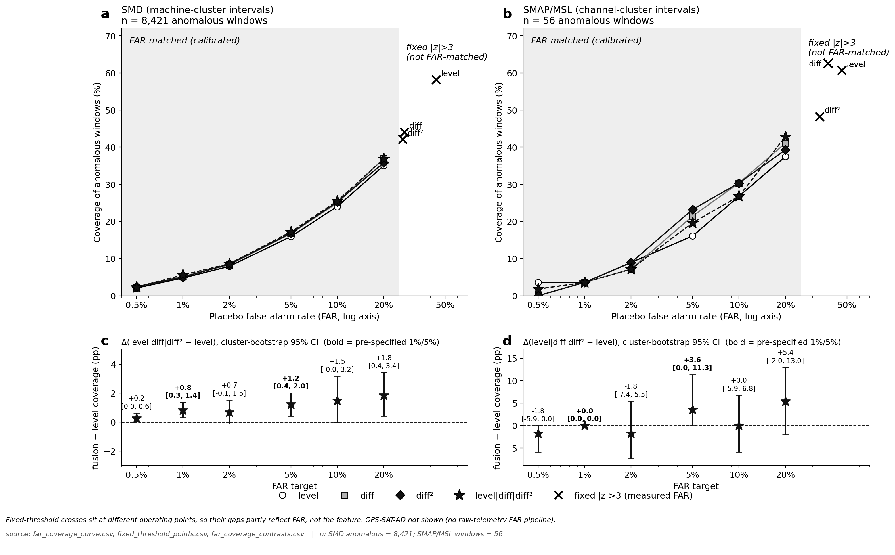

*Fig. 6c. (a, b) Coverage of anomalous windows against placebo FAR (log axis) for `level`, `diff`, `diff²` and the fusion rule `level ∨ diff ∨ diff²`; the shaded region is FAR-matched (calibrated), crosses are fixed abs(z) > 3 at their measured FAR. (c, d) Fusion-minus-`level` coverage with cluster-bootstrap 95% intervals; bold marks the pre-specified 1% and 5% targets. SMD: n = 8,421 anomalous windows, machine clusters. SMAP/MSL: n = 56 windows, channel clusters. OPS-SAT-AD is not shown (no raw-telemetry FAR pipeline).*

**Table 16. Fusion-minus-`level` coverage (percentage points; cluster-bootstrap 95% CI).**

| FAR target | SMD (n = 8,421; machine clusters) | SMAP/MSL (n = 56; channel clusters) |
|---|---|---|
| 0.5% | +0.2 [0.0, 0.6] | −1.8 [−5.9, 0.0] |
| **1%** | **+0.8 [0.3, 1.4]** | **+0.0 [0.0, 0.0]** |
| 2% | +0.7 [−0.1, 1.5] | −1.8 [−7.4, 5.5] |
| **5%** | **+1.2 [0.4, 2.0]** | **+3.6 [0.0, 11.3]** |
| 10% | +1.5 [−0.0, 3.2] | +0.0 [−5.9, 6.8] |
| 20% | +1.8 [0.4, 3.4] | +5.4 [−2.0, 13.0] |

**Read as:**

- In SMD, coverage at 5% FAR rises from 15.9% (`level`) to 17.2% (fusion), a gain of +1.2 pp. The gain is positive at all six targets (+0.25 to +1.84 pp) with intervals excluding zero at four of six (0.5%, 1%, 5%, 20%; the 0.5% lower bound rounds to 0.0). The gain is modest, and the repo reports it as modest.
- In the 56-window SMAP/MSL sample the sign of the gain changes across targets, so that sample does not rank fusion against single-derivative rules.

> [!IMPORTANT]
> Fixed abs(z) > 3 has a placebo false-alarm rate of 46.4% (`level`) and 37.8% (`diff`) in SMAP/MSL and 43.7% and 27.2% in SMD. The crosses in Fig. 6c sit at different operating points, so their gaps partly reflect FAR, not the feature. Compare features only at matched FAR.

### 5.8 Q4, the estimand decides the resampling unit; pooling can bias

*Look at: Fig. 6b(a), where only one procedure falls well below the nominal band, and Fig. 6b(b), where only the pooled estimate moves.*

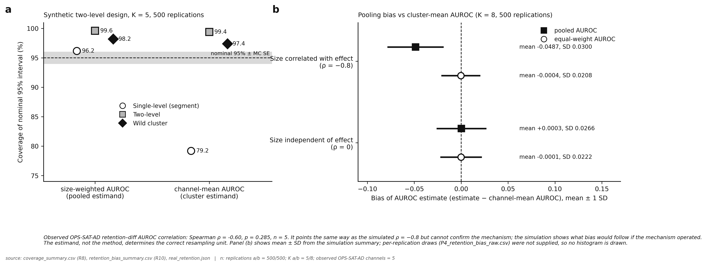

*Fig. 6b. (a) Coverage of nominal 95% intervals for the size-weighted (pooled) and channel-mean (cluster) estimands in a synthetic two-level design (K = 5, 500 replications). (b) Bias of pooled and equal-weight AUROC relative to the channel-mean AUROC when cluster size correlates with effect size (ρ = −0.8) or is independent (ρ = 0); K = 8, 500 replications; mean ± 1 SD. Panel (b) shows the simulation summary; per-replication draws (`P4_retention_bias_raw.csv`) are not plotted.*

**Table 17. Coverage of 95% intervals (K = 5, 500 replications, MC SE ≈ 0.010).**

| Procedure | Coverage, size-weighted target | Coverage, channel-mean target | Mean width |
|---|---|---|---|
| Single-level (segment) | 96.2% | **79.2%** | 0.066 |
| Two-level | 99.6% | 99.4% | 0.188 |
| Wild cluster | 98.2% | 97.4% | 0.163 |

The single-level interval is near nominal for the pooled estimand and under-covers the channel-mean estimand; channel-level procedures cover both but are conservative. **The appropriate resampling unit is determined by the estimand.**

**Table 18. Pooled versus equal-weight AUROC (300 replications per row).**

| Size–effect correlation ρ | Mean (pooled − equal-weight) | SD |
|---|---|---|
| −0.8 | −0.0488 | 0.031 |
| −0.4 | −0.0245 | 0.032 |
| 0.0 | +0.0003 | 0.030 |
| +0.4 | +0.0224 | 0.031 |
| +0.8 | +0.0469 | 0.029 |

The pair-decomposition identity holds to 0 (pooled) and 2.8×10⁻¹⁷ (weighted-mean versus covariance form) on test data and is enforced by `layer3_signature_analysis/tests/test_pooled_identity.py`; the sign of the simulated bias matches the identity in 5/5 conditions.

**Table 19. Endogenous cluster size (retention) and pooled-AUROC bias (K = 8, 500 replications).**

| Mechanism | Pooled bias (mean, SD) | Equal-weight bias (mean, SD) |
|---|---|---|
| Size correlated with effect (ρ = −0.8) | −0.0487 (0.0300) | −0.0004 (0.0208) |
| Size independent of effect | +0.0003 (0.0266) | −0.0001 (0.0222) |

The observed OPS-SAT-AD retention versus `diff` AUROC gives Spearman ρ = −0.60 (t-approximation p = 0.285; exact permutation p = 0.35; n = 5); the retention-weighted mean `diff` AUROC is 0.864 versus 0.885 equal-weight (difference 0.021). The observed correlation has the sign of the simulated mechanism; with n = 5 it is compatible with, but does not establish, that mechanism.

**Table 20. K-sensitivity of interval widths (SMD machine subsets; descriptive).**

| K (machines) | Reps | Width single | Width hierarchical | Ratio hier/single | Ratio wild/single |
|---|---|---|---|---|---|
| 5 | 20 | 0.082 | 0.148 | 1.79 | 1.22 |
| 12 | 20 | 0.067 | 0.113 | 1.68 | 1.10 |
| 20 | 20 | 0.065 | 0.102 | 1.57 | 0.90 |
| 28 | 1 | 0.064 | 0.090 | 1.41 | 0.80 |

The hierarchical/single ratio decreases with K (log–log slope −0.11, p = 0.004) and remains about 1.4 at K = 28. Subsets overlap and K = 28 is a single full-data replicate, so this is a descriptive trend.
### 5.9 Supporting evidence (OPS-SAT-AD): placebo pool, slice replication, heterogeneity

*Serves: Q1. Collapsed because these results support, and do not carry, the headline claims.*

<details>
<summary><b>Placebo-pool comparison and train/test slice replication (Table 21)</b></summary>

**Table 21. Placebo-pool comparison (OPS-SAT-AD, raw placebo pool, one-sided Mann–Whitney, Bonferroni over 15 tests).**

| Feature | Channels significant | Significant-segment fraction |
|---|---|---|
| `level` | 0/5 (p_bonf capped at 1.000) | 54% to 92% within-segment (pre/post test, Section 4.2) |
| `diff` | 5/5 (all p_bonf < 2×10⁻⁴) | magnetometers 0.78 to 0.89; photodiodes 0.12 to 0.42 |
| `diff²` | 5/5 (all p_bonf < 2×10⁻⁴) | magnetometers 0.78 to 0.89; photodiodes 0.12 to 0.42 |

A p_bonf of 1.000 for `level` is the Bonferroni cap (raw p × 15 ≥ 1) and is read as no detectable excess over placebo; no equivalence test was run. The de-duplicated pool (3,951 rows) changes p-values by at most a factor of about three and no significance call. Train-only reproduction (178,504 of 240,979 rows, 74.1%; 126 anomalous segments) matches full data in 15/15 calls; test-only reproduction (62,475 rows, 25.9%; 51 anomalous segments) matches in 12/13 decidable calls, with one borderline (CADC0888 `diff`, p = 0.051) and two not decidable (CADC0894, n = 4 < 5).

Within-segment significance shows that `level` is significant in 54% to 92% of segments per channel and `diff`/`diff²` in 2% to 76%. Temporal-profile classification reconciles this with the precedence test: `diff` is transient in 98% of segments, `diff²` in 94%, and `level` is a near-even mix (50%/45%); the `level` significance rate falls from 0.864 to 0.633 in the early window, a larger relative loss than for `diff`/`diff²`.

</details>

<details>
<summary><b>Between-channel heterogeneity (Fig. 4, Table 22)</b></summary>

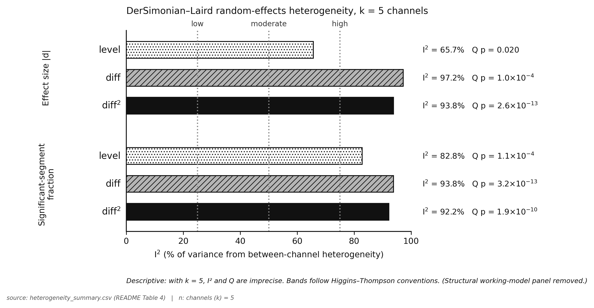

*Fig. 4. Random-effects heterogeneity, k = 5 channels, for effect size |d| (top) and significant-segment fraction (bottom). Bands follow Higgins–Thompson conventions; with k = 5, I² and Q are descriptive. (The file name is kept for provenance; the figure now shows the I² panel only.)*

**Table 22. Between-channel heterogeneity (DerSimonian–Laird, k = 5).**

| Statistic | Feature | I² | Q p |
|---|---|---|---|
| Effect size \|d\| | `level` | 65.7% | 0.020 |
| Effect size \|d\| | `diff` | 97.2% | 1.0×10⁻⁴ |
| Effect size \|d\| | `diff²` | 93.8% | 2.6×10⁻¹³ |
| Significant-segment fraction | `level` | 82.8% | 1.1×10⁻⁴ |
| Significant-segment fraction | `diff` | 93.8% | 3.2×10⁻¹³ |
| Significant-segment fraction | `diff²` | 92.2% | 1.9×10⁻¹⁰ |

Leave-one-out decomposition localizes the heterogeneity: removing CADC0872 eliminates all `level`-|d| heterogeneity, removing CADC0874 eliminates all `diff²`-|d| heterogeneity, and removing CADC0894 nearly halves the pooled `diff`/`diff²` significance fraction. The magnetometer-over-photodiode pattern is aliased with channel type and with detector retention (28% to 100%), and `diff` reverses in the two photodiode channels under detector matching. It is stated as a **hypothesis** for future instrument-level work, not as a finding.

</details>

### 5.10 Supporting evidence: classifier-side robustness and leakage audit

*Serves: Q2. Collapsed; the attribution counts are descriptive because models share data and labels.*

<details>
<summary><b>Sixteen models, three training protocols (Fig. 2, Table 23)</b></summary>

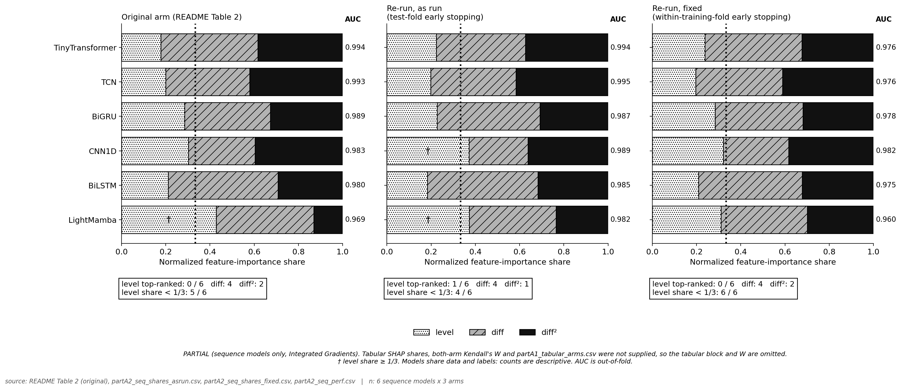

*Fig. 2. Normalized feature-importance shares (Integrated Gradients) for the six sequence models in the original arm, the re-run with test-fold early stopping (superseded protocol), and the re-run with within-training-fold early stopping (reported protocol). † marks `level` share ≥ 1/3; the dotted line is the 1/3 uniform reference. Models share data and labels, so counts are descriptive; AUC is out-of-fold. This supplementary figure covers the sequence models only; the tabular block is summarized in the text below (open item O4).*

**Table 23. Sequence-model arm by training protocol (6 models).**

| Protocol | `level` top-ranked | `diff` top | `diff²` top | `level` share < 1/3 | Out-of-fold AUC range |
|---|---|---|---|---|---|
| Original arm | 0/6 | 4 | 2 | 5/6 | 0.969 to 0.994 |
| Re-run, test-fold early stopping (superseded) | 1/6 (CNN1D) | 4 | 1 | 4/6 | 0.982 to 0.995 |
| Re-run, within-training-fold early stopping (reported) | 0/6 | 4 | 2 | 6/6 | 0.960 to 0.982 |

In the original 16-model arm, 0/16 models rank `level` first (`diff` first in 5, `diff²` in 11; binomial reference (2/3)¹⁶, p = 0.0015, descriptive); tabular 0/10, sequence 0/6; 15/16 give `level` less than 1/3 (the exception is LightMamba, 0.428). Kendall's *W* = 0.609 (χ² = 19.50, df = 2, p = 5.8×10⁻⁵) for the original arm; bootstrap stability over 200 resamples favors `diff`+`diff²` over `level` in 100% of resamples for RandomForest and LogisticRegression. With three features, "`diff` + `diff²` > `level`" is expected 2:1 under a uniform-share null, so the informative quantities are the top-rank count and the size of the `level` share.

The tabular dataset was re-derived from raw time series (exact match) and re-run with a de-duplicated placebo pool, multi-seed stratified-group CV and a row-level CV as a leakage positive control (AUC moves by at most 0.017; positive control |Δ| ≤ 0.009, non-systematic). The six sequence models were re-run under the two early-stopping protocols of Fig. 2. Under the within-training-fold protocol (60 epochs) no sequence model ranks `level` first, whereas under test-fold early stopping CNN1D does (0.371 versus 0.362 for `diff²`). This check controls the classifier side only; dependence on the onset estimator is addressed by the external datasets (Section 5.6).

</details>

### 5.11 Supporting evidence: temporal precedence and tie handling

*Serves: Q4. Collapsed; this analysis is a calibration control, not evidence for a variance-surge mechanism.*

<details>
<summary><b>Precedence with ties excluded, and the tie-handling audit (Fig. 7, Tables 24 and 25)</b></summary>

Crossing times are integer sample indices, so simultaneous crossings occur in 45% / 33% of SMAP/MSL anomalous / normal pairs and 66% / 61% of SMD pairs. The primary analysis excludes ties.

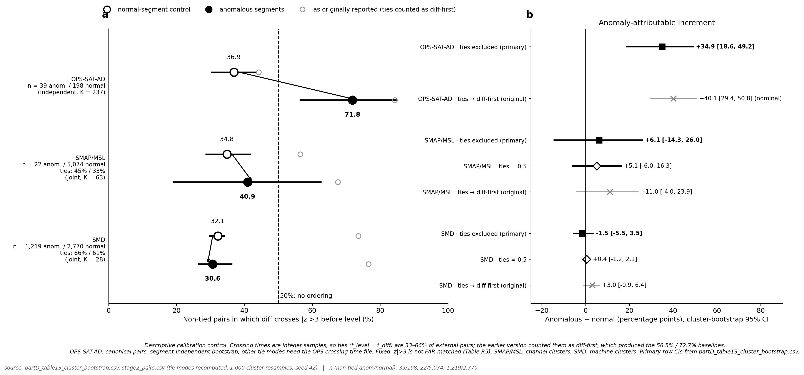

*Fig. 7. (a) Non-tied pairs in which `diff` crosses abs(z) > 3 before `level`, anomalous versus normal control; small open circles show the originally reported values (ties counted as `diff`-first). (b) Anomalous-minus-normal increment in percentage points with cluster-bootstrap 95% intervals under three tie conventions.*

**Table 24. Precedence ordering and normal-control baseline (ties excluded; 95% cluster CI).**

| Dataset | Regime | n pairs | `diff` precedes `level` |
|---|---|---|---|
| OPS-SAT-AD | anomalous | 39 | 71.8% [56.4, 84.6] |
| OPS-SAT-AD | normal control | 198 | 36.9% [30.3, 43.4] |
| SMAP/MSL | anomalous | 22 | 40.9% [19.0, 62.5] |
| SMAP/MSL | normal control | 5,074 | 34.8% [28.7, 41.7] |
| SMD | anomalous | 1,219 | 30.6% [26.4, 36.3] |
| SMD | normal control | 2,770 | 32.1% [29.9, 34.2] |

**Table 25. Increment (anomalous − normal), percentage points, with tie-handling sensitivity.**

| Dataset | Primary: ties excluded | Ties = 0.5 | Ties → `diff`-first (original) |
|---|---|---|---|
| OPS-SAT-AD | **+34.9 [18.6, 49.2]** (p_boot = 0.002) | not computed | +40.1 [29.4, 50.8] (nominal; original pairing rule, 70/224) |
| SMAP/MSL | **+6.1 [−14.3, 26.0]** (p_boot = 0.64) | +5.1 [−6.0, 16.3] | +11.0 [−4.0, 23.9] |
| SMD | **−1.5 [−5.5, 3.5]** (p_boot = 0.49) | +0.4 [−1.2, 2.1] | +3.0 [−0.9, 6.4] |

With ties excluded, `diff` precedes `level` in fewer than half of non-tied pairs at placebo pivots in all three datasets (32% to 37%); counting ties as `diff`-first had produced baselines of 44.2%, 56.5% and 72.7%. Only the OPS-SAT-AD increment excludes zero; in the external datasets the increment is not distinguishable from zero and, in SMD, changes sign with the tie convention.

The criterion has limited diagnostic power: it uses a fixed abs(z) > 3 threshold whose placebo FAR is 27% to 46%, it conditions on pairs where features cross, and in synthetic AR(1) series with φ ≥ 0.8 a *pure level shift* already yields `diff`-first in 74% to 92% of pairs. The decomposition is therefore a calibration control and is not used as evidence for a variance-surge mechanism.

Pair counts in Table 24 follow the canonical-pair rule. The original pairing rule gives 70/224 (`level` vs `diff`), 70/171 (`level` vs `diff²`) and 161/211 (`diff` vs `diff²`); there the `diff` versus `diff²` sign fraction (92.5% vs 35.5%) and the signed-rank test (p = 0.368) disagree, so no claim rests on that comparison. The SMD normal-control count is 7,105 pairs in `stage2_pairs.csv` (73.5% under the original counting rule), against 7,304 (72.7%) in the first version; the anomalous count (3,612) and the SMAP/MSL counts (40 / 7,596) reproduce.

</details>

---

## 6. Alarm design playbook and inflation ledger

### 6.1 Findings

| # | Finding | Question | Where |
|---|---|---|---|
| F1 | **Direction.** Derivative-variance features separate labeled onsets from same-channel placebo pivots more strongly than `level` in every dataset, stable across resampling units, K, FAR targets and (original-arm) classifier architectures. Two of three onset sources are ground-truth labels, so the direction does not depend on an onset estimator. | Q1 | Table 7 |
| F2 | **Sufficiency.** Once `diff`/`diff²` are present, `level` adds no out-of-fold discrimination in any dataset. | Q2 | Table 9 |
| F3 | **Operating value.** The measured gain in coverage at matched FAR is modest: +1.2 pp at 5% FAR and +0.8 pp at 1% FAR in SMD, positive at all six FAR targets. | Q3 | Table 16 |
| F4 | **Evaluation sensitivity.** The size of an apparent advantage depends on the placebo, the resampling unit, the statistic definition and the tie convention. | Q4 | Table 26 |

### 6.2 The inflation ledger

**Table 26. Evaluation choices and their effect on the apparent advantage.**

| Source | Naive reading | Corrected reading | Where |
|---|---|---|---|
| Placebo selection (OPS-SAT-AD) | `diff` 0.900, `diff²` 0.917 | `diff` 0.569 [0.518, 0.626], `diff²` 0.720 [0.675, 0.769] | Table 13, Fig. 3c |
| Direction of `level` | Δ(diff − level) = +0.462 | direction-agnostic +0.338 | Table 8, Fig. 6a |
| Resampling unit | `level` 0.438 [0.401, 0.477], p = 0.004 | [0.350, 0.543], p = 0.244 (two-level) | Table 12, Fig. 3a |
| Interval width of the contrast | 0.099 (segment) | 0.311 (two-level), 2.7 to 3.1 times wider | Table 10 |
| Statistic definition of `level` | +0.122 (SMAP/MSL), +0.042 (SMD) | +0.060 (p = 0.22), +0.010 (p = 0.50) | Table 15 |
| Tie handling in first-crossing precedence | baselines 44.2 / 56.5 / 72.7% | 36.9 / 34.8 / 32.1% | Table 24, Fig. 7 |
| Pooling versus equal weighting | pooled bias −0.049 at ρ = −0.8 | ≈ 0 at ρ = 0; equal-weight bias ≈ 0 in both designs | Tables 18, 19, Fig. 6b |
| Training protocol for sequence models | 1/6 rank `level` first (test-fold early stopping) | 0/6 (within-training-fold early stopping) | Table 23, Fig. 2 |

Each row is an analysis choice that changes the reading of the same data. The ledger is the transferable part of this repo: when a feature advantage is reported on nested telemetry labels, each row identifies a question to ask and a corrected number to expect. Note what the ledger is *not*: it does not say the derivative features lose. Their direction survives every correction; what shrinks is the size of the advertised gap.

### 6.3 Alarm design playbook (rules R1–R8)

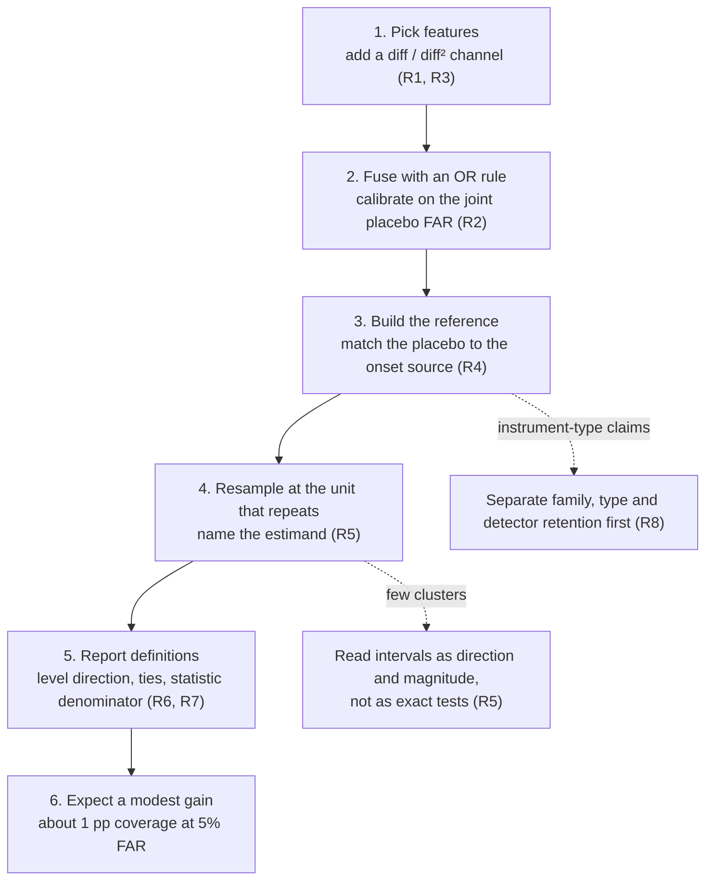
```mermaid
flowchart TD
    A["1. Pick features<br/>add a diff / diff² channel (R1, R3)"] --> B["2. Fuse with an OR rule<br/>calibrate on the joint placebo FAR (R2)"]
    B --> C["3. Build the reference<br/>match the placebo to the onset source (R4)"]
    C --> D["4. Resample at the unit that repeats<br/>name the estimand (R5)"]
    D --> E["5. Report definitions<br/>level direction, ties, statistic denominator (R6, R7)"]
    E --> F["6. Expect a modest gain<br/>about 1 pp coverage at 5% FAR"]
    D -.->|"few clusters"| G["Read intervals as direction and magnitude,<br/>not as exact tests (R5)"]
    C -.->|"instrument-type claims"| H["Separate family, type and detector retention first (R8)"]
```

**Table 27. Design and reporting rules that follow from the evidence (associational).**

| # | Rule | Evidence |
|---|---|---|
| R1 | Add a derivative-variance channel (`diff` and/or `diff²`) to the alarm feature set; expect a gain of about 1 pp coverage at 5% FAR | Tables 7, 16; Figs. 6a, 6c |
| R2 | Combine features with an OR rule and calibrate the joint threshold on the joint placebo FAR, not per-feature fixed thresholds | Table 16; fixed abs(z) > 3 has FAR 27% to 46% |
| R3 | Do not expect `level` to add discrimination once derivative features are present | Table 9 |
| R4 | When evaluating on detector-selected onsets, use a placebo produced by the same detector and expect the offline advantage to shrink | Table 13, Fig. 3c |
| R5 | Resample at the unit that repeats; report pooled and channel-level intervals and name the estimand | Tables 10, 12, 17; Figs. 3a, 6b |
| R6 | Report `level` AUROC together with its direction-agnostic value | Table 8 |
| R7 | Report ties and vary their handling when using first-crossing criteria on integer-sample data | Tables 24, 25; Fig. 7 |
| R8 | Prioritize sensors by instrument type only when family, type and detector retention are separated | Fig. 3c, Table 22 |

### 6.4 Claim ledger

**Table 28. Evidence status of each claim.**

| Claim | Status | Evidence | Boundary |
|---|---|---|---|
| `diff`/`diff²` exceed `level` in cluster-robust onset-vs-placebo AUROC, 3/3 datasets | Established (direction) | Table 7, Fig. 6a | Size: large (OPS-SAT-AD), moderate (SMAP/MSL), small (SMD) |
| Direction holds at channel level with K = 5 | Established (direction and magnitude) | Tables 10, 11 | Minimum attainable p = 0.0625 |
| `level` adds nothing given derivative features | Established | Table 9 | Out-of-fold, group-held-out logistic model |
| Fusion raises coverage at matched FAR in SMD | Established | Table 16, Fig. 6c | +1.2 pp at 5%; four of six targets exclude zero |
| Fusion gain in SMAP/MSL | Not resolved | Table 16 | 56 windows; sign changes across targets |
| `diff²` exceeds `level` under detector-matched placebo | Established for the pool | Table 13, Fig. 3c | Per-channel reversals in CADC0888/0894 |
| `diff` exceeds direction-agnostic `level` under detector-matched placebo | Not supported | Table 13 | 0.569 vs 0.618 |
| Pooled `level` reversal in OPS-SAT-AD | Inconclusive | Table 12 | Significant only at segment level |
| Magnetometer > photodiode derivative effect | Hypothesis | Fig. 3c, Table 22 | Aliased with type, family and retention |
| Precedence increment | Descriptive | Table 25, Fig. 7 | Only OPS-SAT-AD excludes zero |
| No `level`-first model in 16 (original arm) | Descriptive | Table 23, Fig. 2 | Sequence side depends on the training protocol |

---

## 7. Scope, limits and roadmap

The study is associational. It does not identify a causal mechanism linking onsets to derivative-statistic surges, does not claim superiority over published detectors, and does not claim a general instrument-physics effect.

### 7.1 Limits, how each is bounded, and what extends the evidence

**Table 29. Scope of validity.**

| Limit | Effect on the claims | How this repo bounds it | What extends the evidence |
|---|---|---|---|
| K = 5 channels in OPS-SAT-AD | OPS-SAT-AD contrasts are direction and magnitude, not formal tests | Four small-K schemes agree on sign and size (Table 10); small K is the typical spacecraft-anomaly-database situation, so the tools are the point | additional missions or labeled channels |
| OPS-SAT-AD onsets depend on the BOCPD front end (46.1% scoreable) | magnitude is detector-conditioned | Detector-matched placebo quantifies the conditioning (Table 13); SMAP/MSL and SMD carry the estimator-free arm | alternative front ends |
| Detector-matched intervals are segment-level | between-channel uncertainty is not reflected in Table 13 | Stated in Section 5.5; direction is corroborated at channel level (Table 10) | channel-level resampling of the detector-matched intervals |
| External `diff` advantage depends on the `level` definition | with `level_prez`: +0.060 (p = 0.22) and +0.010 (p = 0.50) | Reported as a result (Table 15) and framed as *complementary and sufficient*; rule R6/R7 ask for equal-footing definitions | equal-footing statistic definitions in future protocols |
| No comparison with published detectors or classical monitoring baselines | the claim is feature-level, not detector-level | Scope statement (Section 1.6); FAR-matched comparison across the three feature families is provided | baseline comparison on the same labels and FAR (roadmap item R-A) |
| No raw-telemetry FAR pipeline for OPS-SAT-AD | operating value is measured in SMD and SMAP/MSL only | SMD provides 8,421 FAR-matched windows across 28 machines | FAR pipeline on OPS-SAT-AD raw telemetry |
| SMAP/MSL FAR-matched sample is 56 windows | fusion is not ranked against single-derivative rules there | Reported as "not resolved" (Table 28) | larger labeled sample |
| Tabular SHAP shares and Kendall's *W* are reported for the original arm only | the re-run arm covers sequence models | Sequence re-run under two protocols (Table 23) | method-matched SHAP re-run of the ten tabular models |
| Two pairing rules for OPS-SAT-AD precedence (70/224 original, 39/198 canonical) | conclusions rest on the canonical-pair rule | Precedence is a calibration control only (Section 5.11) | crossing-time inputs under a single pairing rule |
| No documented quantitative segment-cutting rule in OPS-SAT-AD; anomalous onsets skew toward the back half of segments (mean position ratio ≈ 0.569) | labeling provenance is open | Its consequence for the direction is bounded by SMAP/MSL and SMD, which follow different protocols | provenance documentation from the dataset authors |

### 7.2 Conclusion

Across three benchmarks with different platforms, sensors, labeling protocols and onset provenance, derivative-variance features carry at least as much onset information as signal level, `level` adds nothing once they are present, and a fused alarm with a joint-FAR-calibrated threshold adds a measurable but modest coverage gain at matched false-alarm rate. The size of every advantage depends on the placebo, the resampling unit, the statistic definition and the tie convention. The recommendation for practice is to add a derivative-variance channel to the alarm feature set, calibrate on the joint false-alarm rate, and state the estimand, placebo and tie convention behind any reported advantage.

### 7.3 Provenance-only files

`layer3_signature_analysis/scm_skeleton.py` is retained for provenance only; no reported result depends on it. Development logs in `docs/dev-log/` keep the original "causal" wording in file names; the reported analyses are associational.

---
## 8. Repository structure

The tree below is the contract between the README and the code: every table and figure in Sections 3 to 6 is produced by a script listed here and written to a file listed here (Section 10 gives the exact mapping).

**Where each question lives**

| Question | Code | Results |
|---|---|---|
| Q1 Direction | `layer3_signature_analysis/`, `external_validation/`, `care_protocol_v8.py` | `results/layer3/`, `results/external_validation/` |
| Q2 Sufficiency | `care_protocol_v8.py`, `model_cross_validation/` | `results/layer3/cluster_robust_contrasts.csv`, `results/model_cross_validation/` |
| Q3 Operating value | `ress_priority_analyses_v5.py`, `run_pending_analyses.py` | `results/external_validation/far_*.csv` |
| Q4 Trust | `care_protocol_v8.py`, `proposition1_verification.py`, `ress_followup_v6.py`, `run_pending_analyses.py` | `results_care_v8/`, `results/layer3/partC_*.csv` |

```
opssat-ad-onset-signatures/
│
├── README.md                              # this file: question-driven overview + full methodology + inline figures
├── LICENSE
├── CITATION.cff
├── requirements.txt
├── environment.yml
├── Makefile                               # `make all` reproduces every figure/table below
├── care_protocol_v8.py                    # small-K resampling (Tables 10-12), interval coverage (Table 17), K-sensitivity (Table 20), retention bias (Table 19), tier rules and method table (helper artifacts, Section 10.5); writes results_care_v8/
├── proposition1_verification.py           # pair-decomposition identity check and bias-direction simulation (Table 18)
├── run_pending_analyses.py                # detector-matched placebo (Table 13), tie-aware precedence (Tables 24-25), sequence-model re-run (Table 23), extended FAR grid (Table 16)
├── ress_priority_analyses_v5.py           # loaders, detection dataset, FAR-matched alarm evaluation (imported by run_pending_analyses.py)
├── ress_followup_v6.py                    # replica, detector-matched placebo, pair-level precedence, sequence re-run (imported by run_pending_analyses.py)
├── make_pending_figures.py                # renders Fig. 3 (panel c) and Fig. 6c from results_pending/ and results_ress_followup_v6/
├── extract_inputs.py                      # rebuilds figure-input CSVs from README tables/captions (see Section 10.3; figures made this way are consistency checks only)
│
├── data/
│   ├── download_opssat_ad.sh              # fetches OPS-SAT-AD from Zenodo (no redistribution)
│   ├── download_smap_msl.sh               # fetches SMAP/MSL (Telemanom) release (no redistribution)
│   ├── download_smd.sh                    # fetches SMD (OmniAnomaly) release (no redistribution)
│   ├── README.md                          # dataset layout, checksum, license notes for all three datasets
│   └── raw/                               # (gitignored) populated by download scripts
│
├── layer1_signal_estimation/
│   ├── channel_classification.py          # quantized / float_noise_suspect / continuous auto-tagging (Table 4)
│   ├── noise_estimation.py                # var(diff)/2 vs. mixture-model comparison
│   ├── kalman_filter.py                   # local-linear-trend Kalman filter, state estimation
│   ├── hierarchical_shrinkage.py          # Bayesian shrinkage for low-sample channels
│   ├── tests/
│   └── run.py
│
├── layer2_anomaly_detection/              # onset estimation (BOCPD) + channel scoping
│   ├── bocpd_forgetting.py                # BOCPD with forgetting-factor extension
│   ├── ablation_mixture_forgetting.py     # 2x2 ablation grid (mixture x forgetting) (Table 5)
│   ├── channel_scoping.py                 # MCC / Youden's J channel decision table (Fig. 1a, Table 3)
│   ├── triple_verification.py             # full / train-only / test-only re-fit & re-select (Fig. 1b)
│   ├── bootstrap_ci.py                    # per-channel MCC bootstrap confidence intervals
│   ├── problem_channel_diagnosis.py       # noise-model vs. forgetting diagnosis for 890/892/894 (Section 4.3)
│   ├── tests/
│   └── run.py
│
├── layer3_signature_analysis/
│   ├── onset_mc_propagation.py            # Monte Carlo propagation of onset-time posterior (200 draws)
│   ├── temporal_precedence_test.py        # pooled Wilcoxon signed-rank, level vs diff vs diff² (Fig. 7; original pairing rule)
│   ├── temporal_profile_classification.py # transient vs. persistent post-onset trajectory classification
│   ├── early_window_sensitivity.py        # 10-point vs. full-window Welch-test comparison
│   ├── quasi_experimental_placebo.py      # Mann-Whitney U vs. same-channel placebo pool (Table 21, Fig. 3)
│   ├── meta_analysis_random_effects.py    # DerSimonian-Laird random-effects meta-analysis + I² (Fig. 4, Table 22)
│   ├── loo_sensitivity.py                 # leave-one-channel-out sensitivity analysis
│   ├── scm_skeleton.py                    # retained for provenance only; no reported result depends on it (Section 7.5)
│   ├── supplementary_diagnostics_A_D.py   # cross-correlation, CMH test, normal-segment controls, lag resolution
│   ├── labeling_protocol_audit.py         # external audit of the OPS-SAT-AD labeling protocol
│   ├── train_test_triple_reverification.py# train-only / test-only reproduction of the placebo-pool test
│   ├── tests/                             # includes test_pooled_identity.py: pooling-bias identities as regression tests
│   └── run.py
│
├── model_cross_validation/
│   ├── models/                            # 16 model wrappers (+1 excluded by the fit-quality screen)
│   │   ├── linear.py                      # LogReg (L1, L2)
│   │   ├── probabilistic.py               # GaussianNB
│   │   ├── kernel.py                      # SVM (RBF)
│   │   ├── instance_based.py              # kNN
│   │   ├── tree_ensembles.py              # RandomForest, ExtraTrees, GradBoost, XGBoost, LightGBM
│   │   ├── shallow_mlp.py                 # MLP_shallow, excluded (AUC=0.403, below chance; failed fit)
│   │   ├── conv_sequence.py               # CNN1D, TCN
│   │   ├── recurrent_sequence.py          # BiLSTM, BiGRU
│   │   ├── attention_sequence.py          # TinyTransformer
│   │   └── ssm_sequence.py                # LightMamba (pure-PyTorch selective state-space substitute)
│   ├── representations/
│   │   ├── tabular_summary_features.py    # 10 models: engineered summary-statistic features
│   │   └── raw_sequence_features.py       # 6 models: raw 3-channel windowed time series
│   ├── attribution/
│   │   ├── shap_permutation.py            # tabular-model attribution (SHAP + permutation fallback; method recorded per row)
│   │   └── integrated_gradients.py        # sequence-model attribution (Captum / manual IG fallback)
│   ├── agreement_statistics.py            # Kendall's W, binomial test, bootstrap stability (original arm)
│   ├── tests/
│   └── run_all.py
│
├── external_validation/
│   ├── stage0_preprocessing.py            # command-column exclusion, channel re-typing, triviality filter
│   ├── stage1_placebo_pooled.py           # dataset-pooled and channel-type-stratified placebo tests (FDR) (Table 14, Fig. 6)
│   ├── stage2_temporal_precedence.py      # ground-truth-onset precedence + normal-segment control; writes pair-level rows
│   ├── window_cap_sensitivity.py          # 150-5,000-sample search-window sensitivity sweep
│   └── run_external_validation.py
│
├── results/
│   ├── README.md                          # index of every artifact below + provenance table + sample-size accounting (partE_n_accounting.csv)
│   ├── layer1/  (noise_estimates.csv, channel_classification.json)
│   ├── layer2/
│   │   ├── channel_scope.json                  # -> consumed by opssat-ad-risk-optimization
│   │   ├── channel_scope_full_table.csv, channel_scope_final_locked.csv    # Table 3
│   │   ├── ablation_grid.csv, ablation_best_combo_test_eval.csv            # Table 5
│   │   ├── bootstrap_ci.csv, bootstrap_ci_test_only.csv
│   │   └── train_fit_test_eval.csv, full_vs_test_ci_comparison.csv
│   ├── layer3/
│   │   ├── onset_posteriors.parquet             # -> consumed by opssat-ad-risk-optimization & opssat-ad-dss
│   │   ├── placebo_comparison.csv               # Table 21
│   │   ├── temporal_precedence.csv, temporal_precedence_normal_control.csv
│   │   ├── temporal_precedence_group_comparison.csv, temporal_precedence_lag_resolution.csv
│   │   ├── heterogeneity_summary.csv            # Table 22; -> consumed by opssat-ad-dss
│   │   ├── triple_verification_matrix.csv       # Fig. 3b
│   │   ├── per_channel_auroc.csv                # channel-level AUROC, complete-case; -> Fig. 3a
│   │   ├── cluster_robust_contrasts.csv         # Tables 7-9 and 15 contrasts incl. direction-agnostic; -> Fig. 6a
│   │   ├── partC_normal_segments_for_stage2.csv # the 996 normal segments given to the stage-2 detector
│   │   ├── partC_detector_matched_pivots.csv    # detector-matched placebo pivots and their features
│   │   ├── partC_detector_matched_auroc.csv     # Table 13 (per channel and pooled); -> Fig. 3c
│   │   └── partC_detection_rates.csv            # normal detection rate and anomalous retention; -> Fig. 3c
│   ├── model_cross_validation/
│   │   ├── feature_attribution_16models.csv     # original arm
│   │   ├── partA2_seq_shares_asrun.csv          # sequence re-run, test-fold early stopping (superseded protocol)
│   │   ├── partA2_seq_shares_fixed.csv          # sequence re-run, within-training-fold early stopping (reported)
│   │   ├── partA2_seq_perf.csv                  # out-of-fold AUC of both sequence re-runs
│   │   ├── family_summary.csv, performance_leaderboard.csv, bootstrap_stability.csv
│   │   └── agreement_statistics.json            # W for the original arm only
│   ├── external_validation/
│   │   ├── stage1_placebo_pooled_dataset.csv        # Table 14 pooled rows
│   │   ├── stage1_channel_level_significance.csv    # SMD channel-level counts; -> Fig. 6b
│   │   ├── stage1_channel_type_stratified.csv       # exploratory FDR family (Section 4.9)
│   │   ├── stage2_pairs.csv                         # pair-level crossing times (SMAP/MSL, SMD)
│   │   ├── partD_table13_cluster_bootstrap.csv      # Tables 24-25 primary rows (ties excluded), cluster CIs; -> Fig. 7 (legacy file name)
│   │   ├── taskD_tie_sensitivity_external_recomputed.csv   # Table 25 tie-handling sensitivity (external); -> Fig. 7
│   │   ├── taskD_pair_count_check.csv               # pair counts vs. previously reported counts
│   │   ├── far_coverage_curve.csv                   # coverage on the FAR grid 0.5-20%; -> Fig. 6c
│   │   ├── far_coverage_contrasts.csv               # paired contrasts vs level with cluster CIs (Table 16); -> Fig. 6c
│   │   ├── fixed_threshold_points.csv               # fixed abs(z) > 3 operating points with measured FAR; -> Fig. 6c
│   │   └── window_cap_sensitivity.csv               # 150-5,000-sample sweep log
│   ├── figures/
│   │   ├── _figstyle.py                             # shared style, CSV loader with column checks, n-assertions, figure_manifest.json
│   │   ├── fig01_channel_scope.png                  # Fig. 1
│   │   ├── figS_fig02_sequence_partial.png          # Fig. 2 (sequence models, three protocols; supplementary, partial)
│   │   ├── fig03_quasi_experimental.png             # Fig. 3, panels a, b, c
│   │   ├── fig04_scm_and_heterogeneity.png          # Fig. 4 (file name kept for provenance; content is the I² panel only)
│   │   ├── fig05_dataset_and_precedence.png         # Fig. 5 (file name kept; content is segments per channel; precedence is fig07)
│   │   ├── fig06_cross_dataset_placebo.png          # Fig. 6
│   │   ├── fig06b_coverage_and_pooling_bias.png     # Fig. 6b
│   │   ├── fig06c_coverage_vs_far.png               # Fig. 6c
│   │   └── fig07_precedence_baseline.png            # Fig. 7
│   └── tables/                            # camera-ready LaTeX tables (.tex) mirroring the CSVs above (legacy IDs R1-R12 map to README tables in Section 10.1)
│
├── results_care_v8/                       # written by care_protocol_v8.py (Tables 10-12, 17-20)
│   ├── P1_coverage_raw.csv, P1_coverage_summary.csv          # Table 17
│   ├── P2_smallK_convergence.csv, P2_level_reversal_diagnosis.csv, P2_leave_one_channel_out.csv   # Tables 10, 12, 11
│   ├── P3_K_sensitivity_{raw,summary,trend_test}.csv + .png   # Table 20
│   ├── P4_retention_bias_{raw,summary}.csv, P4_real_retention_table.csv   # Table 19
│   ├── P5_care_tier_v2.csv, P6_method_selection_table.csv
│   └── SUMMARY.md
│
└── docs/
    ├── dev-log/                           # raw, unabridged research log (see note below)
    │   ├── step1_signal_estimation.md, step2_anomaly_detection.md
    │   ├── step3_causal_analysis.md, step3b_labeling_protocol_revalidation.md
    │   ├── step_ai_model_cross_validation.md, step_external_validation.md
    ├── METHODS_SUPPLEMENT.md
    └── REPRODUCIBILITY_CHECKLIST.md
```

The files in `docs/dev-log/` are the research logs kept during development, included verbatim (file names retain the original "causal" wording). `step_external_validation.md` also records the SMAP/MSL sliding-onset scheme that contaminated the pre-onset baseline for windows longer than the baseline (diagnosed by a jointly-valid-candidate check and a window-length stratification, then discarded), the 150 to 5,000-sample search-window sweep (n = 40 → 41; `diff`-first 67.5% → 65.9%, original counting) and the consistency-gate results of the re-analysis.

---

## 9. Reproducing every number

```bash
git clone https://github.com/USERNAME/opssat-ad-onset-signatures
cd opssat-ad-onset-signatures
pip install -r requirements.txt          # or: conda env create -f environment.yml
bash data/download_opssat_ad.sh
bash data/download_smap_msl.sh
bash data/download_smd.sh
make all                                  # regenerates every figure and table
```

Seeds, package versions and expected runtimes are in `docs/REPRODUCIBILITY_CHECKLIST.md`. Every figure script asserts the sample sizes of its input CSVs and writes `figure_manifest.json` (`results/figures/_figstyle.py`). `results/README.md` holds the sample-size accounting table (`partE_n_accounting.csv`) referenced by every table and figure caption. `docs/METHODS_SUPPLEMENT.md` is the extended methodological record.

### 9.1 Sanity checks after a fresh run

If these numbers match, the pipeline reproduced end to end.

| Check | Expected | Table |
|---|---|---|
| Replica vs saved 16-model dataset | 4,996/4,996 rows exact; max relative error 1.8×10⁻¹⁵ | 6 |
| Pooled complete-case AUROC (n = 3,991) | level 0.438, diff 0.900, diff² 0.917 | 6 |
| SMD Δ(diff − level), machine clusters | +0.042 [0.016, 0.066] | 7 |
| SMAP/MSL Δ(diff − level), channel clusters | +0.122 [0.045, 0.196] | 7 |
| OPS-SAT-AD `diff` under detector-matched placebo | 0.569 [0.518, 0.626] | 13 |
| SMD fusion-minus-`level` coverage at 5% FAR | +1.2 pp [0.4, 2.0] | 16 |
| Pooling-bias identity regression test | passes (`layer3_signature_analysis/tests/test_pooled_identity.py`) | 18 |

---

## 10. Artifact index

### 10.1 Tables and the repository artifacts that produce them

"Legacy ID" is the artifact identifier used in `results/README.md` and in the camera-ready `.tex` tables.

| README table | Legacy ID | Source file(s) |
|---|---|---|
| Table 1 | n/a | `data/README.md` (dataset descriptions) |
| Table 2 | n/a | `results/partE_n_accounting.csv` |
| Table 3 | Table 1 | `results/layer2/channel_scope_full_table.csv`, `channel_scope_final_locked.csv` |
| Table 4 | n/a | `results/layer1/channel_classification.json` |
| Table 5 | Table 8 | `results/layer2/ablation_grid.csv`, `ablation_best_combo_test_eval.csv` |
| Table 6 | R1 | `results/README.md` provenance table; replica in `ress_followup_v6.py` |
| Tables 7, 8 | R2 | `results/layer3/cluster_robust_contrasts.csv` |
| Table 9 | R2 companion | `results/layer3/cluster_robust_contrasts.csv` |
| Tables 10, 11, 12 | R7, R7c, R7b | `results_care_v8/P2_smallK_convergence.csv`, `P2_leave_one_channel_out.csv`, `P2_level_reversal_diagnosis.csv` |
| Table 13 | R12, R12b | `results/layer3/partC_detector_matched_auroc.csv`, `partC_detection_rates.csv` |
| Table 14 | 12 | `results/external_validation/stage1_placebo_pooled_dataset.csv`, `stage1_channel_level_significance.csv`, `stage1_channel_type_stratified.csv` |
| Table 15 | R4 | `results/layer3/cluster_robust_contrasts.csv` and `level_prez` re-analysis |
| Table 16 | R3, R3b | `results/external_validation/far_coverage_curve.csv`, `far_coverage_contrasts.csv`, `fixed_threshold_points.csv` |
| Tables 17, 18, 19, 20 | R8, R9, R10, R11 | `results_care_v8/P1_*`, `proposition1_verification.py`, `P4_*`, `P3_*` |
| Table 21 | 3 | `results/layer3/placebo_comparison.csv`, `triple_verification_matrix.csv` |
| Table 22 | 4 | `results/layer3/heterogeneity_summary.csv` |
| Table 23 | 2 (sequence arm) | `results/model_cross_validation/partA2_seq_shares_*.csv`, `partA2_seq_perf.csv` |
| Tables 24, 25 | 13 | `results/external_validation/partD_table13_cluster_bootstrap.csv`, `taskD_tie_sensitivity_external_recomputed.csv`, `stage2_pairs.csv` |
| Tables 26–29 | n/a | derived from the tables above (ledger, rules, claim status, scope) |

### 10.2 Figures

| Figure | File | Panels and what to look at | Rendered from |
|---|---|---|---|
| Fig. 1 | `results/figures/fig01_channel_scope.png` | (a) MCC and J per channel, excluded channels dashed; (b) screening funnel | `channel_scope.csv` |
| Fig. 2 | `results/figures/figS_fig02_sequence_partial.png` | Importance shares for six sequence models under three protocols; † marks `level` share ≥ 1/3 | `feature_attribution_16models.csv`, `partA2_seq_shares_asrun.csv`, `partA2_seq_shares_fixed.csv`, `partA2_seq_perf.csv` |
| Fig. 3 | `results/figures/fig03_quasi_experimental.png` | (a) channel-level `level` AUROC and pooled interval by scheme; (b) slice-replication grid; (c) position- vs detector-matched placebo | (a, b) `per_channel_auroc.csv` and Table 12 constants; (c) `partC_detector_matched_auroc.csv`, `partC_detection_rates.csv` |
| Fig. 4 | `results/figures/fig04_scm_and_heterogeneity.png` | I² per feature for effect size and significant-segment fraction | `heterogeneity_summary.csv` |
| Fig. 5 | `results/figures/fig05_dataset_and_precedence.png` | Segments per channel, anomalous vs nominal, prevalence | `channel_scope.csv` |
| Fig. 6 | `results/figures/fig06_cross_dataset_placebo.png` | (a) Δ AUROC forest plots by scheme; (b) SMD channel-level breadth | `cluster_robust_contrasts.csv`, `stage1_channel_level_significance.csv` |
| Fig. 6b | `results/figures/fig06b_coverage_and_pooling_bias.png` | (a) interval coverage by estimand; (b) pooling bias by size-effect correlation | `P1_coverage_summary.csv`, `P4_retention_bias_summary.csv`, `P4_real_retention_table.csv` |
| Fig. 6c | `results/figures/fig06c_coverage_vs_far.png` | (a, b) coverage vs FAR; (c, d) fusion-minus-`level` gain | `far_coverage_curve.csv`, `far_coverage_contrasts.csv`, `fixed_threshold_points.csv` |
| Fig. 7 | `results/figures/fig07_precedence_baseline.png` | (a) precedence, anomalous vs normal; (b) increment under three tie conventions | `partD_table13_cluster_bootstrap.csv`, `stage2_pairs.csv` |

### 10.3 Figure provenance classes

| Class | Meaning | Figures |
|---|---|---|
| A | Rendered directly from result CSVs | Figs. 1, 3c, 4, 5, 6, 6b, 6c, 7 |
| B | Includes constants transcribed from tables (consistency checks, rebuilt by `extract_inputs.py`) | Fig. 2 (original arm), Fig. 3a–b (pooled intervals by scheme) |

Class B figures are flagged so that readers know which panels can be diffed against a CSV and which against a README table (open item O6).

### 10.4 Figure footer strings to update on the next render

PNG text is baked in at render time, so the figures still show the older table numbering until they are re-rendered. The captions in this README already use the corrected references.

| Figure | Baked-in string | Replace with |
|---|---|---|
| Fig. 1 | `source: channel_scope.csv (README Table 1)` | `source: channel_scope.csv (README Table 3)` |
| Fig. 2 | `Original arm (README Table 2)` and `source: README Table 2 (original)` | `Original arm (Table 23; feature_attribution_16models.csv)` |
| Fig. 3 | `source: README Table R7b/5 constants (a,b)` and `Read per the pre-specified rule in §11.8` | `source: per_channel_auroc.csv and Table 12 constants (a,b)` and `Read per Section 5.5` |
| Fig. 4 | `source: heterogeneity_summary.csv (README Table 4)` | `source: heterogeneity_summary.csv (README Table 22)` |
| Fig. 6 | `Pooled p-values are not plotted (Table 12)` | `Pooled p-values are not plotted (Table 14)` |
| Fig. 6b | `source: coverage_summary.csv (R8), retention_bias_summary.csv (R10), real_retention.json` | `source: P1_coverage_summary.csv (Table 17), P4_retention_bias_summary.csv (Table 19), P4_real_retention_table.csv` |
| Fig. 7 | `Fixed abs(z)>3 is not FAR-matched (Table R5)` | `Fixed abs(z)>3 is not FAR-matched (Table 16, Section 5.7)` |

Comment strings in scripts that pointed at the older numbering (`temporal_precedence_test.py` "Fig. 5b", `extract_inputs.py` "§15", `scm_skeleton.py` "§14", and the `§11.x` tags in the top-level scripts) are already corrected in the tree of Section 8.

### 10.5 Crosswalk from the previous README numbering, and helper artifacts

| Previous table number | Now | Previous table number | Now |
|---|---|---|---|
| 1 (datasets) | 1 | 14 (placebo-pool, OPS-SAT-AD) | 21 |
| 2 (channel typing) | 4 | 15 (heterogeneity) | 22 |
| 3 (channel scope) | 3 | 16 (external placebo-pool) | 14 |
| 4 (sample accounting) | 2 | 17 (`level_prez`) | 15 |
| 5–13 | 5–13 (unchanged) | 18 (FAR fusion) | 16 |
| 19 (interval coverage) | 17 | 23 (sequence arm) | 23 |
| 20 (pooled vs equal-weight) | 18 | 24, 25 (precedence) | 24, 25 |
| 21 (endogenous size) | 19 | 26–29 | 26–29 |
| 22 (K-sensitivity) | 20 | | |

Helper artifacts written by `care_protocol_v8.py` but not tabulated in the body: `results_care_v8/P5_care_tier_v2.csv` (tier assignment rules) and `results_care_v8/P6_method_selection_table.csv` (method-selection table); `results_care_v8/SUMMARY.md` summarizes the run.

Downstream artifacts consumed by Paper 2 and the DSS prototype: `results/layer2/channel_scope.json`, `results/layer3/onset_posteriors.parquet`, `results/layer3/heterogeneity_summary.csv`.

---

## 11. Data and code availability

Analysis code, data-provenance scripts, figure source scripts, development logs and the robustness re-analysis are in this repository under the MIT license. Datasets are not redistributed; the scripts in `data/` fetch them from their public releases (OPS-SAT-AD from its Zenodo record; SMAP/MSL from the Telemanom release; SMD from the OmniAnomaly release). Checksums and license notes are in `data/README.md`.

---

## 12. References

**Data and detectors**

- Adams, R. P., and MacKay, D. J. C. (2007). Bayesian online changepoint detection. arXiv:0710.3742.
- Hundman, K., Constantinou, V., Laporte, C., Colwell, I., and Soderstrom, T. (2018). Detecting spacecraft anomalies using LSTMs and nonparametric dynamic thresholding. *Proceedings of KDD 2018*.
- Ruszczak, B., Kotowski, K., Evans, D., and Nalepa, J. (2025). The OPS-SAT benchmark for detecting anomalies in satellite telemetry. *Scientific Data*, 12, 710.
- Su, Y., Zhao, Y., Niu, C., Liu, R., Sun, W., and Pei, D. (2019). Robust anomaly detection for multivariate time series through stochastic recurrent neural network. *Proceedings of KDD 2019*.
- Wu, R., and Keogh, E. J. (2021). Current time series anomaly detection benchmarks are flawed and are creating the illusion of progress. *IEEE Transactions on Knowledge and Data Engineering*.

**Inference**

- Benjamini, Y., and Hochberg, Y. (1995). Controlling the false discovery rate: a practical and powerful approach to multiple testing. *Journal of the Royal Statistical Society: Series B*, 57(1), 289–300.
- Cameron, A. C., Gelbach, J. B., and Miller, D. L. (2008). Bootstrap-based improvements for inference with clustered errors. *Review of Economics and Statistics*, 90(3), 414–427.
- DerSimonian, R., and Laird, N. (1986). Meta-analysis in clinical trials. *Controlled Clinical Trials*, 7(3), 177–188.
- Efron, B., and Morris, C. (1973). Stein's estimation rule and its competitors: an empirical Bayes approach. *Journal of the American Statistical Association*, 68(341), 117–130.
- Higgins, J. P. T., and Thompson, S. G. (2002). Quantifying heterogeneity in a meta-analysis. *Statistics in Medicine*, 21(11), 1539–1558.
- Webb, M. D. (2014). Reworking wild bootstrap based inference for clustered errors. Queen's Economics Department Working Paper No. 1315.

**Monitoring context (conceptual anchors for Section 1.5; no baseline results are reported here)**

- ANSI/ISA-18.2-2016. *Management of Alarm Systems for the Process Industries*.
- Montgomery, D. C. *Introduction to Statistical Quality Control*. Wiley.
- Page, E. S. (1954). Continuous inspection schemes. *Biometrika*, 41(1/2), 100–115.
- Roberts, S. W. (1959). Control chart tests based on geometric moving averages. *Technometrics*, 1(3), 239–250.
- Shewhart, W. A. (1931). *Economic Control of Quality of Manufactured Product*. Van Nostrand.
- von Neumann, J., Kent, R. H., Bellinson, H. R., and Hart, B. I. (1941). The mean square successive difference. *Annals of Mathematical Statistics*, 12(2), 153–162.

---
