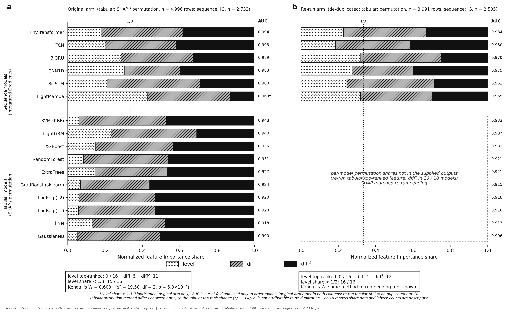

# opssat-ad-onset-signatures

**Dependence-Aware Evaluation of Onset Features for Alarm Design: Cross-Dataset Evidence from Spacecraft and Industrial Telemetry (OPS-SAT-AD, SMAP/MSL, SMD)**

[](./LICENSE)
[](https://www.python.org/)
[](#reproducing-every-number-in-this-readme)
[](#citation)

> **Status legend used throughout.** ✅ = computed and reproduced from the released scripts. 🔶 = analysis defined and scripted, result not yet regenerated; the number shown is the previous value and must not be read as confirmed. All 🔶 items are listed in §11.8 together with the rule by which each will be interpreted.

> **Summary.** Alarm thresholds for spacecraft telemetry are conventionally set on signal *level*, on the premise that an anomaly begins as a mean shift. We compare *level* with onset-relative change features (`diff`, `diff²`) on labeled anomaly onsets in three benchmarks: OPS-SAT-AD (9 ESA telemetry channels, 5 in scope), SMAP/MSL (82 NASA channels) and SMD (1,064 industrial server channels), each against same-channel placebo pivots. Because onset labels are nested in segments, channels or machines, every headline statistic is an onset-vs-placebo AUROC with a **cluster-bootstrap interval at the unit that repeats** (segment / channel / machine), and the analysis was passed through a fixed audit sequence: an independent replica of the data pipeline, resampling at the higher level (small-K), false-alarm-rate (FAR) matching, and a synthetic existence-proof.
>
> **What survived the audit.** (i) *Direction.* Δ(diff − level) AUROC = **+0.462 [0.409, 0.508]** (OPS-SAT-AD), **+0.122 [0.045, 0.196]** (SMAP/MSL), **+0.042 [0.016, 0.066]** (SMD). SMAP/MSL and SMD have ground-truth onsets, so this direction does not depend on an onset estimator; the external contrasts are qualified in item (iii) of the next paragraph. Because `level` falls below 0.5 in OPS-SAT-AD, the direction-agnostic contrast (level scored as max(AUC, 1 − AUC) = 0.562) is also reported: **+0.338**. (ii) *No incremental value of level.* Adding `level` to `diff`/`diff²` in an out-of-fold logistic model changes AUROC by −0.0007, −0.0068 and −0.0009. (iii) *Small-K robustness.* The two OPS-SAT-AD contrasts keep direction and size under two-level, wild-cluster and exact sign-flip resampling at the channel level (e.g. [0.282, 0.593] two-level), although with K = 5 no exact test can reject at 0.05 (minimum p = 0.0625), so they are read as direction and magnitude, not as formal tests. (iv) *Operating value.* At a matched 5% FAR in SMD, a `level OR diff OR diff²` rule raises coverage from 15.9% to 17.2%, **+1.2 pp [0.4, 2.2]** (differences are computed from unrounded coverages); single derivative features do not reach significance. In the smaller SMAP/MSL sample (56 windows) the fusion gain is +3.6 pp [0.0, 11.5] and the single `diff`/`diff²` rules (21.4%, 23.2%) lie above the fusion rule (19.6%), so that sample does not rank fusion against single-derivative rules.
>
> **What did not survive, or was weakened.** (i) The pooled OPS-SAT-AD `level` reversal (AUROC 0.438) is significant only under segment-level resampling (p = 0.004); under channel-level schemes every interval includes 0.5 (Table R7b), so it is *inconclusive*, and it is driven by one channel (CADC0873). (ii) SMAP/MSL `level` is "weak", not "reliably detectable": its channel-cluster interval [0.497, 0.608] includes 0.5 although the pooled test gives p_fdr = 0.031. (iii) **Part of the external `diff` advantage is definitional.** Replacing `level`'s pooled-SD denominator by the pre-onset SD (`level_prez`) raises `level` AUROC by +0.080 (SMAP/MSL) and +0.035 (SMD), after which `diff − level_prez` is +0.060 (p = 0.22) and +0.010 (p = 0.50): not distinguishable from zero (Table R4). In OPS-SAT-AD the same substitution changes nothing (+0.015, n.s.; gap to `diff` stays +0.447). (iv) The operator-baseline decomposition of `diff`-first ordering is **demoted to a descriptive control**: the precedence criterion cannot separate a mean shift from a variance surge (a pure level shift on an AR(1) φ ≥ 0.8 series yields `diff`-first in 74–92% of cases, §11.6), the criterion is not FAR-matched, and the OPS-SAT-AD figure is being re-estimated at pair level (🔶). (v) Re-running the 16-model benchmark changed two counts; one of the changes is due to the attribution method, not the data (§11.7).
>
> **Methodological finding that generalizes.** The correct resampling unit depends on the estimand. In a synthetic two-level design (K = 5), a segment-level interval covers the size-weighted AUROC at 96.2% but the channel-mean AUROC at only 79.2%; channel-level procedures cover both at ≥ 97% but are conservative (Table R8). When cluster size is correlated with effect size, pooled AUROC is biased relative to the equal-weight AUROC (−0.049 at ρ = −0.8, ≈ 0 at ρ = 0; Tables R9, R10). In OPS-SAT-AD the observed retention–effect correlation (ρ = −0.60, p = 0.285, n = 5) points the same way but cannot confirm the mechanism.
>
> **Open.** Detector-matched placebo pivots for OPS-SAT-AD 🔶, the CADC0873 within-channel reversal, pair-level cluster intervals for the precedence decomposition 🔶, a harmonized re-run of the 16-model attribution 🔶, and an extended FAR grid for Fig. 6c 🔶. We interpret the findings as an **associational, direction-level result with a modest, quantified incremental value**, not as evidence of a universally superior detector, a causal mechanism, or a general instrument-physics effect.

This repository is the code, data-provenance and figure-reproduction companion to **Paper 1** of a two-paper series built primarily on OPS-SAT-AD, with independent generalization testing on SMAP/MSL and SMD. It is **self-contained and independently evaluable** and does not depend on any other repository.

| This series | Repository | Status |
|---|---|---|
| **Paper 1 (this repo)** — Cross-dataset signature analysis | `opssat-ad-onset-signatures` | ✅ independent, no upstream deps |
| Paper 2 — Risk-aware alarm design (CVaR / conformal) | [`opssat-ad-risk-optimization`](https://github.com/USERNAME/opssat-ad-risk-optimization) | depends on this repo's `results/` artifacts |
| DSS prototype (not a paper) | [`opssat-ad-dss`](https://github.com/USERNAME/opssat-ad-dss) | depends on both papers' artifacts |

---

## Table of Contents

1. [Contribution at a glance](#contribution-at-a-glance)
2. [Scope and submission package](#scope-and-submission-package)
3. [Evidence ladder and claim scope](#evidence-ladder-and-claim-scope)
4. [Storyline of the investigation](#storyline-of-the-investigation)
5. [Onset provenance of each result](#onset-provenance-of-each-result)
6. [Headline results](#headline-results)
7. [Repository structure](#repository-structure)
8. [Datasets](#datasets)
9. [Methodology (OPS-SAT-AD primary pipeline)](#methodology-ops-sat-ad-primary-pipeline)
   - [Layer 1 — Signal Estimation](#layer-1--signal-estimation)
   - [Layer 2 — Onset Estimation and Channel Scoping](#layer-2--onset-estimation-and-channel-scoping)
   - [Layer 3 — Signature Analysis](#layer-3--signature-analysis)
   - [Layer 3b — Labeling-Protocol Audit & Train/Test Triple Verification](#layer-3b--labeling-protocol-audit--traintest-triple-verification)
   - [Model Cross-Validation (16 architecturally diverse models)](#model-cross-validation-16-architecturally-diverse-models)
10. [External Validation / Generalization Study (SMAP/MSL, SMD)](#external-validation--generalization-study-smapmsl-smd)
11. [Robustness Re-Analysis: Cluster-Robust, FAR-Matched, and Sensitivity Checks](#robustness-re-analysis-cluster-robust-far-matched-and-sensitivity-checks)
12. [Analytical baseline: why differencing may respond faster](#analytical-baseline-why-differencing-may-respond-faster)
13. [Practical implications for alarm design](#practical-implications-for-alarm-design)
14. [Scope of the inferential claims](#scope-of-the-inferential-claims)
15. [Figures](#figures)
16. [Results tables](#results-tables)
17. [Reproducing every number in this README](#reproducing-every-number-in-this-readme)
18. [Threats to validity](#threats-to-validity)
19. [Boundary conditions and scope of validity](#boundary-conditions-and-scope-of-validity)
20. [Research roadmap enabled by this release](#research-roadmap-enabled-by-this-release)
21. [Data and code availability](#data-and-code-availability)
22. [License](#license)

---

## Contribution at a glance

**The question.** Change-point and anomaly-detection pipelines for spacecraft and industrial telemetry treat a level shift as the default anomaly signature. Which feature family should an alarm be built on, and how much of an apparent advantage survives when the dependence structure of the labels is respected?

**The answer this study provides.** Across three benchmarks that differ in platform, sensor physics, labeling protocol and onset provenance, `diff`/`diff²` features separate labeled onsets from placebo pivots better than `level` on cluster-robust AUROC, with an advantage that is large in OPS-SAT-AD, moderate in SMAP/MSL and small in SMD. Applying the same audit sequence to every headline statistic also shows which readings do *not* hold up (pooled `level` reversal, the strength of the external `diff` advantage under an alternative `level` definition, the mechanism reading of the precedence decomposition), and yields a reusable procedure for reporting feature-discrimination claims under nested labels.

**Seven contributions.**

1. **A cross-dataset directional result with an estimator-free arm.** `diff`/`diff²` exceed `level` in onset-vs-placebo AUROC in 3/3 datasets; in SMAP/MSL and SMD the onsets are ground-truth labels, so no onset estimator is involved (Table 12, Table R2, Fig. 6a).
2. **Cluster-robust quantification with a small-K check and a direction-agnostic variant.** Δ(diff − level) = +0.462 / +0.122 / +0.042 (segment / channel / machine clusters; Table R2). For OPS-SAT-AD (K = 5) the same contrasts are re-estimated under two-level, wild-cluster (Webb, Rademacher) and exact sign-flip resampling with unchanged direction and size (Table R7, R7c). The direction-agnostic contrast in OPS-SAT-AD is +0.338 rather than +0.462.
3. **Documented cases where the naive and the dependence-aware reading differ.** Pooled `level` reversal in OPS-SAT-AD: p = 0.004 at segment level, interval including 0.5 at channel level (Table R7b, Fig. 3a). SMAP/MSL `level`: pooled p_fdr = 0.031 versus a channel-cluster interval including 0.5 (Table R2). The two cases where both readings agree (SMD `level`; all `diff`/`diff²` contrasts) are equally reported.
4. **A FAR-matched measurement of the alarm-design payoff.** At 5% FAR, the `level|diff|diff²` fusion rule adds +1.2 pp [0.4, 2.2] coverage over `level` in SMD; the fusion threshold is calibrated so that the *joint* placebo FAR equals the target. Single derivative features are not individually significant in SMD; in the 56-window SMAP/MSL sample the single derivative rules (21.4%, 23.2%) lie above the fusion rule (19.6%) with wide intervals, so fusion is not shown to be preferable there (Table R3, Fig. 6c).
5. **An estimand-dependent resampling result and a pooling-bias identity.** Coverage of segment-, two-level and wild-cluster intervals against the size-weighted and channel-mean estimands (Table R8, Fig. 6b), and the exact pair-decomposition identity showing that pooled AUROC is a pair-count-weighted average (Table R9). Simulated pooled-AUROC bias under size–effect correlation is reported with the caveat that the observed OPS-SAT-AD correlation (ρ = −0.60, p = 0.285, n = 5) does not confirm the mechanism (Table R10).
6. **An independent replica audit and leakage/duplication checks.** From-scratch replica of the canonical-onset and placebo-pool pipeline (4,996/4,996 rows, max relative error 1.8×10⁻¹⁵); de-duplicated placebo pool; multi-seed grouped CV; row-level leakage positive control; within-fold early stopping for sequence models (§11.2, §11.7).
7. **Disclosure of open and demoted items.** The operator-baseline decomposition and the OPS-SAT-AD instrument-type pattern are reported as secondary, descriptive readings; the open items (detector-matched placebo, CADC0873, pair-level precedence intervals, harmonized 16-model re-run) are listed with pre-specified interpretation rules (§11.8). An early SMAP/MSL scheme that contaminated the pre-onset baseline was caught, discarded and documented (§10, `docs/dev-log/`).

**What this changes for practice.**

- **Add a derivative-variance channel to the alarm feature set, and expect a modest gain.** At a matched false-alarm rate the realistic gain is on the order of one percentage point of coverage in SMD (§11.4). Fusion is the only rule with a significant gain in the larger dataset (SMD); in SMAP/MSL (56 windows) the data do not separate fusion from single derivative rules.
- **Report cluster-robust intervals and the direction-agnostic AUROC before claiming a feature reversal or advantage**, and state which estimand (pooled vs. equal-weight) the number refers to (§11.3).
- **Do not read fixed-threshold precedence as early-warning evidence without a FAR-matched comparison and a normal-segment control** (§11.4, §11.6).
- **Prioritize by instrument type only provisionally.** Float-noise magnetometer channels show the strongest derivative signature, but this pattern is aliased with detector-selection retention (28–100% across the five channels, §11.2).

---

## Scope and submission package

**Scope fit.** The paper addresses a general methodological question in anomaly and onset detection: which signal statistic should carry the primary decision signal when an alarm is intended to identify the onset of an anomalous episode, and how should such a claim be evaluated when labels are nested in segments, channels or machines? The contribution is not tied to a particular spacecraft, sensor or detector. The analysis combines dependence-aware cluster-bootstrap AUROC with FAR-matched coverage to quantify statistical discrimination and operational relevance. The companion paper (`opssat-ad-risk-optimization`) addresses the subsequent problem of selecting alarm thresholds under explicit risk criteria (CVaR, conformal calibration); the present repository supplies the feature-choice inputs (`channel_scope.json`, `onset_posteriors.parquet`) and their justification.

**What is, and is not, claimed.** The paper does not claim a detector that outperforms published benchmarks (§19), nor a causal mechanism (§11.6, §14). It claims (a) a cross-dataset directional result, with estimator-free support in SMAP/MSL and SMD; (b) dependence-aware and FAR-matched quantification of the corresponding increment; and (c) an explicit map of where the evidence is robust and where it is conditional or open (§11.8).

**Reproducibility package.** The repository contains the analysis code, data-provenance scripts, the exact source scripts for the figures, development logs and the robustness re-analysis of §11. `docs/METHODS_SUPPLEMENT.md` is the extended methodological record; `docs/REPRODUCIBILITY_CHECKLIST.md` documents seeds, package versions and expected runtimes (§17). Every figure script asserts the sample sizes of its input CSVs and writes a `figure_manifest.json`, so a figure cannot be regenerated with counts that differ from those quoted in this README. `results/README.md` contains the sample-size accounting table (`partE_n_accounting.csv`) referenced by every table and figure caption.

**Status of pending analyses (🔶).** Detector-matched placebo for OPS-SAT-AD; pair-level cluster intervals for Table 13; harmonized (same-method) re-run of the tabular attribution shares and Kendall's *W* for the re-run arm; extended FAR grid for Fig. 6c. See §11.8.

---

## Evidence ladder and claim scope

The claims are graded by how far the evidence travels. Tiers are ordered by weight; Tier 3 and Tier 4 are secondary.

| Tier | Claim | Where it is supported | Status and boundary |
|---|---|---|---|
| **1 — Direction, cluster-robust** | `diff`/`diff²` separate labeled onsets from same-channel placebo pivots more strongly than `level` on a cluster-bootstrap AUROC at the segment (OPS-SAT-AD), channel (SMAP/MSL) or machine (SMD) level. | Table 12; **Table R2** (cluster-robust Δ, direction-agnostic variant); **Table R7, R7c** (small-K, OPS-SAT-AD); Fig. 6a | ✅ Same direction in 3/3 datasets; two of three onset sources are estimator-free. With K = 5 the OPS-SAT-AD contrasts are direction and magnitude, not formal tests. **Qualification:** in the external datasets the `diff − level_prez` contrast is not distinguishable from zero (Table R4), so the size of the external advantage depends on the definition of the `level` statistic. |
| **2 — Operational, FAR-matched** | Adding derivative features raises coverage at a matched false-alarm rate. | **Table R3, §11.4**, Fig. 6c | ✅ Fusion rule in SMD: +1.2 pp at 5% FAR and +0.8 pp at 1% FAR. Single-feature gains and the SMAP/MSL estimate (n = 56) are not individually significant; in SMAP/MSL the single derivative rules exceed the fusion rule in point estimate. Not evaluated for OPS-SAT-AD. |
| **3 — Baseline-calibrated increment (descriptive, secondary)** | `diff`-first ordering has an operator-level baseline visible in normal controls (44.2% / 56.5% / 72.7%). The anomalous-minus-normal increment is +40.1 pp (OPS-SAT-AD 🔶), +11.0 pp (SMAP/MSL; interval spans zero, n = 40), +3.9 pp (SMD). | Table 13, Fig. 7 (appendix-level) | Same sign in 3/3; magnitudes are regime-dependent. **Descriptive only:** the criterion is not FAR-matched, treats pairs as independent, and does not distinguish a mean shift from a variance surge (Table R5); the synthetic generator reproduces direction, not magnitude. |
| **4 — OPS-SAT-AD instrument-level readings** | Pooled `level` is inconclusive (AUROC 0.438; interval includes 0.5 under channel-level resampling); CADC0873 shows a within-channel reversal; derivative effects are stronger in magnetometer than photodiode channels. | Layer 3; **Table R1/R4/R7b/R7c** | Conditional on the BOCPD onset estimator; the pooled reversal is not robust; the CADC0873 reversal rests on segment clusters within one channel and is unresolved; sensor family, channel type and detector retention are aliased. Preliminary. |
| **Scope by design** | A causal mechanism linking onsets to derivative-statistic surges; superiority of a `diff`-based detector over published detectors; do-calculus identification. | — | Outside this paper. |

**Scope of detection results.** Layer 2 detection metrics (Table 1) serve channel scoping and lock the BOCPD hyperparameters. Separating *which feature carries onset information* (this paper) from *how to set the threshold under a risk criterion* (Paper 2) is a deliberate modular design.

---

## Storyline of the investigation

The investigation began with **OPS-SAT-AD** (ESA OPS-SAT mission, 9 telemetry channels, 2,123 expert-labeled univariate segments) and one question: is a level shift the operative anomaly signature, or do variance surges in the first and second differences (`diff`, `diff²`) carry more anomaly-relevant information?

The early working hypothesis, stated before any hypothesis testing, was the conventional `level → diff → diff²` ordering. The pooled Wilcoxon precedence test of §3.2 found the opposite pattern within OPS-SAT-AD (`diff`/`diff²` first in 82–84% of pairs). Every subsequent analysis was designed to stress-test that finding, first inside OPS-SAT-AD and then outside it. The stress test proceeded along seven lines, each aimed at a different class of confound:

1. **Is `level`'s lack of excess just a weaker null?** → same-channel placebo-pool comparison (§3.7). *Result: `level` shows no detectable excess over placebo in 5/5 channels; `diff`/`diff²` are significant in 5/5. (Table 3 was computed on the raw placebo pool; a de-duplicated recomputation changes p-values by at most a factor of about three and no significance call, §11.2.)*
2. **Is the pattern a side effect of manual segment cutting?** → labeling-protocol audit (§3b). *Result: no quantitative cutting rule is documented; the question is open, and SMAP/MSL and SMD, with different protocols, bound its consequence for the directional claim.*
3. **Is the result an artifact of using the full dataset?** → train-only and test-only reproduction (§3b). *Result: 15/15 train-only and 12/13 decidable test-only calls match.*
4. **Is the attribution ranking specific to one learner?** → 16-model cross-validation (§9). *Result: 0/16 models rank `level` first in both the original and re-run arms. This controls the classifier side only; all models share labels derived from the same BOCPD onsets.*
5. **Does the result depend on the onset estimator?** → SMAP/MSL and SMD with ground-truth onsets (§10). *Result: the direction is confirmed with no estimator in the loop.*
6. **Is the result specific to OPS-SAT-AD's instrument physics?** → the same external replication. *Result: the direction travels; the strict-specificity and reversal readings do not (Table 12, 13).*
7. **Do the significance statements, the 16-model benchmark and the precedence decomposition survive independence, deduplication, small-K, FAR-matching and alternative-statistic checks?** → §11. *Result: the direction and the classifier-side ranking survive; the OPS-SAT-AD direction survives channel-level resampling; the pooled `level` reversal does not; the size of the external `diff` advantage depends on the `level` definition; the precedence decomposition is demoted to a descriptive control.*

Lines 1–3 and 6 converge within OPS-SAT-AD. Lines 5–6 carry the directional claim to independent datasets. Line 7 is a self-audit conducted after the original analysis, under the same disclosure standard as the SMAP/MSL contamination episode of §10.

This repository packages:

- The **signal-estimation → onset-estimation → signature-analysis** pipeline for OPS-SAT-AD (Layers 1–3).
- The **labeling-protocol audit** and **train/test/bootstrap triple re-verification** (Layer 3b).
- The **16-model cross-validation** benchmark and its agreement statistics.
- An **external-validation pipeline** for SMAP/MSL and SMD.
- A **robustness re-analysis** (§11): cluster-bootstrap re-estimation, small-K schemes, estimand-dependent coverage, FAR-matched comparison, duplicate-pool and leakage audit, `level`-statistic sensitivity, and a synthetic regime map.
- **Every figure regenerated from its exact source script** (`results/figures/*.py`), reading only from `results/**` CSV/JSON.
- **Raw development logs** (`docs/dev-log/`), including discarded ablations and corrections.

---

## Onset provenance of each result

| Result | Onset source | Depends on BOCPD onset estimate? |
|---|---|---|
| OPS-SAT-AD Layer 3 (§3.1–3.7), triple verification, 16-model cross-validation | BOCPD on Kalman-filter innovations; canonical onset = median of 200 Monte Carlo draws | **Yes** |
| SMAP/MSL Stage 1–2 | Ground-truth onset indices (`labeled_anomalies.csv`) | **No** |
| SMD Stage 1–2 | Ground-truth timestep-level 0/1 labels | **No** |

**Design of the OPS-SAT-AD onset front end.** A local-linear-trend Kalman filter absorbs a persistent mean shift into its state within a few samples and leaves a short-lived transient in the innovations. BOCPD on those innovations is therefore a transient-sensitive front end. It yields a scoreable window for 178 of 386 anomalous segments (46.1%): 176 high-reliability, 1 medium, 1 low (177/178 = 99.4% high-or-medium). The scoreable subset is a quality-gated selection. Placebo pivots in §3.7 are position-matched resamples on normal segments while anomalous onsets are detector-selected; this asymmetry is the main open threat to the OPS-SAT-AD readings, and the detector-matched placebo analysis (🔶, §11.8) is designed to remove it.

**How the results are weighted.** The onset-independent evidence (SMAP/MSL, SMD) carries the directional claim (Tier 1). OPS-SAT-AD-specific readings (Tier 4) are conditional on the estimator. OPS-SAT-AD's large effect (AUROC 0.90) is therefore treated as case-study evidence until the detector-matched analysis is complete.

---

## Headline results

| Claim | OPS-SAT-AD evidence | Outside OPS-SAT-AD (SMAP/MSL, SMD) |
|---|---|---|
| Channel scope: 9 → 5 channels, identical across 3 independent derivations | Fig. 1, Table 1 | N/A |
| `diff`/`diff²` separate onsets from placebo more strongly than `level` (**direction, cluster-robust**) | Fig. 6a, Table R2: **Δ +0.462 [0.409, 0.508]**; direction-agnostic **+0.338**; channel-level schemes [0.282, 0.593] (two-level), [0.350, 0.574] (exact); sign stable in every leave-one-channel-out fit (R7, R7c); K = 5, so direction and magnitude, not a formal test | **3/3 datasets**: +0.122 [0.045, 0.196] (SMAP/MSL), +0.042 [0.016, 0.066] (SMD); with `level_prez` the external contrasts are +0.060 (p = 0.22) and +0.010 (p = 0.50) (R4) |
| `level` incremental value once `diff`/`diff²` are present | ΔAUROC −0.0007 (negligible) | −0.0068 (n.s.), −0.0009 (n.s.) |
| `level` versus placebo | Pooled AUROC 0.438 [0.401, 0.477] at segment level; **intervals include 0.5 under channel-level schemes (R7b, Fig. 3a)** → inconclusive; CADC0873 within-channel AUROC 0.289 (two-sided p_bonf = 0.002, segment-level, not re-tested at channel level) | SMAP/MSL: weak (channel-cluster AUROC 0.554 [0.497, 0.608] includes 0.5; pooled p_fdr = 0.031). SMD: small but reliable (0.534 [0.521, 0.546]) |
| Adding derivative features at a matched false-alarm rate | Not evaluated (no raw-telemetry FAR pipeline) | SMD fusion **+1.2 pp [0.4, 2.2]** at 5% FAR, +0.8 pp [0.3, 1.6] at 1% FAR; SMAP/MSL +3.6 pp [0.0, 11.5] (n = 56; single derivative rules ≥ fusion in point estimate) (R3, Fig. 6c) |
| Precedence decomposition (descriptive) | 84.3% anomalous vs 44.2% normal 🔶 (pair-level cluster CI pending) | SMAP/MSL 67.5% vs 56.5% (anomalous n = 40, n.s.); SMD 76.6% vs 72.7%. Not FAR-matched; does not separate mean shift from variance surge (R5) |
| Estimand-dependent resampling | — | Simulation: segment-level interval covers channel-mean AUROC at 79.2%, size-weighted at 96.2% (R8, Fig. 6b) |
| Magnetometer vs photodiode derivative effects | Fig. 3a (aliased with sensor family and with retention 28–100%, R1) | 1/82 float-noise channels in SMAP/MSL; no significant effect in SMD's 17 |
| Placebo-pool result replicates across full / train / test | 12/13 decidable agree (Fig. 3b); replica max error 1.8×10⁻¹⁵ (R1) | — |
| 0/16 models rank `level` first | Original arm and re-run arm both 0/16 (Fig. 2, Table 6, R6). Re-run counts differ (16/16 below 1/3; split 4/12): the first is due to a retrained sequence model, the second to a change of tabular attribution method (§11.7) | — |
| No documented quantitative segment-cutting rule | — | N/A |

**Reading this table.** Rows 2–3 are the load-bearing results, with the qualification in Row 2 (external contrasts under `level_prez`). Row 4 documents the case where naive and dependence-aware readings of `level` differ. Row 5 gives the operating size. Row 6 is descriptive and secondary.

---

## Repository structure

The directory layout is unchanged. Files added by the robustness re-analysis are marked **(new)**; no directory was added.

```
opssat-ad-onset-signatures/
│
├── README.md                              # this file — full methodology + inline figures
├── LICENSE
├── CITATION.cff
├── requirements.txt
├── environment.yml
├── Makefile                               # `make all` reproduces every figure/table below
├── care_protocol_v8.py                    # §11.3 small-K resampling (P2), coverage (P1), K-sensitivity (P3), retention bias (P4), tier rules (P5), method table (P6), related-work draft (P7); writes results_care_v8/
├── proposition1_verification.py           # §11.3 pair-decomposition identity check and bias-direction simulation (Table R9)
├── extract_inputs.py                      # rebuilds figure-input CSVs from README tables/captions and the final analysis log when results/**/*.csv are absent (see Figures)
│
├── data/
│   ├── download_opssat_ad.sh              # fetches OPS-SAT-AD from Zenodo (no redistribution)
│   ├── download_smap_msl.sh               # fetches SMAP/MSL (Telemanom) release (no redistribution)
│   ├── download_smd.sh                    # fetches SMD (OmniAnomaly) release (no redistribution)
│   ├── README.md                          # dataset layout, checksum, license notes for all three datasets
│   └── raw/                               # (gitignored) populated by download scripts
│
├── layer1_signal_estimation/
│   ├── channel_classification.py          # quantized / float_noise_suspect / continuous auto-tagging
│   ├── noise_estimation.py                # var(diff)/2 vs. mixture-model comparison
│   ├── kalman_filter.py                   # local-linear-trend Kalman filter, state estimation
│   ├── hierarchical_shrinkage.py          # Bayesian shrinkage for low-sample channels
│   ├── tests/
│   └── run.py                             # entry point: `python -m layer1_signal_estimation.run`
│
├── layer2_anomaly_detection/              # onset estimation (BOCPD) + channel scoping
│   ├── bocpd_forgetting.py                # BOCPD with forgetting-factor extension
│   ├── ablation_mixture_forgetting.py     # 2×2 ablation grid (mixture × forgetting)
│   ├── channel_scoping.py                 # MCC / Youden's J channel decision table (Fig. 1a)
│   ├── triple_verification.py             # full / train-only / test-only re-fit & re-select (Fig. 1b)
│   ├── bootstrap_ci.py                    # per-channel MCC bootstrap confidence intervals
│   ├── problem_channel_diagnosis.py       # Hypothesis A/B diagnosis for 890/892/894 (§ Layer 2.5)
│   ├── tests/
│   └── run.py
│
├── layer3_signature_analysis/
│   ├── onset_mc_propagation.py            # Monte Carlo propagation of onset-time posterior (200 draws)
│   ├── temporal_precedence_test.py        # pooled Wilcoxon signed-rank, level vs diff vs diff² (Fig. 5b)
│   ├── temporal_profile_classification.py # transient vs. persistent post-onset trajectory classification
│   ├── early_window_sensitivity.py        # 10-point vs. full-window Welch-test comparison
│   ├── quasi_experimental_placebo.py      # Mann–Whitney U vs. same-channel placebo pool (Fig. 3a)
│   ├── meta_analysis_random_effects.py    # DerSimonian–Laird random-effects meta-analysis + I² (Fig. 4)
│   ├── loo_sensitivity.py                 # leave-one-channel-out sensitivity analysis
│   ├── scm_skeleton.py                    # retained for provenance; the structural working model is no longer cited (see §14)
│   ├── supplementary_diagnostics_A_D.py   # cross-correlation, CMH test, normal-segment controls, lag resolution
│   ├── labeling_protocol_audit.py         # external audit of the OPS-SAT-AD labeling protocol
│   ├── train_test_triple_reverification.py# train-only / test-only reproduction of the placebo-pool test
│   ├── tests/                             # includes test_pooled_identity.py (new): identities (*) and (**) as regression tests
│   └── run.py
│
├── model_cross_validation/
│   ├── models/                            # 16 model wrappers (+1 excluded by the fit-quality screen, see § below)
│   │   ├── linear.py                      # LogReg (L1, L2)
│   │   ├── probabilistic.py               # GaussianNB
│   │   ├── kernel.py                      # SVM (RBF)
│   │   ├── instance_based.py              # kNN
│   │   ├── tree_ensembles.py              # RandomForest, ExtraTrees, GradBoost, XGBoost, LightGBM
│   │   ├── shallow_mlp.py                 # MLP_shallow — excluded (AUC=0.403, below chance; failed fit)
│   │   ├── conv_sequence.py               # CNN1D, TCN
│   │   ├── recurrent_sequence.py          # BiLSTM, BiGRU
│   │   ├── attention_sequence.py          # TinyTransformer
│   │   └── ssm_sequence.py                # LightMamba (pure-PyTorch selective state-space substitute)
│   ├── representations/
│   │   ├── tabular_summary_features.py    # 10 models: engineered summary-statistic features
│   │   └── raw_sequence_features.py       # 6 models: raw 3-channel windowed time series
│   ├── attribution/
│   │   ├── shap_permutation.py            # tabular-model attribution (SHAP + permutation fallback; method recorded per row)
│   │   └── integrated_gradients.py        # sequence-model attribution (Captum / manual IG fallback)
│   ├── agreement_statistics.py            # Kendall's W, binomial test, bootstrap stability (Fig. 2)
│   ├── tests/
│   └── run_all.py                         # entry point: `python -m model_cross_validation.run_all`
│
├── external_validation/
│   ├── stage0_preprocessing.py            # command-column exclusion, channel re-typing, triviality filter
│   ├── stage1_placebo_pooled.py           # dataset-pooled and channel-type-stratified placebo tests (FDR) (Fig. 6)
│   ├── stage2_temporal_precedence.py      # ground-truth-onset precedence + normal-segment control; now also writes pair-level rows (Fig. 7)
│   ├── window_cap_sensitivity.py          # 150–5,000-sample search-window sensitivity sweep
│   └── run_external_validation.py         # entry point
│
├── results/
│   ├── README.md                          # index of every artifact below + provenance table + sample-size accounting (partE_n_accounting.csv)
│   ├── layer1/
│   │   ├── noise_estimates.csv
│   │   └── channel_classification.json
│   ├── layer2/
│   │   ├── channel_scope.json                  # → consumed by opssat-ad-risk-optimization
│   │   ├── channel_scope_full_table.csv
│   │   ├── channel_scope_final_locked.csv
│   │   ├── ablation_grid.csv
│   │   ├── ablation_best_combo_test_eval.csv
│   │   ├── bootstrap_ci.csv
│   │   ├── bootstrap_ci_test_only.csv
│   │   ├── train_fit_test_eval.csv
│   │   └── full_vs_test_ci_comparison.csv
│   ├── layer3/
│   │   ├── onset_posteriors.parquet             # → consumed by opssat-ad-risk-optimization & opssat-ad-dss
│   │   ├── placebo_comparison.csv
│   │   ├── temporal_precedence.csv
│   │   ├── temporal_precedence_normal_control.csv
│   │   ├── temporal_precedence_group_comparison.csv
│   │   ├── temporal_precedence_lag_resolution.csv
│   │   ├── heterogeneity_summary.csv            # → consumed by opssat-ad-dss
│   │   ├── triple_verification_matrix.csv
│   │   ├── per_channel_auroc.csv                # (new) channel-level AUROC, complete-case; → Fig. 3a
│   │   ├── cluster_robust_contrasts.csv         # (new) Table R2 contrasts incl. direction-agnostic; → Fig. 6a
│   │   └── detector_matched_placebo.csv         # (new, 🔶) filled when the analysis in §11.8 completes
│   ├── model_cross_validation/
│   │   ├── feature_attribution_16models.csv
│   │   ├── feature_attribution_16models_rerun.csv   # (new) re-run arm, attribution method recorded per row
│   │   ├── family_summary.csv
│   │   ├── performance_leaderboard.csv
│   │   ├── bootstrap_stability.csv
│   │   └── agreement_statistics.json            # W reported per arm and per attribution method
│   ├── external_validation/
│   │   ├── stage1_placebo_pooled_dataset.csv        # Table 12 pooled rows
│   │   ├── stage1_channel_level_significance.csv    # Table 12 SMD channel-level counts; → Fig. 6b
│   │   ├── stage1_channel_type_stratified.csv       # exploratory FDR family (§ Stage 1)
│   │   ├── stage2_temporal_precedence.csv           # Table 13 precedence rows; → Fig. 7a
│   │   ├── stage2_baseline_decomposition.csv        # Table 13 increment rows; → Fig. 7b
│   │   ├── stage2_pairs.csv                         # (new, 🔶) pair-level rows for cluster intervals of Table 13
│   │   ├── far_coverage_points.csv                  # (new) coverage at the computed FAR targets (1%, 5%), cluster CIs; → Fig. 6c
│   │   ├── fixed_threshold_points.csv               # (new) fixed |z| > 3 operating points with measured FAR; → Fig. 6c
│   │   ├── far_coverage_curve.csv                   # (new, 🔶) extended FAR grid; written when the analysis in §11.8 completes
│   │   └── window_cap_sensitivity.csv               # 150–5,000-sample sweep log
│   ├── figures/
│   │   ├── _figstyle.py                             # (new) shared style, CSV loader with column checks, n-assertions, figure_manifest.json
│   │   ├── fig01_channel_scope.png
│   │   ├── fig01_channel_scope.py
│   │   ├── fig02_model_cross_validation.png
│   │   ├── fig02_model_cross_validation.py
│   │   ├── fig03_quasi_experimental.png
│   │   ├── fig03_quasi_experimental.py
│   │   ├── fig04_scm_and_heterogeneity.png          # file name kept; now the I² panel only
│   │   ├── fig04_scm_and_heterogeneity.py
│   │   ├── fig05_dataset_and_precedence.png
│   │   ├── fig05_dataset_and_precedence.py
│   │   ├── fig06_cross_dataset_placebo.png
│   │   ├── fig06_cross_dataset_placebo.py
│   │   ├── fig06b_coverage_and_pooling_bias.png     # (new)
│   │   ├── fig06b_coverage_and_pooling_bias.py      # (new)
│   │   ├── fig06c_coverage_vs_far.png               # (new)
│   │   ├── fig06c_coverage_vs_far.py                # (new)
│   │   ├── fig07_precedence_baseline.png
│   │   └── fig07_precedence_baseline.py
│   └── tables/                            # camera-ready LaTeX tables (.tex) mirroring the CSVs above (incl. R7–R11)
│
├── results_care_v8/                       # written by care_protocol_v8.py (§11.3, Tables R7–R11)
│   ├── P1_coverage_raw.csv                # replication-level coverage records (Table R8)
│   ├── P1_coverage_summary.csv            # coverage by estimand × procedure (Table R8)
│   ├── P2_smallK_convergence.csv          # contrasts under every resampling scheme (Table R7)
│   ├── P2_level_reversal_diagnosis.csv    # pooled `level` under every scheme (Table R7b)
│   ├── P2_leave_one_channel_out.csv       # leave-one-channel-out fits (Table R7c)
│   ├── P3_K_sensitivity_{raw,summary,trend_test}.csv   # (Table R11) + P3_K_sensitivity.png
│   ├── P4_retention_bias_{raw,summary}.csv, P4_real_retention_table.csv   # (Table R10)
│   ├── P5_care_tier_v2.csv                # tier rules applied to the three datasets
│   ├── P6_method_selection_table.csv      # which interval is reported for which dataset
│   ├── P7_related_work_draft.md           # draft only; regenerated after the format-string fix; citations to be verified against the sources
│   └── SUMMARY.md
│
└── docs/
    ├── dev-log/                           # raw, unabridged research log (see note below)
    │   ├── step1_signal_estimation.md
    │   ├── step2_anomaly_detection.md
    │   ├── step3_causal_analysis.md
    │   ├── step3b_labeling_protocol_revalidation.md
    │   ├── step_ai_model_cross_validation.md
    │   └── step_external_validation.md
    ├── METHODS_SUPPLEMENT.md               # extended methods (mirrors README methodology)
    └── REPRODUCIBILITY_CHECKLIST.md
```

> **Note on `docs/dev-log/`.** These files are the conversational research logs kept during development, included **verbatim** for transparency (file names retain the original "causal" wording). `step_external_validation.md` now also records: (a) the SMAP/MSL sliding-onset scheme that contaminated the pre-onset baseline for windows longer than the baseline (diagnosed by a jointly-valid-candidate check and a window-length stratification, then discarded); (b) the 150→5,000-sample search-window sensitivity sweep (n = 40→41; `diff`-first 67.5%→65.9%); and (c) the consistency-gate results of the re-analysis.

---

## Datasets

### OPS-SAT-AD (primary)

European Space Agency's OPS-SAT experimental nanosatellite telemetry anomaly-detection benchmark (Ruszczak, Kotowski, Evans & Nalepa, *Scientific Data* 12:710, 2025).

- **9 channels**: 3 magnetometer channels (`CADC0872`, `CADC0873`, `CADC0874`) + 6 photodiode channels (`CADC0884`, `CADC0886`, `CADC0888`, `CADC0890`, `CADC0892`, `CADC0894`).
- **2,123 univariate segments**, each expert-labeled *nominal* or *anomalous*. Labels are at segment level; onset position within a segment is estimated via BOCPD (§ Layer 2).
- Per-channel segment counts and anomaly prevalence vary sharply (0% to 78.6%); see Fig. 1, Fig. 5a and Table 1. The five in-scope channels hold 386 anomalous segments (131 + 105 + 69 + 60 + 21).
- An official train/test partition (`train ∈ {0,1}`, ≈75%/25%) is used for train-fit/test-evaluate verification.
- Segment boundaries were determined by manual expert annotation using ESA's OXI tool; no quantitative cutting rule is documented (§ Layer 3b).
- Not redistributed; `data/download_opssat_ad.sh` fetches it from its Zenodo record.

### SMAP/MSL (external validation)

NASA SMAP and MSL spacecraft telemetry, released with the Telemanom benchmark (Hundman et al., KDD 2018).

- **82 channels** (55 SMAP + 27 MSL), each a long continuous series with **ground-truth onset/offset indices** per anomaly window (`labeled_anomalies.csv`).
- Each `.npy` file has multiple columns; only the first (telemetry) column is used; the rest are one-hot command context and are excluded from all `diff`/`diff²` computation.
- Anomaly window lengths are highly variable (median 120, mean 616, max 4,217 samples).
- A triviality filter motivated by Wu & Keogh (2021) excludes extreme, visually obvious point outliers (17 of 105 windows; 88 non-trivial windows remain).
- Not redistributed; `data/download_smap_msl.sh` fetches the public release.

### SMD (Server Machine Dataset, external validation)

Industrial server telemetry from the OmniAnomaly benchmark (Su et al., KDD 2019).

- **28 machines × 38 dimensions = 1,064 channels**, each with timestep-level (0/1) ground-truth labels; 1,038 channels enter the channel-level counts of Stage 1.
- Included as a domain-generalization check; SMD is *supporting*, not primary, evidence.
- Anomaly events (327) are nested within 28 machines and replicated across dimensions, which is why §11.3 uses the **machine** as the cluster unit.
- Not redistributed; `data/download_smd.sh` fetches the public release.

---

## Methodology (OPS-SAT-AD primary pipeline)

### Layer 1 — Signal Estimation

**Goal**: obtain a denoised, well-calibrated state estimate for each channel before any change-point logic is applied.

**1.1 Channel typing.** Each channel is classified from the distribution of first differences (Δ) within nominal segments only. Thresholds were set from this dataset's diagnostics and **re-fitted, not reused,** on SMAP/MSL and SMD:

- **`quantized`** if the fraction of exact-zero Δ is ≥ 0.10 (step = 25th percentile of non-zero |Δ|).
- **`float_noise_suspect`** if not quantized and the smallest non-zero |Δ| is < 1 × 10⁻⁶.
- **`continuous`** otherwise.

| Channel | Type | frac_zero_diff | Quantization step |
|---|---|---|---|
| CADC0872 | float_noise_suspect | 0.053 | n/a |
| CADC0873 | float_noise_suspect | 0.052 | n/a |
| CADC0874 | float_noise_suspect | 0.044 | n/a |
| CADC0884 | quantized | 0.183 | ≈0.0144 |
| CADC0886 | quantized | 0.371 | ≈0.0274 |
| CADC0888 | quantized | 0.354 | ≈0.0144 |
| CADC0890 | continuous | 0.083 | n/a |
| CADC0892 | quantized | 0.416 | ≈0.0054 |
| CADC0894 | quantized | 0.583 | ≈0.0026 |

Channel type maps one-to-one onto sensor family in this dataset (three magnetometers are `float_noise_suspect`; the photodiodes are `quantized` except CADC0890, which is `continuous` and out of scope). §11.2 shows both are also aliased with detector-selection retention.

**1.2 Noise estimation.** `r = Var(Δ)/2`, `q = Var(Δ²)/6` from pooled nominal-segment differences. A Gaussian-mixture alternative did not improve train macro-MCC (Table 8), so the simple estimator was retained.

**1.3 Quantization floor.** For `quantized` channels, `step²/12` is added to the observation-noise variance.

**1.4 Hierarchical Bayesian shrinkage.** Efron–Morris-type empirical-Bayes shrinkage stabilizes channels with very few nominal points (CADC0886: n=8; CADC0890: n=3). Shrunk estimates are in Table 11.

**1.5 State estimation.** A local-linear-trend Kalman filter is fit per channel using the shrunk `r`, `q`. Standardized innovations `z_t = (y_t − ŷ_t)/√S_t` are the sole input to Layer 2.

---

### Layer 2 — Onset Estimation and Channel Scoping

**2.1 Change-point model.** BOCPD (Adams & MacKay 2007) on `z_t`, Normal-Inverse-Gamma conjugate predictive model, hazard rate `1/250`, with a forgetting extension (`κ_max = 40`).

**2.2 Full 2×2 ablation.**

| Combination | Train macro-MCC (6 scoring channels) |
|---|---|
| mixture=False, forgetting=True (**locked**) | **0.308** |
| mixture=True, forgetting=True | 0.275 |
| mixture=False, forgetting=False | 0.238 |
| mixture=True, forgetting=False | 0.199 |

Train-only reselection reproduces the locked combination.

**2.3 Channel scoping.** MCC and Youden's *J* at locked hyperparameters, with exclusion criteria applied in order: structural (zero anomalous segments), underpowered (< 5 anomalous or < 5 normal), chance-level (MCC ≤ 0). See **Table 1** and Fig. 1. The rule is conservative by construction: CADC0890 has the highest point-estimate MCC (0.83) yet is excluded for having only 3 nominal segments.

**2.4 Triple verification.** The 5-channel scope was re-derived via bootstrap CI, train-fit/test-eval and test-only bootstrap CI; all three agree (Fig. 1b).

**2.5 Problem-channel diagnosis (CADC0890/0892/0894).** Hypothesis B (BOCPD forgetting deficiency) was rejected; Hypothesis A (noise-model deficiency) is supported for CADC0890/CADC0894 under the mixture estimator; CADC0892 is explained by neither (steady-state kurtosis 63.32 drives spurious resets). This localizes the detector-tuning difficulty to channel-specific noise modeling, separately from the feature-choice question.

---

### Layer 3 — Signature Analysis

**Goal**: determine what changes at an OPS-SAT-AD anomaly onset and whether the answer is an artifact of labeling, channel choice or leakage. All Layer 3 analyses operate on the 5 scoped channels and on **BOCPD-estimated onsets**.

**3.1 Onset-uncertainty propagation (Monte Carlo).** 200 onset candidates per segment (seed = 42); pre/post comparisons for `level` (Cohen's *d*) and for `diff`, `diff²` (log-variance ratio). 178/386 anomalous segments (46.1%) yield a scoreable window; 176/178 (98.9%) are high-reliability and 177/178 (99.4%) high-or-medium. **Sample accounting:** 178 scoreable → 177 high-or-medium → **168 complete-case** events; the nine dropped between the last two have a non-positive pre- or post-window variance in the `diff` windows (CADC0873: 1, CADC0888: 3, CADC0894: 5), so `diff`/`diff²` are undefined for them (`partE_n_accounting.csv`). The CADC0894 `diff` results therefore rest on n = 16 events.

Within-segment, `level` is significant in 54–92% of segments per channel and `diff`/`diff²` in 2–76%; read alone this favors `level`; §3.3 reconciles it with the precedence test.

**3.2 Temporal precedence test.** The canonical onset (median of 200 MC draws) defines the pre/post split; the first post-onset |z| > 3 crossing time is recorded per series.

| Comparison | n pairs | *p* (pooled Wilcoxon) | Result |
|---|---|---|---|
| `level` vs. `diff` | 70 | 1.4×10⁻⁵ | `diff` first in **84.3%** of pairs |
| `level` vs. `diff²` | 70 | 3.2×10⁻⁵ | `diff²` first in **82.9%** of pairs |
| `diff` vs. `diff²` | 161 | 0.368 (n.s.) | treated as one derivative family (see reporting note under Table 10) |

**3.3 Reconciling §3.1 and §3.2.**
- **(a) Temporal-profile classification**: `diff` is transient in 98% of segments, `diff²` in 94%, `level` a near-even mix (50%/45%). A first-crossing test rewards transient, onset-localized surges.
- **(b) Early-window sensitivity**: `level`'s significance rate drops 0.864→0.633 in the early window, a larger relative loss than `diff`/`diff²`.
- **(c) Normal-segment control.** Repeating the test on normal segments with resampled pivots (mean position ratio ≈ 0.569), `level` precedes `diff` in 55.8% of normal pairs (vs 15.7% anomalous) and `diff²` in 74.3% (vs 17.1%). The normal-control fraction estimates a baseline for the criterion and the anomalous-minus-normal difference an increment (+40.1 pp for `level` vs `diff`; 🔶 pair-level cluster interval pending). This decomposition is **descriptive**: the criterion is not FAR-matched and cannot separate a mean shift from a variance surge (§11.6).

**3.4 Formal group comparison and diff-vs-diff² tie resolution.** Two-proportion *z*/Fisher exact tests and a channel-stratified CMH test confirm the orderings (CMH p ≤ 4.33×10⁻¹⁵). For `diff` vs `diff²` the cross-correlation lag in anomalous segments differs from zero (p = 0.00094) but anomalous-vs-normal lag distributions do not differ (p = 0.906); the two are therefore treated as one derivative-variance family.

**3.5 Random-effects meta-analysis (DerSimonian–Laird, k = 5).** *I²* ranges 65.7%–97.2% (Table 4, Fig. 4). With k = 5, *I²* and Q are descriptive; they motivate reporting channel-level results next to pooled ones.

**3.6 Leave-one-out (LOO) decomposition.** Removing CADC0872 eliminates all `level`-|*d*| heterogeneity; removing CADC0874 eliminates all `diff²`-|*d*| heterogeneity; removing CADC0894 nearly halves the pooled `diff`/`diff²` significance fraction.

**3.7 Quasi-experimental placebo-pool comparison.** Each anomalous segment's canonical-onset effect is compared, by one-sided Mann–Whitney *U*, against a placebo pool of resampled pivots on normal segments (15 tests, Bonferroni).

*How to read the statistics.*
- Each feature is tested on its **own natural statistic** (|*d*| for `level`; log-variance ratio for `diff`/`diff²`). The p-values are distinguishability measures; the common-scale comparison is in §11.3 (Table R2).
- `level` p_bonf = 1.000 is the Bonferroni cap (raw p × 15 ≥ 1), not an estimate of equality; the correct reading is *no detectable excess over placebo*, and no equivalence test was run. The null is not uniform: CADC0873 shows a within-channel reversal (two-sided p_bonf = 0.002, segment clusters), whereas the pooled reversal is not robust to channel-level resampling (Table R7b, Fig. 3a).
- **Table 3 was computed on the raw placebo pool (4,980 rows, 20.7% duplicates).** The de-duplicated recomputation (3,951 rows) changes the p-values by at most a factor of about three and no significance call (Table 3, right-hand columns).

*Result.* `level` shows no detectable excess over placebo in 5/5 channels; `diff`/`diff²` are significant in 5/5 (p_bonf < 2×10⁻⁴). `diff`/`diff²` strength is higher in the three magnetometer channels (0.78–0.89 significant-segment fraction) than in the two photodiode channels (0.12–0.42); type, sensor family and retention are aliased.

> **Independent verification (§11.2).** A from-scratch replica of the canonical-onset extraction, effect computation and placebo-pool assembly, built from raw segment time series, matches the saved analysis dataset row for row: **4,996/4,996 rows, maximum relative error 1.8×10⁻¹⁵.** This rules out a class of end-to-end pipeline bugs (onset-index mismatch, feature-definition drift, placebo-pool corruption) as an explanation for any result in this section.

**Interpretive consequence (OPS-SAT-AD-scoped).** The within-segment `level` significance of §3.1 is not reproduced against placebo, while the `diff`/`diff²` surge is. The cause of `level`'s weak showing is **unresolved**: the pooled-SD denominator of |*d*| is *not* an explanation in OPS-SAT-AD (Table R4), and the segment-level reversal is not robust at channel level (Table R7b). These readings are conditional on the onset estimator (§5).

**Note on the former structural working model.** Earlier versions drew an onset → variance surge → level-shift diagram (Fig. 4a). It has been removed from the figure and from the argument: it was asserted from signal-processing structure rather than identified, and the precedence criterion on which its ordering rested cannot distinguish a mean shift from a variance surge (§11.6). `scm_skeleton.py` is retained for provenance only.

---

### Layer 3b — Labeling-Protocol Audit & Train/Test Triple Verification

**3b.1 Labeling-protocol audit.** The normal-segment control found anomalous-segment onsets skewed toward the back half of their segment (mean position ratio ≈ 0.569). No quantitative segment-cutting rule was found in the primary publication, its SoftwareX companion or either preprint; segments were cut manually via ESA's OXI tool. The origin of the skew remains an open provenance question. Its consequence is bounded because the directional claim is confirmed on SMAP/MSL and SMD, whose labels follow different protocols.

**3b.2 Train-only and test-only reproduction of §3.7.**

| Slice | Coverage | Result |
|---|---|---|
| Train-only | 178,504/240,979 rows (74.1%); 126 anomalous segments | 15/15 (channel×feature) significance calls match full-data |
| Test-only | 62,475/240,979 rows (25.9%); 51 anomalous segments | 12/13 decidable calls match; 1 borderline (CADC0888 `diff`, p = 0.051, monotone power loss); 2 not decidable (CADC0894, n = 4 < 5) |

*Segment accounting.* Train (126) + test (51) = 177 = high-or-medium segments; the full-data analysis adds one low-tier segment (178). The 177 → 168 complete-case step is explained in §3.1.

---

### Model Cross-Validation (16 architecturally diverse models)

**Goal**: test whether the feature-importance ranking (`diff`/`diff²` above `level`) depends on a particular learner's inductive bias.

**What this controls.** All models solve the same binary problem, whose labels come from BOCPD-estimated canonical onsets. The check controls the **classifier side** (architecture, representation, attribution method); onset-estimation dependence is addressed by the external replication. The models share data and labels, so agreement statistics are descriptive.

**Task and labels.** Canonical-onset anomalous segments vs. resampled placebo pivots: 4,996 tabular rows (168 positive / 4,828 negative; raw placebo pool) and 2,733 sequence-window rows (2,505 after de-duplication). Out-of-fold AUCs only order the models; the quantity of interest is the attribution share.

**Two data representations.**
- *Tabular* (10 models): the three engineered features of §3.7. Original arm: SHAP / permutation importance.
- *Raw sequence* (6 models): per-window z-normalized 3-channel series; out-of-fold AUC 0.969–0.994. Attribution: Integrated Gradients.

Shares are normalized within each model and compared by rank and by the 1/3 uniform reference, not by magnitude across methods.

**Model zoo — 16 models, 9 coarse families (13 finer groupings):**

| Coarse family | Models (finer grouping) | Representation |
|---|---|---|
| Linear | LogReg (L2); LogReg (L1, sparse) | tabular |
| Probabilistic | GaussianNB | tabular |
| Instance-based | kNN | tabular |
| Kernel | SVM (RBF) | tabular |
| Tree ensemble | RandomForest (bagging); ExtraTrees (bagging, extra); GradBoost, XGBoost, LightGBM (boosting) | tabular |
| Convolutional | CNN1D; TCN (dilated causal) | sequence |
| Recurrent | BiLSTM, BiGRU | sequence |
| Attention | TinyTransformer | sequence |
| State-space (SSM) | LightMamba (pure-PyTorch substitute) | sequence |

A 17th model (MLP_shallow) was removed by the fit-quality screen (AUC = 0.403, failed optimization). Headline statistics are over **16 models**.

**Result (original arm).**
- **0/16 models rank `level` first** (`diff` first in 5, `diff²` in 11; binomial reference (2/3)¹⁶, p = .0015, descriptive). Tabular 0/10, sequence 0/6.
- **15/16 give `level` less than 1/3**; the exception is LightMamba (0.428).
- Kendall's *W* = 0.609 (χ² = 19.50, df = 2, p = 5.8×10⁻⁵), original arm.
- Bootstrap stability (200 resamples): 100% of resamples favor `diff`+`diff²` over `level` for RandomForest and LogisticRegression.

Because the design has three features, "`diff`+`diff²` > `level`" is expected 2:1 under a uniform-share null; the informative quantities are the top-rank count and the size of the `level` share.

> **Leakage, duplication and re-run audit (§11.7).** The tabular dataset was re-derived from raw time series (exact match) and re-run with a de-duplicated placebo pool, multi-seed stratified-group CV, and a row-level CV as a leakage positive control (AUC moves by at most 0.017; positive control |Δ| ≤ 0.009, non-systematic). Sequence models were re-run with within-training-fold early stopping. **0/16 top-ranked `level` in both arms.** The re-run differs in two counts, and the two differences have *different causes*: (a) `level` < 1/3 in 16/16 instead of 15/16 because the retrained LightMamba's `level` share fell from 0.428 to 0.319; (b) top-rank split 4/12 instead of 5/11 because LightGBM's top feature flips from `diff` to `diff²` when the tabular attribution changes from SHAP (original) to permutation importance (re-run) — the sequence-model top-rank counts are unchanged (4 `diff`, 2 `diff²`). The re-run tabular attribution therefore is not method-matched to the original; a SHAP-based re-run and *W* for the re-run arm are pending (🔶). The Kendall's *W* printed by the re-run script (0.609) is not interpreted or quoted for the re-run arm.

**Scope note.** Run on OPS-SAT-AD only; a reduced replication on SMAP/MSL or SMD is in the roadmap.

---

## External Validation / Generalization Study (SMAP/MSL, SMD)

### Motivation and positioning

The external datasets provide the **onset-independent** evidence: onsets are ground-truth labels, and placebo pivots are compared against human-labeled onsets rather than detector-selected ones. We re-ran the placebo-pool comparison (§3.7) and the temporal-precedence test with normal-segment control (§3.2–3.3c) on SMAP/MSL and SMD, with the directional hypothesis (`diff`/`diff²` > `level`) fixed in advance. The 16-model benchmark and the labeling-protocol audit remain OPS-SAT-AD-internal.

### Stage 0 — Adaptations required by the label formats

Ground-truth onset locations remove the need for Monte Carlo onset propagation. Five adaptations are documented in `docs/dev-log/step_external_validation.md`:

- **SMAP/MSL command-column exclusion.** `diff`/`diff²` use only the telemetry column.
- **Channel re-typing.** Typing thresholds re-fitted per dataset.
- **Multiple-comparisons correction.** Bonferroni is inappropriate for 82 and 1,064 channels; Benjamini–Hochberg FDR is used, with a **confirmatory** family (dataset-pooled, 3 tests) and an **exploratory** family (channel-type-stratified) corrected separately because the latter is nested in the former.
- **Triviality filtering.** Windows whose values exceed 20 nominal SDs are excluded from the primary test (`is_trivial_anomaly`).
- **Sample-size-matched design.** SMAP/MSL has a median of 1 window per channel (max 3); per-channel tests are infeasible (no channel reaches n ≥ 5), so dataset-pooled and type-stratified tests are primary, with per-channel counts for SMD.

### Stage 1 — Placebo-pool comparison (external replication of §3.7; Fig. 6)

**Table 12 — Placebo-pool comparison across datasets** (pooled p-values are nominal one-sided tests for excess over placebo: windows are nested in channels and machines; the cluster-robust version is Table R2)

| Dataset | Scope | `level` | `diff` | `diff²` |
|---|---|---|---|---|
| **OPS-SAT-AD** | channel-level (n = 5) | 0/5 significant (p_bonf capped at 1.000) | 5/5 (all p < 2×10⁻⁴) | 5/5 (all p < 2×10⁻⁴) |
| **SMAP/MSL** | dataset-pooled (88 windows) | p_fdr = 0.031 | p_fdr = 4.7×10⁻⁹ | p_fdr = 1.3×10⁻⁶ |
| **SMD** | dataset-pooled (11,493 windows ≈ 327 events × ≤ 38 dimensions) | p_fdr = 8×10⁻³⁸ | p_fdr = 3.7×10⁻¹⁶⁷ | p_fdr = 1.4×10⁻¹⁶⁶ |

**Direction.** `diff`/`diff²` clear placebo by larger margins than `level` in all three datasets. **The pooled p-values treat non-independent windows as exchangeable and are descriptive of direction only**; Table R2 and Fig. 6a give the calibrated comparison. Outside OPS-SAT-AD, `level` carries a small component above placebo in the pooled test; in SMAP/MSL, however, the channel-cluster interval for `level` AUROC includes 0.5, so the component is best described as weak there and small-but-reliable in SMD.

**Channel-level breadth (SMD, descriptive; Fig. 6b).** 97/1,038 channels (9.3%; Wilson 95% 7.7–11.3%) are significant for `level`, 142/1,038 (13.7%; 11.7–15.9%) for `diff`, and 145/1,038 (14.0%; 12.0–16.2%) for `diff²`: the derivative features flag about 1.5× as many channels.

**Channel-type-stratified results (exploratory family).** In SMAP/MSL, `continuous` channels show `level` n.s. (p_fdr = 0.35) with `diff`/`diff²` significant, the OPS-SAT-AD pattern, while `quantized` channels show `level` weakly significant. `float_noise_suspect` cannot be tested in SMAP/MSL (1/82 channels, 3 windows) and shows no significant effect for any feature in SMD (162 windows across 17 channels; `diff`/`diff²` medians are negative there). The moderator hypothesis is untestable externally.

### Stage 2 — Temporal precedence and normal-segment control (external replication of §3.2–3.3c; Fig. 7)

**Methodological self-audit.** An early attempt to raise power by sliding onset candidates within each SMAP/MSL window contaminated the pre-onset baseline whenever the window (median 120) exceeded the baseline length (20): shifted candidates placed part of the anomaly inside the baseline. A jointly-valid-candidate check and a window-length stratification diagnosed this. The reported results use the **ground-truth onset only** with an **adaptive, non-sliding post-onset search window**, whose upper bound was shown by a 150→5,000-sample sweep not to induce censoring bias (n = 40→41; `diff`-first 67.5%→65.9%). Of 88 non-trivial windows, only 40 have all three features crossing within the window.

**Table 13 — Precedence ordering and normal-control baseline (descriptive)**

| Dataset | Regime | n | `diff` precedes `level` | *p* |
|---|---|---|---|---|
| **OPS-SAT-AD** | anomalous | 70 | 84.3% | 1.4×10⁻⁵ |
| **OPS-SAT-AD** | normal control | 224 | 44.2% (`level` first in 55.8%) | — |
| **SMAP/MSL** | anomalous | 40 | 67.5% | 0.223 (n.s.) |
| **SMAP/MSL** | normal control | 7,596 | 56.5% | 1.06×10⁻¹²⁴ |
| **SMD** | anomalous | 3,612 | 76.6% | 2.9×10⁻²⁵ |
| **SMD** | normal control | 7,304 | 72.7% | 1.67×10⁻⁴⁴ |

**Increment (anomalous − normal).** Intervals below are nominal (Wilson / normal approximation, pairs treated as independent); cluster-based intervals from `stage2_pairs.csv` are pending 🔶 and are expected to be wider for SMD (3,612 pairs derive from 327 events in 28 machines).

| Dataset | Normal baseline | Anomalous | Increment (pp) | Reading |
|---|---|---|---|---|
| OPS-SAT-AD 🔶 | 44.2% | 84.3% | +40.1 [29.4, 50.8] | Baseline < 50%, so the ordering reverses. *Re-estimation at canonical-pair level pending; an earlier check that included Monte Carlo draws as pairs is pseudo-replicated and not comparable.* |
| SMAP/MSL | 56.5% | 67.5% | +11.0 [−3.6, 25.6] | Same sign; interval spans zero (n = 40) |
| SMD | 72.7% | 76.6% | +3.9 [2.2, 5.6] | Same sign; nominal interval |

**Interpretation.**
- The reversal (normal baseline < 50%) is specific to OPS-SAT-AD; in SMAP/MSL and SMD `diff` precedes `level` in both regimes.
- The anomalous-minus-normal contrast has the same sign in all datasets; its magnitude is regime-dependent (+40.1 / +11.0 / +3.9 pp).
- **This criterion has limited diagnostic power.** It uses a fixed |z| > 3 threshold whose placebo false-alarm rate is 46.4% (`level`) and 37.8% (`diff`) in SMAP/MSL and 43.7% / 27.2% in SMD; it conditions on pairs where both features cross; and in synthetic AR(1) series with φ ≥ 0.8 a **pure level shift** already yields `diff`-first in 74–92% of pairs (Table R5). The decomposition is therefore a calibration control, not evidence for a variance-surge mechanism.

### Summary of what generalizes and what is regime-specific

| | OPS-SAT-AD | SMAP/MSL | SMD |
|---|---|---|---|
| `diff`/`diff²` more placebo-separating than `level` (cluster-robust direction) | ✓ (also at channel level, K = 5; R7) | ✓ | ✓ |
| Same contrast against `level_prez` (pre-SD statistic) | +0.447 (p ≤ 0.002) | +0.060 (n.s.) | +0.010 (n.s.) |
| `level` shows positive discrimination | no; pooled reversal inconclusive; CADC0873 reversed | weak (interval includes 0.5) | small, reliable |
| Anomalous-vs-normal `diff`-first contrast positive (descriptive) | ✓ (+40.1 pp 🔶) | ✓ (+11.0 pp, spans zero) | ✓ (+3.9 pp) |
| Ordering reverses in normal control | ✓ | no (baseline 56.5%) | no (baseline 72.7%) |
| Magnetometer > photodiode pattern | ✓ (aliased with retention) | not testable | no effect in 17 channels |
| FAR-matched coverage gain from fusion | not evaluated | +3.6 pp [0.0, 11.5] (n = 56) | ✓ +1.2 pp at 5% FAR |

Per-dataset artifacts are in `results/external_validation/`.

---

## Robustness Re-Analysis: Cluster-Robust, FAR-Matched, and Sensitivity Checks

### 11.1 Motivation and scope

The analyses above establish direction from per-feature rank tests and pooled p-values. Three questions remain before that direction can support an alarm-design recommendation: (i) do the statements survive a resampling unit that respects the dependence structure (segments within channels; windows within machines)? (ii) how large is the FAR-matched benefit? (iii) are the two anomalies around `level` (the reversal, most visibly CADC0873, and the weak external `level`) artifacts of the statistic used for `level`? A fourth, methodological question is which estimand each interval addresses (§11.3).

This section is built, where possible, directly from raw time series rather than from aggregated CSVs, so that it does not inherit earlier errors. Every number traces to the scripts in §17 and to artifacts in `results/**` and `results_care_v8/` (index in `results/README.md`).

### 11.2 Data-consistency gate for OPS-SAT-AD

**Table R1 — OPS-SAT-AD consistency gate** ✅

| Check | Result |
|---|---|
| Replica vs. saved 16-model dataset (4,996 rows) | Exact row-for-row match; max relative error 1.8×10⁻¹⁵ |
| Replica vs. saved canonical effect values (168 events) | Max relative error 7.8×10⁻¹⁵ |
| Replica placebo pool (raw / de-duplicated) | 4,980 / 3,951 rows; matches reported counts |
| Replica's Table 3 re-test | Same significance pattern in all 15 channel×feature cells |
| Attrition funnel | 386 → 178 scoreable (46.1%) → 177 high-or-medium (99.4%) → 168 complete-case (nine `diff`-undefined segments: CADC0873 1, CADC0888 3, CADC0894 5) |
| Channel-level retention (scoreable / anomalous) | CADC0872 32.1% (42/131), CADC0873 27.6% (29/105), CADC0874 72.5% (50/69), CADC0888 60.0% (36/60), CADC0894 100.0% (21/21) |
| Pooled AUROC (complete-case n = 3,991) | level 0.438, diff 0.900, diff² 0.917 |
| Stratified-by-channel AUROC (Simpson check) | level 0.434, diff 0.908, diff² 0.937; no material distortion |
| MC-median vs canonical onset (level AUROC, per channel) | 0.463 vs 0.468, 0.276 vs 0.289, 0.468 vs 0.470, 0.424 vs 0.454, 0.558 vs 0.574 (raw-pool denominators; the complete-case canonical values used in Fig. 3a are 0.468, 0.289, 0.470, 0.476, 0.593): the Monte Carlo median is not the source of the `level` reversal |
| Table 3 placebo pool | computed on the raw pool (per-channel n_placebo 1,495 / 1,485 / 625 / 760 / 615 = raw sizes); de-duplicated recomputation in Table 3 |

*Row-count note.* **3,951** = de-duplicated placebo-pool rows (4,980 raw, 20.7% duplicated). **3,991** = 168 anomalous + 3,823 de-duplicated complete-case placebo rows. **4,996** = 168 + 4,828 raw complete-case placebo rows (16-model tabular data). **2,733 / 2,505** = sequence windows before / after de-duplication.

**Reading.** The exact match rules out silent pipeline bugs. The three magnetometer channels, which carry the strongest derivative signature, have the lowest retention (27.6–32.1% vs 60–100%), so the instrument-type pattern is aliased with detector selectivity.

### 11.3 Cluster-robust AUROC: the load-bearing statistic

Each dataset's onset-vs-placebo separation is re-estimated as an AUROC with a cluster bootstrap (1,000 resamples) at the unit that repeats: **segment** (OPS-SAT-AD), **channel** (SMAP/MSL), **machine** (SMD; channel-level reported as a secondary check).

**Table R2 — Cluster-robust AUROC and paired contrasts (95% cluster-bootstrap CI)** ✅

| Dataset | Cluster unit (K) | AUROC `level` | AUROC `diff` | AUROC `diff²` | Δ(diff − level) | Δ(diff² − level) |
|---|---|---|---|---|---|---|
| OPS-SAT-AD | segment (K = 1,163; 168 anomalous events) | 0.438 [0.401, 0.477] | 0.900 [0.875, 0.924] | 0.917 [0.890, 0.943] | **+0.462 [0.409, 0.508]** | **+0.479 [0.427, 0.527]** |
| SMAP/MSL | channel (K = 81; 88 windows) | 0.554 [0.497, 0.608] | 0.677 [0.600, 0.746] | 0.642 [0.568, 0.713] | **+0.122 [0.045, 0.196]** | **+0.088 [0.008, 0.164]** |
| SMD | machine (K = 28; 327 events) | 0.534 [0.521, 0.546] | 0.576 [0.553, 0.599] | 0.576 [0.554, 0.597] | **+0.042 [0.016, 0.066]** | **+0.042 [0.017, 0.066]** |
| SMD (reference) | channel (K = 1,064; 327 events) | 0.534 [0.523, 0.546] | 0.576 [0.566, 0.585] | 0.576 [0.566, 0.585] | +0.042 [0.028, 0.054] | +0.042 [0.028, 0.055] |

**Direction-agnostic variant** (`level` scored as max(AUC, 1 − AUC); `diff`/`diff²` are above 0.5 in every row and unchanged):

| Dataset | `level`, direction-agnostic | Δ(diff − level) | Δ(diff² − level) |
|---|---|---|---|
| OPS-SAT-AD | 0.562 [0.523, 0.599] | **+0.338** | **+0.355** |
| SMAP/MSL | 0.554 (level ≥ 0.5, unchanged) | +0.122 | +0.088 |
| SMD | 0.534 (unchanged) | +0.042 | +0.042 |

*The direction-agnostic OPS-SAT-AD contrast removes the part of +0.462 that arises because `level` lies below 0.5. The `level` interval is the mirror of the segment-level interval; intervals for the direction-agnostic contrasts are in `cluster_robust_contrasts.csv`. The SMAP/MSL AUROCs are on 88 windows (R2 sample); FAR-matched analyses use 56 and Table R4 uses 68 channels (see `partE_n_accounting.csv`).*

*SMD's 327 events are counted once per machine; the 11,493 window-level pairs of Table 12 are these events replicated across up to 38 dimensions, so the machine (K = 28) is the primary cluster. The OPS-SAT-AD row resamples segments (K = 1,163) and does not reflect between-channel heterogeneity (I² = 66–97%, Table 4).*

**Does `level` add anything once `diff`/`diff²` are in the model?** Out-of-fold, group-held-out logistic model, `[level, diff, diff²]` vs `[diff, diff²]`:

| Dataset | Δ AUROC (3-feature − 2-feature) | 95% CI | p (cluster bootstrap) |
|---|---|---|---|
| OPS-SAT-AD (segment) | −0.0007 | [−0.0014, −0.0001] | 0.03 |
| SMAP/MSL (channel) | −0.0068 | [−0.0381, 0.0241] | 0.70 |
| SMD (machine) | −0.0009 | [−0.0143, 0.0129] | 0.93 |

`level` contributes no positive incremental discrimination in any dataset. The OPS-SAT-AD change (|Δ| < 0.001) is negligible in size.

#### Small-K check (OPS-SAT-AD, K = 5 channels)

Segment-level resampling does not reflect between-channel heterogeneity. Table R7 re-estimates the two contrasts with resampling at channel level. With K = 5 no exact test can reject at α = 0.05: the sign-flip enumeration has 2⁵ = 32 patterns, so the smallest attainable two-sided p is 2/32 = 0.0625 (0.0606 with the +1 correction). The intervals are read as direction and magnitude.

**Table R7 — Δ AUROC under alternative resampling schemes (OPS-SAT-AD)** ✅

| Scheme | Unit (K) | Δ(diff − level) [95% CI] | Δ(diff² − level) [95% CI] |
|---|---|---|---|
| Point estimate | — | +0.462 | +0.479 |
| Single-level bootstrap (R2) | segment (1,163) | [0.409, 0.508] | [0.427, 0.527] |
| Two-level bootstrap | channel > segment (5) | [0.282, 0.593] | [0.327, 0.600] |
| Wild cluster, Webb 6-point | channel (5) | [0.342, 0.582] | [0.379, 0.578] |
| Wild cluster, Rademacher | channel (5) | [0.334, 0.590] | [0.380, 0.578] |
| Exact sign-flip enumeration (2⁵ = 32) | channel (5) | [0.350, 0.574] | [0.384, 0.574] |

*The two-level bootstrap is conservative (simulated coverage ≥ 99%, Table R8). From the intervals above, single-level widths are 0.099 (diff) and 0.100 (diff²) and two-level widths are 0.311 and 0.273 (2.7–3.1×).*

**Table R7b — Pooled `level` AUROC (0.438) under the same schemes: a case where the naive and the dependence-aware reading differ** ✅

| Scheme | 95% CI | p vs 0.5 | Excludes 0.5 |
|---|---|---|---|
| Single-level (segment) | [0.401, 0.477] | 0.004 | yes |
| Two-level (channel > segment) | [0.350, 0.543] | 0.244 | no |
| Wild cluster, Webb | [0.364, 0.510] | 0.151 | no |
| Exact enumeration | [0.370, 0.506] | 0.182 | no |

> The pooled `level` reversal is significant only when segments are treated as the independent unit. With channel-level resampling it is not distinguishable from chance. This does not re-test the within-channel CADC0873 result (AUROC 0.289), which rests on segment clusters inside one channel (Fig. 3a). Read as inconclusive, not as evidence of no discrimination.

**Table R7c — Leave-one-channel-out (OPS-SAT-AD)** ✅

| Channel dropped | AUROC `level` | Δ(diff − level) | Δ(diff² − level) |
|---|---|---|---|
| none (full) | 0.438 | 0.462 | 0.479 |
| CADC0872 | 0.426 | 0.448 | 0.476 |
| CADC0873 | 0.486 | 0.390 | 0.417 |
| CADC0874 | 0.437 | 0.475 | 0.489 |
| CADC0888 | 0.433 | 0.495 | 0.494 |
| CADC0894 | 0.415 | 0.490 | 0.513 |

> Both contrasts keep their sign in every fit (LOO range 0.390–0.495 and 0.417–0.513). Pooled `level` moves toward 0.5 only when CADC0873 is removed.

#### Supporting simulations: which estimand does each interval cover, and how does pooling bias the estimate?

**Table R8 — Coverage of 95% intervals, synthetic two-level design (K = 5, 500 replications, MC SE ≈ 0.010)** ✅

| Procedure | Coverage, size-weighted target | Coverage, channel-mean target | Mean width |
|---|---|---|---|
| Single-level (inner) | 96.2% | **79.2%** | 0.066 |
| Two-level | 99.6% | 99.4% | 0.188 |
| Wild cluster (outer) | 98.2% | 97.4% | 0.163 |

*Reading:* the single-level interval is near nominal for the pooled (size-weighted) estimand and under-covers the channel-mean estimand; channel-level procedures cover both but are conservative. **The appropriate resampling unit is determined by the estimand**, which is why Tables R2 and R7 are both reported (Fig. 6b, left).

**Table R9 — Pooled vs. cluster-equal-weight AUROC (simulation, 300 replications per row)** ✅

| Size–effect correlation ρ | Mean (pooled − equal-weight) | SD |
|---|---|---|
| −0.8 | −0.0488 | 0.031 |
| −0.4 | −0.0245 | 0.032 |
| 0.0 | +0.0003 | 0.030 |
| +0.4 | +0.0224 | 0.031 |
| +0.8 | +0.0469 | 0.029 |

*The pair-decomposition identity — pooled AUROC = [Σₖ n₁ₖn₀ₖ·AUCₖ + cross-cluster pair terms] / (N₁N₀), with the within-cluster weighted mean minus the equal-weight mean equal to a weighted covariance — holds to 0 (pooled) and 2.8×10⁻¹⁷ (weighted-mean vs covariance form) on test data, and is enforced by `layer3_signature_analysis/tests/test_pooled_identity.py`. The cross-cluster term is verified only approximately (SD of AUC across target clusters < 0.02). The sign of the bias in the simulation matches the identity in 5/5 conditions. This is an identity plus simulation, not a general proof of bias, and it does not say which estimand is correct.*

**Table R10 — Endogenous cluster size (retention) and pooled-AUROC bias** ✅ simulation; observed correlation descriptive

| Mechanism (K = 8, 500 reps) | Pooled bias (mean, SD) | Equal-weight bias (mean, SD) |
|---|---|---|
| Size correlated with effect (ρ = −0.8) | −0.0487 (0.0300) | −0.0004 (0.0208) |
| Size independent of effect | +0.0003 (0.0266) | −0.0001 (0.0222) |

*Observed OPS-SAT-AD (K = 5): retention vs. `diff` AUROC gives Spearman ρ = −0.60 (p = 0.285); the retention-weighted mean `diff` AUROC is 0.864 vs 0.885 equal-weight (difference 0.021). The reported p = 0.285 is the t-approximation (exact two-sided permutation p = 0.35); either way, with n = 5 the correlation is compatible with the simulated mechanism but does not confirm it; the simulation shows what bias would follow if the mechanism operated.*

**Table R11 — K-sensitivity of interval widths (SMD, machine subsets; descriptive)** ✅

| K (machines) | Reps | Width single | Width hierarchical | Ratio hier/single | Ratio wild/single |
|---|---|---|---|---|---|
| 5 | 20 | 0.082 | 0.148 | 1.79 | 1.22 |
| 12 | 20 | 0.067 | 0.113 | 1.68 | 1.10 |
| 20 | 20 | 0.065 | 0.102 | 1.57 | 0.90 |
| 28 | 1 | 0.064 | 0.090 | 1.41 | 0.80 |

*(K = 8, 16, 24 in `P3_K_sensitivity_summary.csv`.) The hierarchical/single ratio decreases with K (log–log slope −0.11, p = 0.004). Subsets overlap and K = 28 is a single full-data replicate, so this is a descriptive trend, not a convergence result; the hierarchical interval remains ≈1.4× the single-level width at K = 28. Naive (single/hierarchical) resampling used a cluster-proportional subsample of at most 20,000 rows; wild and exact procedures used all rows.*

### 11.4 False-alarm-rate-matched alarm comparison

A fixed |z| > 3 crossing criterion is not a fair cross-feature comparison, because the pre-onset SD differs structurally by feature (§12). Here each rule's threshold is calibrated on the **placebo pool** to a target false-alarm rate (probability of ≥ 1 alarm in the 20-sample post-onset window); coverage and delay are then read on the **anomalous** pool. For the OR-fusion rules, per-feature thresholds are set by bisection so that the **joint** placebo FAR equals the target (not 5% per feature). Cluster CIs resample machines (SMD) or channels (SMAP/MSL).

**Table R3 — Coverage at matched FAR (20-sample post-onset window)** ✅

| Dataset | FAR target | `level` | `diff` | `diff²` | `level`\|`diff`\|`diff²` | Δ(fusion − level), 95% CI |
|---|---|---|---|---|---|---|
| SMAP/MSL (n = 56 anomalous windows) | 5% | 16.1% | 21.4% | 23.2% | 19.6% | +3.6 pp [0.0, 11.5] |
| SMD (n = 8,421; machine cluster) | 5% | 15.9% | 16.7% | 16.8% | **17.2%** | **+1.2 pp [0.4, 2.2]** |
| SMD | 1% | 4.8% | 5.2% | 5.0% | 5.6% | +0.8 pp [0.3, 1.6] |

*Differences in the last column are computed from unrounded coverages and can differ by 0.1 pp from the difference of the rounded entries. Fixed |z| > 3, not FAR-matched (reference):* SMD coverage level 58.2% / diff 44.0% / diff² 42.1% at measured placebo FAR of 43.7% / 27.2% / 26.6%. SMAP/MSL: level 60.7% / diff 62.5% / diff² 48.2% at 46.4% / 37.8% / 33.4%. These are different operating points, so the large gaps in fixed-threshold comparisons partly reflect the operating point, not the feature (Fig. 6c, cross markers).

**Reading.** At matched 5% FAR the single `diff` gain in SMD is +0.78 pp [−0.38, 1.84] (not significant); only the fusion rule clears zero at both FAR targets. `level`|`diff`|`diff²` vs `level` in SMD also reduces the restricted mean time to detection (5% FAR: −0.19 sample [−0.34, −0.05]). The realistic message is **add a derivative channel to the alarm logic and expect a real but modest (~1 pp) coverage gain at typical FAR budgets**. In SMAP/MSL (56 windows) the single `diff` and `diff²` rules (21.4%, 23.2%) exceed the fusion rule (19.6%) in point estimate; because joint-FAR calibration spreads the false-alarm budget over three features, fusion is not guaranteed to dominate, and with n = 56 that sample cannot rank fusion against single derivative rules. Only the 1% and 5% FAR targets (5% only for SMAP/MSL) have been computed, so Fig. 6c shows individual operating points rather than coverage curves; the extended grid (`far_coverage_curve.csv`) is a pending analysis (§11.8). The OPS-SAT-AD FAR-matched comparison requires a raw-telemetry pipeline and is a roadmap item.

### 11.5 Sensitivity of the `level` statistic

`level`'s effect size is |Cohen's *d*|, which divides the pre/post mean shift by a **pooled** (pre-and-post) SD. If an anomaly inflates post-onset variance, the denominator grows and |*d*| can shrink even if the mean moved. To test this, `level_prez` standardizes the same shift by the **pre-onset** SD only (the definition used by the |z| > 3 criterion).

**Table R4 — `level` vs. `level_prez`, cluster-robust AUROC** ✅

| Dataset | Cluster | AUROC `level` | AUROC `level_prez` | Δ(level_prez − level), CI, p | AUROC `diff` | Δ(diff − level_prez), CI, p |
|---|---|---|---|---|---|---|
| OPS-SAT-AD | segment (K = 1,163) | 0.438 [0.401, 0.477] | 0.453 [0.408, 0.496] | +0.015 [−0.013, 0.043], p = 0.30 (n.s.) | 0.900 | **+0.447 [0.400, 0.496]**, p ≤ 0.002 |
| SMAP/MSL | channel (K = 68) | 0.490 [0.423, 0.565] | 0.570 [0.491, 0.653] | **+0.080 [0.030, 0.130]**, p ≤ 0.002 | 0.630 | +0.060 [−0.032, 0.149], p = 0.22 (n.s.) |
| SMD | machine (K = 28) | 0.551 [0.532, 0.567] | 0.586 [0.567, 0.605] | **+0.035 [0.027, 0.044]**, p ≤ 0.002 | 0.596 | +0.010 [−0.017, 0.037], p = 0.50 (n.s.) |

*Bootstrap p-values from 1,000 resamples have a floor of 0.002 (reported p ≤ 0.002). R4 uses the complete-case sample (finite pre-window SD), so AUROCs differ from R2 (SMAP/MSL K = 68 vs 81; SMD 0.551 vs 0.534); contrasts inside R4 are paired on R4's own sample. A variant with a floor on the pre-SD (1e-3 × nominal SD) gives the same conclusions (SMAP/MSL: level_prez_floor − level +0.101, diff − level_prez_floor +0.020 n.s.; SMD +0.0295 and +0.0095 n.s.).*

**Reading.** In the two external datasets, the pre-SD-standardized `level` is significantly better than pooled-SD `level` and the remaining gap to `diff` is not distinguishable from zero. **Hence the size of the external `diff` advantage in Table R2 depends on which `level` statistic is used; what is robust is that no `level` statistic beats `diff`/`diff²`, and that `level` adds nothing once they are in the model.** In OPS-SAT-AD the substitution changes nothing and the gap stays +0.447: the pooled-SD artifact does **not** explain OPS-SAT-AD's `level` reversal, and the cause of that reversal remains open. (The AUROC comparison is on each dataset's own natural statistics; a common-scale comparison with matched definitions is the sensible route for future work.)

### 11.6 Synthetic regime map v2: existence-proof, not mechanism proof

A re-designed synthetic check tests whether an AR(1) baseline with slow sinusoidal drift — the mechanism proposed in §12 for differencing's operator-level speed advantage — reproduces the observed baseline gradient (44.2% / 56.5% / 72.7%) with no anomaly-specific component. The design uses ≥ 1,500 valid pairs per cell, detection-probability-calibrated disturbance intensity and Fisher-exact tests.

**Table R5 — Synthetic regime map (excerpt)** ✅

| AR(1) φ | Drift amplitude | Baseline `diff`-first (95% Wilson CI) | Level-shift increment (pp) | Variance-surge increment (pp) |
|---|---|---|---|---|
| 0.00 | 0.0 | 27.0% [25.0, 29.1] | −8.3 | −3.2 |
| 0.50 | 0.0 | 31.3% [29.3, 33.4] | +12.2 | +4.1 |
| 0.80 | 0.0 | 36.3% [34.4, 38.3] | +38.3 | +6.9 |
| 0.95 | 0.0 | 37.9% [36.2, 39.7] | +49.3 | +8.7 |
| 0.95 | 3.0 | 35.9% [33.8, 38.1] | +56.4 | +11.1 |

**Findings.**
- The simulated baseline never exceeds **39.7%** (φ ∈ {0, 0.5, 0.8, 0.95}, drift ∈ {0, 1, 3}); the observed baselines are 44.2%, 56.5%, 72.7%. **The grid does not cover the observed range.**
- Baseline rises with autocorrelation (Spearman ρ = 0.86, p < 0.001) but not with drift amplitude (ρ = −0.12, p = 0.71).
- **The criterion does not separate mean shifts from variance surges.** Under a *pure level shift* the `diff`-first fraction reaches 74.6% (φ = 0.8) to 92.3% (φ = 0.95, drift 3); reversal (baseline < 50%, anomalous > 50%) occurs in 7/12 level-shift cells and 0/12 variance-surge cells. Increments under level shift (−8.6 to +56.4 pp) do not track the real-data gradient.
- Under a variance surge the increment range (−3.2 to +11.1 pp) is closer to the SMD (+3.9) and SMAP/MSL (+11.0) values; this is suggestive only.

**Conclusion.** The generator reproduces the *existence* of an operator baseline and its *direction* of increase with autocorrelation, not its *magnitude*. Tier 3 is therefore a descriptive calibration control. A search over heteroscedastic, regime-switching, discretized and heavy-tailed generators is the next test.

### 11.7 Dedup / leakage audit of the 16-model cross-validation

**Table R6 — Tabular-model AUC across re-analysis arms (all ten tabular models)** ✅

| Model | O (original, as-run) | D (placebo de-duplicated) | D + multi-seed group CV | R (row-level CV, leakage positive control) | README (original) |
|---|---|---|---|---|---|
| LogReg (L2) | 0.920 | 0.918 | 0.919 | 0.920 | 0.920 |
| LogReg (L1) | 0.920 | 0.918 | 0.919 | 0.920 | 0.920 |
| GaussianNB | 0.900 | 0.906 | 0.908 | 0.902 | 0.900 |
| kNN | 0.918 | 0.913 | 0.910 | 0.916 | 0.918 |
| SVM (RBF) | 0.949 | 0.932 | 0.938 | 0.943 | 0.948 |
| RandomForest | 0.931 | 0.921 | 0.926 | 0.932 | 0.931 |
| ExtraTrees | 0.927 | 0.921 | 0.923 | 0.926 | 0.927 |
| GradBoost | 0.924 | 0.915 | 0.928 | 0.918 | 0.924 |
| XGBoost | 0.935 | 0.933 | 0.934 | 0.943 | 0.935 |
| LightGBM | 0.940 | 0.937 | 0.936 | 0.946 | 0.940 |

Sequence-model arm (dedup + within-training-fold early stopping, replacing test-fold early stopping), n = 2,505 windows: CNN1D 0.975, TCN 0.980, BiLSTM 0.951, BiGRU 0.970, TinyTransformer 0.984, LightMamba 0.965.

**Agreement statistics, original arm vs re-run arm:**

| Statistic | Original arm (Table 6) | Re-run arm |
|---|---|---|
| Models ranking `level` top | 0/16 | 0/16 |
| Top feature `diff` / `diff²` (all 16) | 5 / 11 | 4 / 12 |
| — of which tabular (10) | 1 / 9 (SHAP) | 0 / 10 (**permutation**) |
| — of which sequence (6) | 4 / 2 | 4 / 2 |
| Models with `level` share < 1/3 | 15/16 (exception LightMamba 0.428) | 16/16 (LightMamba 0.319) |
| Tabular attribution method | SHAP / permutation (per model, original script) | permutation importance |
| Kendall's *W* | 0.609 (χ² = 19.50, p = 5.8×10⁻⁵) | 🔶 pending (same-method re-run) |

**Reading.** Original-arm AUCs match the original README to within 0.001. De-duplication moves individual AUCs by at most 0.017 (SVM-RBF); the row-level control does not show the one-directional inflation a leakage bug would produce (R − O between −0.006 and +0.009). The qualitative result (0/16 top-ranked `level`) is unchanged. The two count differences have separate causes: the 16/16 count follows from the retrained sequence model, and the 5/11 → 4/12 shift is entirely a tabular attribution-method change (LightGBM flips from `diff` to `diff²`), so it cannot be attributed to de-duplication or early stopping. A SHAP-based re-run (`feature_attribution_16models_rerun.csv`) and *W* for both arms computed by the same method will replace the pending entry; until then *W* is quoted for the original arm only.

### 11.8 Remaining limitations and pending analyses

**Limitations.**
1. With K = 5 no exact test can reject at 0.05 (min p = 0.0625); OPS-SAT-AD contrasts are direction and magnitude (Table R7).
2. The pooled `level` reversal is not robust to channel-level resampling (R7b) and is driven by CADC0873 (R7c). The CADC0873 within-channel reversal was not re-tested at channel level and its cause is unresolved (R4).
3. The external `diff` advantage depends on the `level` definition (R4); no `level` statistic exceeded `diff`/`diff²`.
4. SMD two-level resampling on a 20,000-row proportional subsample gave a Δ(diff − level) interval width 0.090 at K = 28 (not excluding zero) vs 0.050 for the machine-clustered interval on full data. Whether this reflects subsampling or double resampling is unresolved; no K-sensitivity claim is made (R11 is descriptive).
5. Whether pooled and equal-weight AUROC differ on the real data, and whether retention drives the difference, is not established (R9/R10 are simulations; ρ = −0.60, p = 0.285, n = 5).
6. Table 13 uses a fixed, non-FAR-matched criterion that cannot separate mean shifts from variance surges.
7. OPS-SAT-AD n varies by statistic (177 for `level`, 168 for `diff`/`diff²`; CADC0894 `diff` n = 16).

**Pending analyses (🔶) and how each will be read.**

| Analysis | Output | Pre-specified reading |
|---|---|---|
| Detector-matched placebo (BOCPD run on the 996 normal segments used for placebo; onsets = detected resets) | `detector_matched_placebo.csv`, Fig. 3 panel (c) | If the pooled `diff`/`diff²` AUROC still excludes 0.5 with a detector-matched placebo, the selection-coupling concern is reduced and OPS-SAT-AD stands as a case study; if it collapses, the OPS-SAT-AD `diff` result is reclassified as detector-conditioned and the directional claim rests on SMAP/MSL and SMD alone. The normal-segment detection rate is reported either way. |
| Pair-level cluster CI for Table 13 (canonical OPS-SAT pairs; `stage2_pairs.csv` for SMAP/MSL and SMD) | Updated Table 13, Fig. 7 | Reported as descriptive; the decomposition is not promoted regardless of outcome. |
| SHAP-based re-run of tabular attribution and *W* for both arms | `feature_attribution_16models_rerun.csv`, `agreement_statistics.json` | Replaces the pending *W* entry in R6/Table 6. |
| Extended FAR grid for the coverage comparison (both datasets) | `far_coverage_curve.csv`, Fig. 6c curves | Descriptive. The 1% and 5% points are the pre-specified operating points; the grid only shows whether the ordering is specific to them. |

---

## Analytical baseline: why differencing may respond faster

This section is an analytical argument, tested (and only partly supported) in §11.6.

The first post-onset |z| > 3 crossing is a signal-to-baseline-noise criterion: a series crosses when a disturbance exceeds three pre-onset SDs of that series. For series with slowly varying or autocorrelated components, first differencing suppresses those components, so the pre-onset SD of `diff` is small relative to that of `level` for a comparable local disturbance. A disturbance of fixed amplitude is then more likely to cross in `diff` first **irrespective of whether it is an anomaly**. `diff²` inherits this for variance-type disturbances.

This is a **null-model expectation**, and the normal-control baseline in Table 13 is its empirical measurement (72.7% SMD, 56.5% SMAP/MSL, 44.2% OPS-SAT-AD). The synthetic check (§11.6) confirms that a generator embodying this argument yields a baseline that rises with autocorrelation but tops out at 39.7%, short of all observed values, and that even a pure level shift yields a high `diff`-first fraction at high autocorrelation. Autocorrelation alone is therefore an incomplete account of the baseline, and the fixed-threshold precedence criterion is a poor discriminator of anomaly type. The FAR-matched comparison (§11.4) is the fair alternative.

---

## Practical implications for alarm design

These implications concern **feature choice** and are stated at the FAR-matched operating size measured in §11.4.

- **Feature choice for thresholding.** In all three datasets `diff`/`diff²` separate labeled onsets from placebo more strongly than `level` on cluster-robust AUROC (§11.3); for OPS-SAT-AD the direction also holds under channel-level resampling (Table R7), read as direction and magnitude. In the external datasets the advantage over the pre-SD `level` statistic is not distinguishable from zero (Table R4), so the supported statement is that a derivative channel is at least as informative as any `level` statistic tested, and that `level` adds nothing once it is present.
- **Set expectations at the right scale.** A matched 5% FAR fusion rule raised SMD coverage by +1.2 pp [0.4, 2.2] over `level`; a single derivative feature did not clear significance in SMD, and in SMAP/MSL (56 windows) fusion and single derivative rules cannot be ranked. Adding derivative information is supported; a particular fusion rule is not.
- **Do not read fixed-threshold precedence as early-warning evidence.** The |z| > 3 criterion has placebo FAR of 27–46%; report normal-segment controls and use FAR-matched thresholds.
- **Report intervals at the unit that repeats.** Pooled p-values overstate confidence when windows are nested (SMD p_fdr = 10⁻¹⁶⁷ vs machine-clustered Δ AUROC +0.042 [0.016, 0.066]).
- **Channel-type-dependent sensitivity (OPS-SAT-AD heuristic, preliminary).** `diff`/`diff²` alarms may warrant higher sensitivity for magnetometer channels, with `level` corroboration for photodiode channels; because the magnetometers also have the lowest retention (27.6–32.1%), this hypothesis awaits detector-matched validation.
- **Separating feature choice from detector tuning.** Layer 2 scoping shows CADC0892 and CADC0894 combining high nominal recall with high false-alarm rates under BOCPD (extreme kurtosis, §2.5); channel-specific noise modeling is the lever for detector tuning, complementary to feature choice.
- **Relationship to risk-aware alarm design (Paper 2).** This paper addresses *what* to threshold; the companion paper addresses *how* to set the threshold under CVaR/conformal criteria, consuming `onset_posteriors.parquet` and `channel_scope.json`, and can use the FAR-matched coverage of §11.4 as a baseline.

---

## Scope of the inferential claims

We use **"signature"** for a claim of the form *"feature X changes at labeled anomaly onsets more than at placebo pivots on the same channel."* The title and headline claims avoid "causal".

**What supports the OPS-SAT-AD reading.** A same-channel placebo design; normal-segment control; channel-stratified CMH confirmation; train/test/bootstrap triple verification; convergent classifier-side evidence from 16 models (re-verified for leakage and duplication, with the attribution-method caveat of §11.7); cluster-robust re-estimation of the AUROC gap (§11.3) and its small-K check (R7, R7c); and the independent replica (R1).

**What is deliberately outside the claim.**
- Formal identification in the Pearl do-calculus sense, and algorithmic discovery of causal edges.
- Formal hypothesis rejection for the OPS-SAT-AD contrasts at channel level (min p = 0.0625 with K = 5).
- Freedom of OPS-SAT-AD's placebo comparison from selection asymmetry (detector-selected onsets vs position-matched pivots); the estimator-free replication carries the direction claim, and the detector-matched analysis (🔶) targets this asymmetry.
- A mechanism linking onsets to derivative-statistic surges. The former structural working model was removed; the precedence criterion cannot distinguish mean shifts from variance surges (§11.6).
- A causal account of the operator-baseline gradient (Table 13 is a descriptive control).
- A claim that the observed retention–effect correlation demonstrates endogenous cluster size in OPS-SAT-AD (R10: ρ = −0.60, p = 0.285, n = 5).

**Effect of the external results.** In SMAP/MSL and SMD `diff` precedes `level` in both regimes, so the OPS-SAT-AD normal-control reversal is regime-specific. A claim tested against external data, cluster-robust resampling, a small-K check, a FAR-matched operating point, an alternative `level` statistic and a synthetic existence-proof — and scoped down wherever a check came back partial or negative — is more transferable than one asserted from one benchmark and one statistic.

---

## Figures

Figures are generated by the scripts in `results/figures/` from `results/**` CSV/JSON only. Each script imports `_figstyle.py`, asserts the sample sizes of its inputs and records sources and n in `figure_manifest.json`. Category encoding uses marker shape, hatch or greyscale with direct labels (level = open circle, diff = grey square, diff² = black diamond), so all figures remain legible in black-and-white print. Sample sizes referenced in captions are reconciled in `results/README.md` (`partE_n_accounting.csv`).

**Figure inputs when `results/**` is absent.** `extract_inputs.py` rebuilds the figure-input CSVs from the tables and captions of this README and from the final analysis log. Figures produced this way check the internal consistency of the README (every plotted value equals a quoted value); they do not verify the README against the analysis outputs. `make check_readme_numbers` must therefore be run against CSVs written by the analysis scripts, never against `extract_inputs.py` output. The `source:` line printed on each figure names its input files; a source line that cites a README table (for example "README Table 1") marks a figure drawn from extracted inputs.

### Figure 1 — Channel scoping: MCC/Youden's J and the 9→5 funnel


*(a) MCC and Youden's J per channel at the locked hyperparameters. Filled bars: in-scope channels; dashed outlines: excluded (S structural, U underpowered, C chance-level). Counts under each channel are anomalous / nominal segments; the five in-scope channels hold 386 anomalous segments. CADC0890 has the highest point-estimate MCC (0.83) but only 3 nominal segments. (b) The 9→5 funnel; the scope is identical in full, train-only and test-only re-derivations. These metrics serve channel scoping.*
**Reproduces from:** `results/layer2/channel_scope.json`, `results/layer2/bootstrap_ci.csv` — **Script:** `results/figures/fig01_channel_scope.py`

### Figure 2 — 16-model attribution: original arm vs re-run arm (OPS-SAT-AD)



*Left column: original arm (n = 4,996 tabular rows, tabular attribution SHAP; sequence windows n = 2,733). Right column: re-run arm (de-duplicated, n = 3,991 tabular rows and 2,505 sequence windows; tabular attribution by **permutation importance**; sequence models with within-fold early stopping). Model order is fixed across columns (original-arm AUC order). Dotted line: 1/3 uniform share; † marks the model with `level` share ≥ 1/3 (LightMamba, original arm only). Summary boxes: original 0/16 top-ranked `level`, 15/16 below 1/3, split 5/11; re-run 0/16, 16/16, split 4/12 (tabular 0/10 and sequence 4/2 `diff`/`diff²`). In the re-run column the tabular block shows AUC only (per-model permutation shares were not among the supplied outputs; the top-ranked feature is `diff²` in 10/10 tabular models). Because the tabular attribution method differs between columns, the tabular top-rank difference is not attributable to de-duplication. Kendall's W is shown for the original arm only (0.609); the same-method re-run W is pending. Models share data and labels, so W and the binomial p are descriptive.*
**Reproduces from:** `results/model_cross_validation/feature_attribution_16models.csv`, `results/model_cross_validation/feature_attribution_16models_rerun.csv`, `results/model_cross_validation/agreement_statistics.json` — **Script:** `results/figures/fig02_model_cross_validation.py`

### Figure 3 — Naive versus dependence-aware reading of `level`; triple verification (OPS-SAT-AD)


*(a, upper) Channel-level `level` AUROC (complete-case; 0872 0.468, 0873 0.289, 0874 0.470, 0888 0.476, 0894 0.593; n_anomalous 41/28/50/33/16) against the 0.5 line; the CADC0873 point is annotated "two-sided p_bonf = 0.002, segment-level only". Four of five channel-level AUROCs lie below 0.5 (0.289–0.476) and one above (CADC0894, 0.593, n = 16); only CADC0873 departs materially from 0.5. Channel-level values use the complete-case sample (Table R1 quotes the raw-pool values for the Monte Carlo comparison). (a, lower) Pooled `level` AUROC 0.438 with 95% intervals under four resampling schemes; filled bars exclude 0.5 (segment-level [0.401, 0.477]), open bars include it (two-level [0.350, 0.543]; wild-Webb [0.364, 0.510]; exact [0.370, 0.506]). Pooled AUROC is on n = 3,991 (168 anomalous / 3,823 placebo) rows; channel-level AUROCs differ slightly from the raw-pool-denominator values because the placebo rows with undefined `diff` are excluded (`partE_n_accounting.csv`). (b) Full / train-only / test-only significance-call agreement matrix; the framed row is the single disagreement (reduced power on the smaller test slice). A panel (c) comparing position-matched and detector-matched placebo AUROC per channel is added when the analysis of §11.8 completes 🔶.*
**Reproduces from:** `results/layer3/per_channel_auroc.csv`, `results_care_v8/P2_level_reversal_diagnosis.csv`, `results/layer3/triple_verification_matrix.csv` — **Script:** `results/figures/fig03_quasi_experimental.py`

### Figure 4 — Between-channel heterogeneity (OPS-SAT-AD)


*DerSimonian–Laird heterogeneity (*I²*, Q-test p with df = 4) across the 5 scoped channels for effect size |d| and significant-segment fraction, for `level`, `diff` and `diff²`. With k = 5 these are descriptive. The former structural working-model panel was removed (§ Layer 3).*
**Reproduces from:** `results/layer3/heterogeneity_summary.csv` — **Script:** `results/figures/fig04_scm_and_heterogeneity.py`

### Figure 5 — Dataset overview and pooled temporal-precedence test (OPS-SAT-AD)


*(a) Dataset composition: segments per channel split into anomalous and nominal, excluded channels in dashed/hatched bars, prevalence in italics (2,123 segments; 386 anomalous in scope). (b) Share of pairs in which the faster (second-named) feature crosses |z| > 3 first, in anomalous segments and normal-segment controls; pair counts n = 70/224, 70/171, 161/211 (anomalous/normal). The "50%: no ordering" label sits outside the plotting area. For diff-vs-diff² the sign fraction (92.5% vs 35.5%) and the signed-rank test (p = 0.368) weight pairs differently; the precedence claim rests on level-vs-diff and level-vs-diff². The precedence criterion is not FAR-matched and does not separate mean shifts from variance surges (§11.6).*
**Reproduces from:** `data/raw/` (segment metadata), `results/layer3/temporal_precedence.csv`, `results/layer3/temporal_precedence_normal_control.csv` — **Script:** `results/figures/fig05_dataset_and_precedence.py`

### Figure 6 — Cluster-robust separation across datasets


*(a) Forest plot of ΔAUROC(diff − level) (left) and ΔAUROC(diff² − level) (right) with 95% intervals. Rows: OPS-SAT-AD under segment-level, two-level, wild-Webb, wild-Rademacher and exact (2⁵) resampling (K = 5 channels for the last four; no exact test can reject at 0.05); SMAP/MSL channel clusters (K = 81, 88 windows); SMD machine clusters (K = 28, 327 events; channel clusters, K = 1,064, in a lighter shade). Open triangles on the OPS-SAT-AD rows show the direction-agnostic contrast (+0.338 and +0.355 vs +0.462 and +0.479); external rows are unchanged. Pooled p-values are given in Table 12 and no longer plotted. (b) SMD channel-level breadth: fraction of tested channels significant per feature with 95% Wilson intervals (level 9.3%, diff 13.7%, diff² 14.0%; descriptive).*
**Reproduces from:** `results_care_v8/P2_smallK_convergence.csv`, `results/layer3/cluster_robust_contrasts.csv`, `results/external_validation/stage1_channel_level_significance.csv` — **Script:** `results/figures/fig06_cross_dataset_placebo.py`

### Figure 6b — Estimand-dependent coverage and pooling bias


*(a) Coverage of nominal 95% intervals in a synthetic two-level design (K = 5, 500 replications; grey band = ±MC SE 0.0097) for two estimands (size-weighted AUROC, channel-mean AUROC) and three procedures (segment-level, two-level, wild cluster). Segment-level coverage: 96.2% vs 79.2%; two-level 99.6% vs 99.4%; wild 98.2% vs 97.4%. (b) Mean ± 1 SD of the bias of pooled and equal-weight AUROC (estimate − channel-mean AUROC; K = 8, 500 replications; per-replication draws were not supplied, so no histogram is drawn) when cluster size is correlated with effect (ρ = −0.8; pooled mean −0.049, equal-weight −0.0004) and when it is not (pooled +0.0003). Observed OPS-SAT-AD retention–`diff` AUROC correlation: ρ = −0.60, p = 0.285, n = 5, which does not confirm the simulated mechanism. The equal-weight estimator targets the channel-mean AUROC directly, so its near-zero bias is expected; the informative contrast is the pooled estimator.*
**Reproduces from:** `results_care_v8/P1_coverage_summary.csv`, `results_care_v8/P4_retention_bias_summary.csv`, `results_care_v8/P4_real_retention_table.csv` — **Script:** `results/figures/fig06b_coverage_and_pooling_bias.py`

### Figure 6c — Coverage versus false-alarm rate


*(a) SMD (n = 8,421 anomalous windows; machine-cluster intervals): coverage of `level`, `diff`, `diff²` and `level|diff|diff²` (joint placebo FAR calibrated to the target) at the 1% and 5% FAR targets on a log FAR axis. At 5% FAR: 15.9% (level) vs 17.2% (fusion), +1.2 pp [0.4, 2.2]; at 1%: 4.8% vs 5.6%, +0.8 pp [0.3, 1.6]. Calibrated markers are displaced horizontally around each target to avoid overplotting; all four rules share the target FAR. Cross markers (unshaded region) show the fixed |z| > 3 operating points (level 58.2% at measured FAR 43.7%; diff 44.0% at 27.2%; diff² 42.1% at 26.6%), which are not FAR-matched. (b) SMAP/MSL (n = 56 windows; channel-cluster intervals): 5% FAR target only (fusion − level +3.6 pp [0.0, 11.5]; fixed-threshold crosses: level 60.7% at 46.4%, diff 62.5% at 37.8%, diff² 48.2% at 33.4%). Only these targets have been computed, so points are not joined by lines; the extended FAR grid (`far_coverage_curve.csv`) is pending 🔶. Fixed-threshold crosses sit at different operating points, so their gaps partly reflect FAR, not the feature. OPS-SAT-AD is not shown (no raw-telemetry FAR pipeline).*
**Reproduces from:** `results/external_validation/far_coverage_points.csv`, `results/external_validation/fixed_threshold_points.csv` — **Script:** `results/figures/fig06c_coverage_vs_far.py`

### Figure 7 — Operator baseline and anomaly-attributable increment (descriptive; appendix-level)


*(a) Share of `diff`-before-`level` pairs in normal-segment controls (open circles) and anomalous segments (filled circles) for OPS-SAT-AD (70/224 pairs), SMAP/MSL (40/7,596) and SMD (3,612/7,304). Intervals are nominal (Wilson; pairs treated as independent) until pair-level cluster intervals are available; the OPS-SAT-AD row is drawn as a crossed grey marker labelled "re-estimation pending" 🔶. (b) Anomalous-minus-normal difference in percentage points with approximate 95% interval. The criterion is a fixed |z| > 3 rule (placebo FAR 27–46%), is not FAR-matched, and does not distinguish a mean shift from a variance surge (synthetic: φ ≥ 0.8, pure level shift gives `diff`-first in 74–92%; Table R5). The panels are calibration controls, not mechanism evidence.*
**Reproduces from:** `results/layer3/temporal_precedence_normal_control.csv` (OPS-SAT-AD), `results/external_validation/stage2_temporal_precedence.csv`, `results/external_validation/stage2_baseline_decomposition.csv` (`stage2_pairs.csv` for cluster intervals when available) — **Script:** `results/figures/fig07_precedence_baseline.py`

---

## Results tables

*Tables 1–11 are the OPS-SAT-AD primary-analysis tables; the external-validation tables (12–13) are in [External Validation](#external-validation--generalization-study-smapmsl-smd); the robustness tables (R1–R11) are in [§11](#robustness-re-analysis-cluster-robust-far-matched-and-sensitivity-checks).*

### Table 1 — Channel scoping decision table (underlies Fig. 1)

| Channel | Sensor | # segments | Anomaly % | Recall | FA rate | MCC | Youden's J | Decision |
|---|---|---|---|---|---|---|---|---|
| CADC0872 | Magnetometer #1 | 546 | 24.0 | 0.321 | 0.000 | 0.514 | 0.321 | **Included** |
| CADC0873 | Magnetometer #2 | 593 | 17.7 | 0.276 | 0.000 | 0.489 | 0.276 | **Included** |
| CADC0874 | Magnetometer #3 | 194 | 35.6 | 0.725 | 0.032 | 0.740 | 0.693 | **Included** |
| CADC0884 | Photodiode #1 | 158 | 0.0 | n/a | 0.241 | n/a | n/a | Excluded (structural: 0 anomalous / 158 nominal) |
| CADC0886 | Photodiode #2 | 11 | 27.3 | 0.000 | 0.000 | 0.000 | 0.000 | Excluded (underpowered: 3 anomalous / 8 nominal) |
| CADC0888 | Photodiode #3 | 252 | 23.8 | 0.617 | 0.391 | 0.194 | 0.226 | **Included** |
| CADC0890 | Photodiode #4 | 14 | 78.6 | 0.909 | 0.000 | 0.826 | 0.909 | Excluded (underpowered: 11 anomalous / 3 nominal) |
| CADC0892 | Photodiode #5 | 211 | 16.1 | 0.971 | 0.994 | −0.090 | −0.024 | Excluded (chance-level) |
| CADC0894 | Photodiode #6 | 144 | 14.6 | 1.000 | 0.797 | 0.189 | 0.203 | **Included** |

### Table 2 — Model cross-validation summary (underlies Fig. 2, left column; original arm, tabular attribution SHAP)

| Model | Family | Representation | AUC | level share | diff share | diff² share |
|---|---|---|---|---|---|---|
| TinyTransformer | Attention | sequence | 0.994 | 0.178 | 0.438 | 0.384 |
| TCN | Conv (dilated causal) | sequence | 0.993 | 0.200 | 0.380 | 0.419 |
| BiGRU | Recurrent | sequence | 0.989 | 0.285 | 0.388 | 0.327 |
| CNN1D | Convolutional | sequence | 0.983 | 0.303 | 0.301 | 0.396 |
| BiLSTM | Recurrent | sequence | 0.980 | 0.211 | 0.497 | 0.292 |
| LightMamba | State-space (SSM) | sequence | 0.969 | 0.428 | 0.441 | 0.130 |
| SVM (RBF) | Kernel | tabular | 0.948 | 0.061 | 0.466 | 0.472 |
| LightGBM | Tree ens. (boosting) | tabular | 0.940 | 0.232 | 0.459 | 0.309 |
| XGBoost | Tree ens. (boosting) | tabular | 0.935 | 0.148 | 0.419 | 0.433 |
| RandomForest | Tree ens. (bagging) | tabular | 0.931 | 0.084 | 0.456 | 0.460 |
| ExtraTrees | Tree ens. (bagging, extra) | tabular | 0.927 | 0.145 | 0.389 | 0.466 |
| GradBoost (sklearn) | Tree ens. (boosting) | tabular | 0.924 | 0.068 | 0.371 | 0.561 |
| LogReg (L2) | Linear | tabular | 0.920 | 0.060 | 0.407 | 0.534 |
| LogReg (L1) | Linear (sparse) | tabular | 0.920 | 0.057 | 0.412 | 0.531 |
| kNN | Instance-based | tabular | 0.918 | 0.129 | 0.391 | 0.480 |
| GaussianNB | Probabilistic | tabular | 0.900 | 0.051 | 0.446 | 0.503 |

AUC is out-of-fold and used to order models. See Table R6 (§11.7) for the re-run arm; its counts differ in the `level`-below-1/3 count (16/16 vs 15/16, retrained LightMamba) and the top-rank split (4/12 vs 5/11, tabular attribution method).

### Table 3 — Quasi-experimental placebo-pool comparison (OPS-SAT-AD; underlies Fig. 3a)

| Channel | level, p_bonf | diff, p_bonf (raw pool, as originally computed) | diff, p_bonf (de-duplicated) | diff², p_bonf (raw pool) | diff², p_bonf (de-duplicated) |
|---|---|---|---|---|---|
| CADC0872 | 1.000 (capped) | 7.94×10⁻²⁴ | 2.39×10⁻²³ | 1.12×10⁻²² | 2.31×10⁻²³ |
| CADC0873 | 1.000 (capped) | 2.40×10⁻¹⁷ | 6.54×10⁻¹⁷ | 3.09×10⁻¹⁶ | 1.46×10⁻¹⁶ |
| CADC0874 | 1.000 (capped) | 5.37×10⁻¹⁶ | 3.64×10⁻¹⁶ | 2.88×10⁻²² | 4.62×10⁻²² |
| CADC0888 | 1.000 (capped) | 6.92×10⁻⁶ | 4.25×10⁻⁶ | 3.24×10⁻¹³ | 2.84×10⁻¹³ |
| CADC0894 | 1.000 (capped) | 3.89×10⁻⁶ | 3.87×10⁻⁶ | 1.95×10⁻⁴ | 1.82×10⁻⁴ |

*One-sided Mann–Whitney U per feature on its own statistic; 15 tests, Bonferroni. n (anomalous): `level` 41/29/50/36/21 (177), `diff`/`diff²` 41/28/50/33/16 (168). Significance calls are identical between raw and de-duplicated pools. See Table 12 / Fig. 6 for SMAP/MSL and SMD and Table R2 for the cluster-robust AUROC comparison.*

### Table 4 — Heterogeneity summary (underlies Fig. 4, OPS-SAT-AD)

| Outcome | I² | Q-test p |
|---|---|---|
| Effect size \|d\| (level) | 65.7% | 0.0202 |
| Effect size \|d\| (diff) | 97.2% | 1.0×10⁻⁴ |
| Effect size \|d\| (diff²) | 93.8% | 2.6×10⁻¹³ |
| frac_sig (level) | 82.8% | 1.1×10⁻⁴ |
| frac_sig (diff) | 93.8% | 3.2×10⁻¹³ |
| frac_sig (diff²) | 92.2% | 1.9×10⁻¹⁰ |

*Q-tests have df = k − 1 = 4. For `diff` |d|, I² = 97.2% corresponds to Q ≈ 143; the p-value shown for that row is therefore an upper bound.*

### Table 5 — Full/train/test triple-verification agreement (underlies Fig. 3b, OPS-SAT-AD)

| Channel | Feature | Sig. (full) | Sig. (train) | Sig. (test) | 3-way agree |
|---|---|---|---|---|---|
| CADC0872 | level | No | No | No | Yes |
| CADC0872 | diff | Yes | Yes | Yes | Yes |
| CADC0872 | diff² | Yes | Yes | Yes | Yes |
| CADC0873 | level | No | No | No | Yes |
| CADC0873 | diff | Yes | Yes | Yes | Yes |
| CADC0873 | diff² | Yes | Yes | Yes | Yes |
| CADC0874 | level | No | No | No | Yes |
| CADC0874 | diff | Yes | Yes | Yes | Yes |
| CADC0874 | diff² | Yes | Yes | Yes | Yes |
| CADC0888 | level | No | No | No | Yes |
| CADC0888 | diff | Yes | Yes | **No** (p = 0.051) | **No** (power loss) |
| CADC0888 | diff² | Yes | Yes | Yes | Yes |
| CADC0894 | level | No | No | No | Yes |
| CADC0894 | diff | Yes | Yes | n/a (n = 4 < 5) | n/a |
| CADC0894 | diff² | Yes | Yes | n/a (n = 4 < 5) | n/a |

### Table 6 — Model-cross-validation agreement and stability statistics (OPS-SAT-AD)

| Statistic | Original arm | Re-run arm (Table R6) |
|---|---|---|
| Kendall's *W* | **0.609** | 🔶 pending (same-method re-run) |
| χ² approximation (df = 2) | χ² = 19.50, p = 5.8×10⁻⁵ | 🔶 pending |
| Models ranking `level` top | 0/16 (tabular 0/10, sequence 0/6) | 0/16 |
| Models ranking `diff` / `diff²` top | 5 / 11 | 4 / 12 (tabular attribution method changed) |
| Binomial reference, (2/3)¹⁶ | p = .0015 (descriptive: models share data) | p = .0015 |
| Models with `level` share < 1/3 | 15/16 | 16/16 (retrained LightMamba) |
| Bootstrap stability, RandomForest | 100% favor diff+diff² > level | — |
| Bootstrap stability, LogisticRegression | 100% favor diff+diff² > level | — |

### Table 7 — Grouping-level aggregation (13 groupings within 9 coarse families, OPS-SAT-AD, original arm)

| Grouping | Coarse family | n models | mean level | mean diff | mean diff² | diff+diff² > level |
|---|---|---|---|---|---|---|
| Linear | Linear | 1 | 0.060 | 0.407 | 0.534 | Yes |
| Linear (sparse) | Linear | 1 | 0.057 | 0.412 | 0.531 | Yes |
| Probabilistic | Probabilistic | 1 | 0.051 | 0.446 | 0.503 | Yes |
| Instance-based | Instance-based | 1 | 0.129 | 0.391 | 0.480 | Yes |
| Kernel | Kernel | 1 | 0.061 | 0.466 | 0.472 | Yes |
| Tree ensemble (bagging) | Tree ensemble | 1 | 0.084 | 0.456 | 0.460 | Yes |
| Tree ensemble (bagging, extra) | Tree ensemble | 1 | 0.145 | 0.389 | 0.466 | Yes |
| Tree ensemble (boosting) | Tree ensemble | 3 | 0.149 | 0.416 | 0.434 | Yes |
| Convolutional | Convolutional | 1 | 0.303 | 0.301 | 0.396 | Yes |
| Convolutional (dilated causal) | Convolutional | 1 | 0.200 | 0.380 | 0.419 | Yes |
| Recurrent | Recurrent | 2 | 0.248 | 0.443 | 0.310 | Yes |
| Attention | Attention | 1 | 0.178 | 0.438 | 0.384 | Yes |
| State-space (SSM) | State-space | 1 | 0.428 | 0.441 | 0.130 | Yes (narrowest margin) |

### Table 8 — 2×2 ablation grid (train macro-MCC; OPS-SAT-AD)

| mixture | forgetting | train_macro_mcc | n_scoring_channels |
|---|---|---|---|
| False | True (**locked**) | 0.308 | 6 |
| True | True | 0.275 | 6 |
| False | False | 0.238 | 6 |
| True | False | 0.199 | 6 |

### Table 9 — Pooled temporal-precedence test (OPS-SAT-AD; underlies Fig. 5b)

| Comparison | n pairs | p (Wilcoxon) | Interpretation |
|---|---|---|---|
| level vs. diff | 70 | 1.4×10⁻⁵ | diff precedes level in 84.3% of pairs |
| level vs. diff² | 70 | 3.2×10⁻⁵ | diff² precedes level in 82.9% of pairs |
| diff vs. diff² | 161 | 0.368 (n.s.) | descriptive; `diff`/`diff²` treated as one family |

*See Table 13 / Fig. 7 for SMAP/MSL and SMD (no reversal in normal control). The criterion is not FAR-matched (§11.6).*

### Table 10 — Normal-segment control: precedence ordering (OPS-SAT-AD; underlies Fig. 5b)

| Comparison | Regime | n pairs | frac(first precedes second) |
|---|---|---|---|
| level vs. diff | anomalous | 70 | level 15.7% / diff **84.3%** |
| level vs. diff | normal | 224 | level **55.8%** / diff 44.2% |
| level vs. diff² | anomalous | 70 | level 17.1% / diff² **82.9%** |
| level vs. diff² | normal | 171 | level **74.3%** / diff² 25.7% |
| diff vs. diff² | anomalous | 161 | diff 7.5% / diff² **92.5%** |
| diff vs. diff² | normal | 211 | diff **64.5%** / diff² 35.5% |

*Reporting note on diff vs. diff².* Table 9 (signed-rank, p = 0.368) and Table 10 (sign fractions, diff² first in 92.5%) refer to the same 161 anomalous pairs. The sign fraction ignores lag magnitude, whereas the signed-rank test weights pairs by lag; the cross-correlation analysis finds no anomalous-vs-normal lag difference (p = 0.906). Both are shown in Fig. 5b, `diff` and `diff²` are treated as one family, and the precedence claim rests on the level-vs-diff and level-vs-diff² rows. Note that this criterion has limited diagnostic power (§11.6).

### Table 11 — Layer 1 noise estimates (OPS-SAT-AD)

| Channel | Type | r_robust | q_robust |
|---|---|---|---|
| CADC0872 | float_noise_suspect | 2.65×10⁻¹² | 4.83×10⁻¹³ |
| CADC0873 | float_noise_suspect | 2.51×10⁻¹² | 2.94×10⁻¹³ |
| CADC0874 | float_noise_suspect | 8.02×10⁻¹³ | 2.73×10⁻¹³ |
| CADC0884 | quantized | 4.86×10⁻⁴ | 2.83×10⁻⁵ |
| CADC0886 | quantized | 1.33×10⁻³ | 7.37×10⁻⁵ |
| CADC0888 | quantized | 1.28×10⁻³ | 8.23×10⁻⁵ |
| CADC0890 | continuous | 2.32×10⁻³ | 2.69×10⁻⁴ |
| CADC0892 | quantized | 1.51×10⁻⁴ | 3.79×10⁻⁵ |
| CADC0894 | quantized | 1.33×10⁻⁴ | 1.42×10⁻⁵ |

*Table 12 (placebo-pool comparison across datasets) and Table 13 (precedence ordering and baseline decomposition) are in [External Validation](#external-validation--generalization-study-smapmsl-smd). Tables R1–R11 are in [§11](#robustness-re-analysis-cluster-robust-far-matched-and-sensitivity-checks): data-consistency gate (R1), cluster-robust AUROC (R2), FAR-matched coverage (R3), `level` statistic sensitivity (R4), synthetic regime map (R5), 16-model dedup/leakage audit (R6), small-K resampling (R7, R7b, R7c), coverage simulation (R8), pooled vs equal-weight (R9), retention bias (R10), K-sensitivity (R11).*

---

## Reproducing every number in this README

```bash
# 1. Clone and set up the environment
git clone https://github.com/USERNAME/opssat-ad-onset-signatures.git
cd opssat-ad-onset-signatures
conda env create -f environment.yml && conda activate opssat-ad-signatures   # or: pip install -r requirements.txt

# 2. Download all three datasets (none are redistributed in this repo)
bash data/download_opssat_ad.sh
bash data/download_smap_msl.sh
bash data/download_smd.sh

# 3. Run the full OPS-SAT-AD Layer 1 → 2 → 3 pipeline
python -m layer1_signal_estimation.run
python -m layer2_anomaly_detection.run
python -m layer3_signature_analysis.run

# 4. Run the labeling-protocol audit + train/test triple re-verification
python -m layer3_signature_analysis.labeling_protocol_audit
python -m layer3_signature_analysis.train_test_triple_reverification

# 5. Run the 16-model cross-validation benchmark (OPS-SAT-AD)
python -m model_cross_validation.run_all

# 6. Run the external-validation pipeline (SMAP/MSL, SMD); stage 2 now also writes pair-level rows
python -m external_validation.run_external_validation

# 7. Robustness re-analysis (§11): consistency gate, cluster-robust AUROC, FAR-matched comparison
#    (FAR grid), level_prez sensitivity, synthetic regime map, 16-model dedup/leakage audit
#    (incl. SHAP-matched re-run). Inputs are re-derived from raw per-segment/channel time series.
python -m layer3_signature_analysis.robustness_reanalysis
python -m model_cross_validation.dedup_leakage_audit
python -m external_validation.cluster_robust_and_far_matched

#    Resampling / estimand study (Tables R7–R11): all seven parts
python care_protocol_v8.py --parts P1,P2,P3,P4,P5,P6,P7 --full
#    Pair-decomposition identity and bias-direction simulation (Table R9):
python proposition1_verification.py
#    Identity regression tests:
python -m pytest layer3_signature_analysis/tests/test_pooled_identity.py

# 8. (🔶) Detector-matched placebo: run the stage-2 onset detector on the exported normal segments,
#    then regenerate Fig. 3 panel (c) and detector_matched_placebo.csv
make detector_matched_placebo

# 9. Regenerate every figure (each script asserts input sample sizes and writes figure_manifest.json).
#    Without results/** CSVs: python extract_inputs.py README.md <final_analysis_log.txt> inputs/  (see Figures; not valid input for `make check_readme_numbers`)
python results/figures/fig01_channel_scope.py
python results/figures/fig02_model_cross_validation.py
python results/figures/fig03_quasi_experimental.py
python results/figures/fig04_scm_and_heterogeneity.py
python results/figures/fig05_dataset_and_precedence.py
python results/figures/fig06_cross_dataset_placebo.py
python results/figures/fig06b_coverage_and_pooling_bias.py
python results/figures/fig06c_coverage_vs_far.py
python results/figures/fig07_precedence_baseline.py

# 10. Check that every number quoted in this README matches the CSVs (fails on mismatch)
make check_readme_numbers

# ...or simply:
make all
```

`REPRODUCIBILITY_CHECKLIST.md` documents seeds, package versions and expected runtime. Measured/approximate CPU runtimes: OPS-SAT-AD Layers 1–3 ≈ 40 min; 16-model benchmark ≈ 2–3 h on CPU / ≈ 25 min on one GPU; external validation ≈ 15–30 min (dominated by SMD's 1,064-channel loop); robustness re-analysis ≈ 30–45 min (+ ≈ 15–20 min on GPU for the sequence-model re-run); `care_protocol_v8.py --full` ≈ 38 min in the logged run (P1 ≈ 7 min, P2 ≈ 7 s, P3 ≈ 29 min, P4 ≈ 6 s; P3 dominates because naive resampling is repeated per K and replicate); figures regenerate in seconds once the CSVs exist.

---

## Threats to validity

The threats most likely to undermine the directional claim were tested rather than assumed away, each by a specific artifact-producing check. **Dependence** among OPS-SAT-AD segments, SMAP/MSL channels and SMD machines is handled with cluster-bootstrap AUROC rather than pooled p-values (§11.3, Table R2); for OPS-SAT-AD's K = 5, channel-level resampling, exact enumeration and leave-one-channel-out fits leave direction and size unchanged but no exact test can reject at 0.05, and the pooled `level` reversal does not survive channel-level resampling (Tables R7–R7c). **Choice of estimand:** intervals are calibrated to different targets (size-weighted vs channel-mean), documented by simulation (Table R8), and pooled AUROC can be biased relative to equal-weight AUROC when cluster size and effect covary (Tables R9–R10). **Definition of `level`:** an alternative pre-SD statistic shows that the external `diff` advantage depends on the `level` definition, while no `level` statistic exceeded `diff`/`diff²` (Table R4). **Operating point:** the direction is translated into a FAR-matched coverage comparison (Table R3), and fixed-threshold precedence, whose placebo FAR is 27–46%, is not used as evidence of early warning. **Differencing artifact:** normal-segment controls and a synthetic AR(1)+drift check show that differencing responds first in the null and that the criterion does not distinguish mean shifts from variance surges (Table R5). **Leakage and duplication:** an independent replica built from raw time series, de-duplicated placebo pool, multi-seed grouped CV, a row-level positive control and within-fold early stopping (Tables R1, R6); the two re-run count differences are reported with their separate causes. **Train/test leakage** in scoping and the placebo test is ruled out by train-only and test-only reproduction (§3b). **Labeling protocol:** no quantitative cutting rule is documented; consequence bounded by two datasets with different protocols. Three threats remain **open** and are reported as such: (i) OPS-SAT-AD's onset estimator governs which segments enter OPS-SAT-AD analyses and its onsets are detector-selected while placebo pivots are position-matched (detector-matched placebo pending 🔶, with a pre-specified reading in §11.8); (ii) the CADC0873 within-channel `level` reversal is unexplained and not re-tested at channel level; (iii) the pair-level cluster intervals of the precedence decomposition are pending. The remaining limitations are collected in §11.8.

---

## Boundary conditions and scope of validity

The load-bearing result is the directional finding that `diff`/`diff²` separate onsets from placebo more strongly than `level`, supported in all three datasets and estimator-free in SMAP/MSL and SMD. Its size is large in OPS-SAT-AD (+0.462; +0.338 direction-agnostic), moderate in SMAP/MSL (+0.122) and small in SMD (+0.042), and in the external datasets it is not distinguishable from zero against the pre-SD `level` statistic. OPS-SAT-AD-specific findings — the inconclusive pooled `level` result (driven by CADC0873), the CADC0873 within-channel reversal, and the magnetometer-over-photodiode pattern — are conditional on the BOCPD onset estimator, on the 178/386 (46.1%) quality-gated scoreable segments (168 complete-case events), and on detector-selectivity confounding (retention 28–100%); the instrument-type pattern is a preliminary hypothesis. Because OPS-SAT-AD has only K = 5 channels, its contrasts are supported as direction and magnitude, not formal tests (min p = 0.0625). The operator-baseline decomposition of Table 13 is a descriptive control: the criterion is not FAR-matched, its pair-level cluster intervals are pending, the OPS-SAT-AD increment is being re-estimated, the SMAP/MSL increment interval spans zero (n = 40), and a pure level shift reproduces a high `diff`-first fraction in synthetic series. The operational implication is reported at its measured size (+1.2 pp coverage at 5% FAR, SMD fusion rule) and is not extrapolated to OPS-SAT-AD. The 16-model check is an OPS-SAT-AD-internal classifier-side robustness check; its re-run arm is not method-matched for the tabular attribution and its *W* is pending. `level` and `diff`/`diff²` are compared on natural statistics in per-feature rank tests and on a common AUROC scale in R2. OPS-SAT-AD inference is restricted to five of nine channels under the pre-specified conservative power rule, excluding CADC0890 despite its highest point-estimate MCC.

---

## Research roadmap enabled by this release

Completing the pending items of §11.8 (detector-matched placebo, pair-level cluster intervals for Table 13, same-method re-run of the 16-model attribution) is the immediate step. Further extensions enabled by the released artifacts: a FAR-matched coverage comparison for OPS-SAT-AD from a raw-telemetry pipeline; a synthetic-generator search with heteroscedastic, regime-switching, discretized and heavy-tailed processes to test whether alternative assumptions can account for the observed baseline gradient; a common-scale comparison with matched definitions of the `level` and `diff` statistics; a reduced 2–4-family replication of the classifier benchmark on SMAP/MSL or SMD (including an official `mamba_ssm` implementation); re-running the SMD two-level resampling on full data rather than a 20,000-row subsample; per-channel and equal-weight AUROCs next to pooled ones on real data; and, with the companion risk-optimization study, a primary-source-verified comparison with published OPS-SAT-AD Layer 2 baselines, reported only for the same task and metric (e.g. channel-level MCC against the original study's values), not against the onset-vs-placebo diagnostics reported here.

---

## Data and code availability

The three datasets are public and are not redistributed here; `data/download_*.sh` fetches each from its upstream release (§ Datasets). All analysis code, figure scripts and the intermediate CSV/JSON artifacts needed to regenerate every table and figure are in this repository under the MIT License. The artifacts consumed by Paper 2 (`channel_scope.json`, `onset_posteriors.parquet`) are in `results/`. The outputs of the pending analyses (§11.8) will be added under the file names given there; until they are, numbers marked 🔶 are not confirmed.

---

## License

Code in this repository is released under the MIT License (see `LICENSE`). This repository does not redistribute any of the three datasets; each is governed by its own upstream license and terms of use:

- **OPS-SAT-AD**: see the dataset's Zenodo record and `data/README.md`.
- **SMAP/MSL (Telemanom)**: see the dataset's public release terms and `data/README.md`.
- **SMD (OmniAnomaly)**: see the dataset's public release terms and `data/README.md`.

Users are responsible for independently confirming that their intended use complies with each dataset's license.
